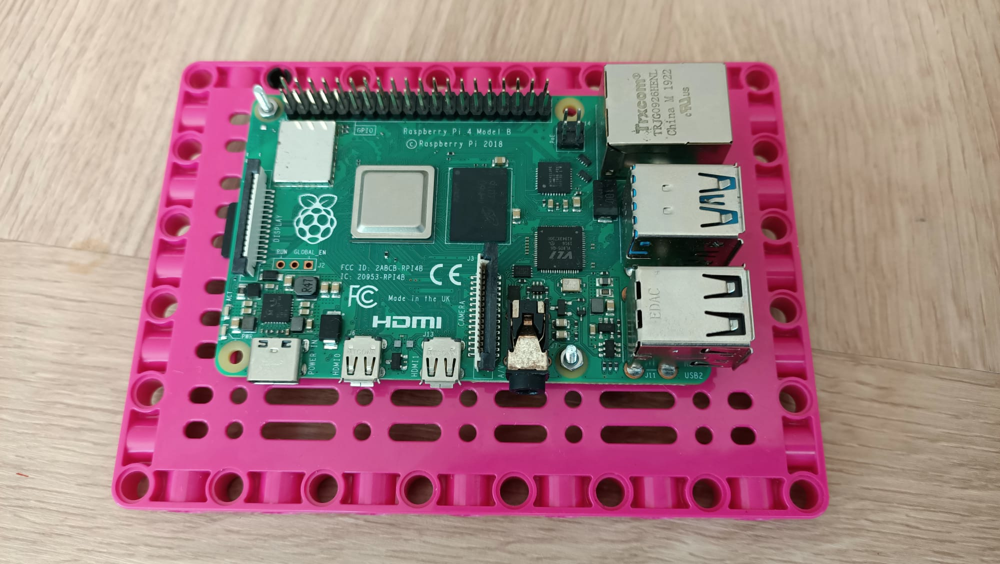

## Einleitung

In diesem Projekt erstellst du eine Instrumententafel, die Daten visualisiert. Du kannst auswählen, welche Daten aus einer Reihe von Online-Quellen angezeigt werden. Deine Daten-Instrumententafel muss die **Projektbeschreibung**erfüllen.

Eine Instrumententafel ist eine Benutzeroberfläche, die eine aktuelle Zusammenfassung wichtiger Informationen bereitstellt, meist in grafischer oder leicht lesbarer Form. Der Begriff stammt aus dem Auto, bei dem dem Fahrer durch große, helle Zifferblätter und Skalen der aktuelle Status des Fahrzeugs angezeigt wird.

Du wirst:
+ Automatisierte Anzeigen mit LEGO® Motoren und Elementen bauen
+ Auf eine Online - **API** (Application Programming Interface) zugreifen, um interessante Daten mit Python abzurufen
+ Deine ausgewählten Daten auf einer Instrumententafel anzeigen, die du mit LEGO erstellst

--- no-print ---

--- /no-print ---

--- collapse ---
---
title: Was du brauchen wirst
---
### Hardware

+ Einen Raspberry Pi-Computer
+ Ein Raspberry Pi Build HAT
+ Ein Raspberry Pi Build HAT 7,5 V Netzteil
+ 2 LEGO® Technic™ Motoren (weitere optional)
+ Ein LEGO® SPIKE™ Kraftsensor
+ Sortiment von LEGO® (wir haben eine Auswahl aus dem [LEGO® SPIKE™ Prime Kit](https://education.lego.com/en-gb/product/spike-prime){:target="_blank"} verwendet)
+ Papier oder Karton
+ Hefter oder Klebeband zum Befestigen der Karte
+ Marker oder Bleistift
+ Schere oder Bastelmesser

Optional:
+ LEDs
+ Widerstände
+ Verbindungsdrähte
+ Ein Steckbrett
+ M2-Schrauben und Muttern (jeweils 2x für die Montage des Raspberry Pi auf der LEGO® Bauplatte)

### Software

+ BuildHAT Python-Bibliothek zur Steuerung des Build HAT
+ Thonny Python-IDE

### Downloads

+ Das endgültige Skript für dieses Projekt ist [hier]((https://rpf.io/p/en/lego-data-dash-go){:target="_blank"}) verfügbar

--- /collapse ---

Bevor du beginnst, musst du deinen Raspberry Pi-Computer eingerichtet und deinen Build HAT angeschlossen haben:

--- task ---

Montiere deinen Raspberry Pi mit M2-Schrauben und Muttern auf der LEGO Build Plate und stelle sicher, dass sich der Raspberry Pi auf der flachen Seite befindet:

 

--- /task ---

Die Montage des Raspberry Pi auf diese Weise ermöglicht einen einfachen Zugriff auf die Anschlüsse sowie den SD-Kartensteckplatz. Mit der Bauplatte kannst du den Raspberry Pi einfacher mit der Hauptstruktur deiner Instrumententafel verbinden.

--- task ---

Richte den Build HAT mit dem Raspberry Pi aus und stelle sicher, dass du das Etikett `This way up` siehst. Stelle sicher, dass alle GPIO-Pins vom Stecker des HAT bedeckt sind, und drücke ihn fest nach unten. (Das Beispiel verwendet einen [Stacking-Header](https://www.adafruit.com/product/2223){:target="_blank"}, der die Pins verlängert.)

 

--- /task ---

Jetzt solltest du deinen Raspberry Pi über die 7,5-V-Hohlstecker-Buchse des Build HAT mit Strom versorgen, damit du die Motoren verwenden kannst.

--- task ---

Wenn du dies noch nicht getan hast, richte deinen Raspberry Pi ein, indem du diesen Anweisungen folgst:

[Einrichten deines Raspberry Pi](https://projects.raspberrypi.org/en/projects/raspberry-pi-setting-up){:target="_blank"}

--- /task ---

--- task ---

Nachdem der Raspberry Pi gebootet hat, öffne das Raspberry Pi Configuration Tool, indem du auf die Schaltfläche Raspberry Menu (Himbeere) klickst und dann „Einstellungen“ und dann „Raspberry Pi Konfiguration“ auswählst.

Klicke auf die Registerkarte "Schnittstellen" und passe die seriellen Einstellungen wie unten gezeigt an:

--- /task ---

--- task ---

Du musst auch die buildhat Python-Bibliothek installieren, indem du diese Anweisungen befolgst:

--- collapse ---
---
title: Installation der buildhat Python-Bibliothek
---

Öffne ein Terminalfenster auf deinem Raspberry Pi, indem du <kbd>Strg</kbd>+<kbd>Alt</kbd>+<kbd>T</kbd>drückst.

Gib an der Eingabeaufforderung `sudo pip3 install buildhat` ein

Drücke <kbd>Enter</kbd> und warte auf die Meldung "Installation abgeschlossen".

--- /collapse ---

--- /task ---

###PROJEKTBESCHREIBUNG: LEGO® Daten-Instrumententafel

Deine Aufgabe besteht darin, eine LEGO-Instrumententafel zu erstellen, die deine ausgewählten Daten anzeigt. Die Quellen für deine Daten können beliebige APIs sein, aber in diesem Beispiel zeigen wir dir, wie du auf OpenAQ zugreifen kannst, was nur eine minimale oder keine Anmeldung erfordert. 

Für unsere Beispieldaten messen wir:
+ Die **NO2**-Werte an einem ausgewählten Ort. Stickstoffdioxid (NO2) gehört zu einer Gruppe hochreaktiver Gase, die als Stickoxide oder NOx bekannt sind. NO2 wird hauptsächlich bei der Verbrennung von Kraftstoff in die Luft freigesetzt.
+ Die **Feinpartikel (PM2,5)** an einem ausgewählten Ort. Der Begriff **feine Partikel** oder Feinstaub 2,5 (PM2,5) bezieht sich auf winzige Partikel oder Tröpfchen in der Luft, die zweieinhalb Mikrometer (oder weniger) groß sind. Rauch und Smog bestehen aus PM2,5 klassifizierten Partikel.

Die Beispiel-API, die wir in diesem Projekt verwenden, stammt von [OpenAQ](https://openaq.org/#/), einer globalen gemeinnützigen Organisation, die „Luftungleichheit durch offene Daten bekämpft“. Weltweit ist **1 von 8 Todesfällen** auf schlechte Luftqualität zurückzuführen, und OpenAQ sammelt globale Luftqualitätsdaten, um mehr Menschen über die Probleme der zunehmenden Luftverschmutzung in einigen Teilen der Welt zu informieren. 

Deine Instrumententafel sollte:
+ LEGO® verwenden, um deine ausgewählten Daten übersichtlich anzuzeigen
+ Auf eine Online-API zugreifen um aktuelle Daten zu erhalten
+ Mindestens zwei LEGO® Indikatoren haben

Deine Instrumententafel könnte:
+ Andere elektronische Komponenten (LEDs, Summer) verwenden
+ Physische Benutzereingaben haben (LEGO® Technic™ Motoren, LEGO® Force Sensor, GPIO-Taster, Distanzsensor)
  

--- no-print ---

### Hole dir Inspiration

--- task ---

Denke an die Informationen, die du auf deiner Instrumententafel anzeigen möchtest, wenn du diese Beispielprojekte ansiehst, um mehr Ideen zu erhalten.

Dieses Beispiel zeigt eine Wetter-Instrumententafel an, die die aktuelle Temperatur auf einem vertikalen Schieberegler anzeigt, die Wolkendecke mit einer LED-Skala, und auf den Drehtasten ein passendes Kleidungsniveau auf der Grundlage der gefühlten Temperatur (berücksichtigt Wind und Wetter in der Temperatur) und einen detaillierten Wetterbericht unter Verwendung von World Weather Codes (auch bekannt als WMO code).

--- /task ---

--- /no-print ---

--- print-only ---

--- /print-only ---

