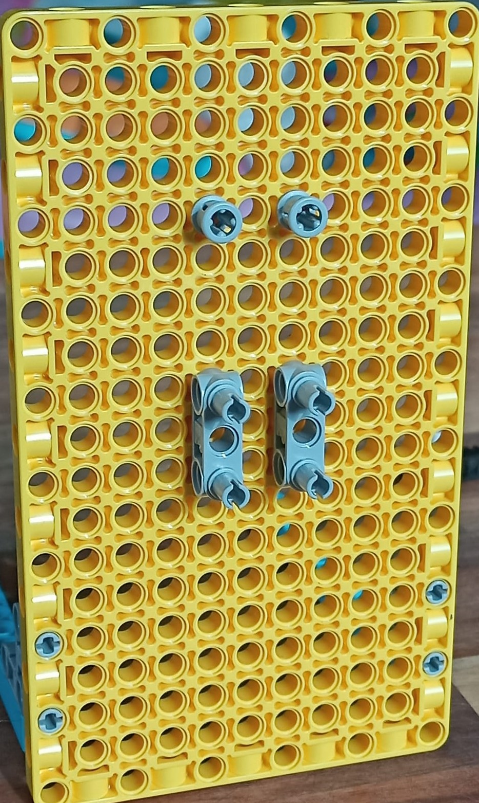

## Machen Sie einen LEGO® Schiebeindikator

Jetzt ist es an der Zeit, einen LEGO® Schiebeindikator herzustellen! Wenn du keinen Schiebeindikator einfügen möchtest, kannst du mit dem nächsten Schritt fortfahren, der dir zeigt, wie du rotierende LEGO-Zifferblätter erstellest.

So sieht ein vertikaler Schieberegler aus:

Schiebeindikatoren können auch horizontal verlaufen, wenn du dies bevorzugst, indem du den Aufbau um 90 Grad gegen den Uhrzeigersinn drehst.

--- task ---

Befolge diese Bauanleitung, um einen vertikalen Schiebeindikator zu erstellen:

Um dieses Modell zu konstruieren, folge unserer praktischen Bauanleitung hier oder [lade sie dir herunter.](resources/lego-data-dash-slider.pdf)
<embed src="resources/lego-data-dash-slider.pdf" width="600" height="500" alt="pdf" pluginspage="https://www.adobe.com/products/acrobat/readstep2.html">
  
 
  
  

    --- /task ---
  

  
  

    --- task ---
  

  
  

    Nimm ein gelbes Plattenelement und befestige zwei blaue Balken mit 90-Grad-Bolzenhalterungen. 
  

  
  

    --- /task ---
  

  
  

    --- task ---
  

  
  

    Bringe zwei graue gerade Klammern im Abstand einer Säule an. 
  

  
  

    --- /task ---
  

  
  

    --- task ---
  

  
  

    Befestige zwei graue Bolzen mit doppelter Länge mit Abstandshaltern an einem Ende am Plattenelement über den Halterungen. 
  

  
  

    --- /task ---
  

  
  

    --- task ---
  

  
  

    Bringe zwei gelbe (Drei-Loch-) Balken horizontal zwischen den beiden geraden Halterungen an. 
  

  
  

    --- /task ---
  

  
  

    --- task ---
  

  
  

    Nimm ein kleines schwarzes Zahnrad und eine kurze Achse und füge sie zusammen. 
  

  
  

    --- /task ---
  

  
  

    --- task ---
  

  
  

    Stecke die Achse wie abgebildet durch die Bauplatte über der rechten Halterung: 
  

  
  

    --- /task ---
  

  
  

    --- task ---
  

  
  

    Nimm eine Zahnstange, eine rote Achse und einen Anzeigepfeil. Stecke die Achse in ein Ende der Zahnstange, wobei der Anzeigepfeil zur gezahnten Seite zeigt: 
  

  
  

    --- /task ---
  

  
  

    --- task ---
  

  
  

    Schiebe die Zahnstange nach unten in die Oberseite des Mechanismus.
  

  
  

    Du musst das Zahnrad nach vorne ziehen, um die Zahnstange vorbeizulassen, und dann das Zahnrad wieder hineinschieben, damit es in die Zähne eingreift. Der Mechanismus gleitet leicht nach oben und unten, während das Zahnrad und die Achse frei sind. Das Verbinden eines Motors hält ihn stabil. 
  

  
  

    --- /task ---
  

  
  

    --- task ---
  

  
  

    Nimm einen Motor und stecke zwei Bolzen in die oberen beiden Löchern. 
  

  
  

    --- /task ---
  

  
  

    --- task ---
  

  
  

    Stelle sicher, dass der Motor auf 'null' steht, indem du die beiden lollipop Symbole am Motor aneinander ausrichtest, bevor du den Motor an der Rückseite der Slider-Achse montierst:
  

  
  

    
  

  
  

    --- /task ---
  

  
  

    --- task ---
  

  
  

    Stelle deine Zahnstange so ein, dass sich das Zahnrad ungefähr in der Mitte befindet. Montiere dann den Motor mit den beiden Bolzen hinter der Platine, während du die Zahnstange festhältst. Stelle sicher, dass die Achse in das Loch auf der <strong x-id="1">flachen Seite</strong> des Motors passt. Es sollte den Schieber jetzt, ungefähr auf halbem Weg der Zahnstange, stabil halten. 
  

  
  

    --- /task ---
  

<h3 spaces-before="0">
  Testen Sie den Schiebeindikator
</h3>

  Um deinen Schiebeanzeiger zu programmieren, kannst du einen Teil des Codes wiederverwenden, der im <a href="https://projects.raspberrypi.org/en/projects/lego-plotter">LEGO® Daten Plotter</a> Projekt geschrieben wurde, da du denselben Mechanismus verwendest.

  --- task ---

  Verbinde den Motor deine Linearanzeige mit Port A deines Build HAT.

  --- /task ---

  --- task ---

  Du benötigst die BuildHAT Python-Bibliothek, stelle also sicher, dass sie installiert ist:

  --- collapse ---

<h2 spaces-before="0">
  title: Installation der buildhat Python-Bibliothek
</h2>

  Öffne ein Terminalfenster auf deinem Raspberry Pi, indem du <kbd>Strg</kbd>+<kbd>Alt</kbd>+<kbd>T</kbd>drückst.

  Gib an der Eingabeaufforderung <code>sudo pip3 install buildhat</code> ein

  Drücke <kbd>Enter</kbd> und warte auf die Meldung "Installation abgeschlossen".

  --- /collapse ---

  --- /task ---

<h3 spaces-before="0">
  Skalierung für den Schiebe-Indikator erstellen
</h3>

  Du weist jetzt, dass es funktioniert. Du musst aber noch eine Skala für den Schiebeindikator erstellen, damit du weist, was es bedeutet.

  --- task ---

  Besorge dir ein Stück Karton, etwa so lange wie deine Zahnstange. Klebe ihn neben den Schiebeanzeiger unter den Zeiger. Halte einen Marker oder Bleistift bereit.

  --- /task ---

  --- task ---

  Öffne <strong x-id="1">Thonny</strong> auf deinem Raspberry Pi aus dem Menü <strong x-id="1">Entwicklung</strong>.

  Gib in der <strong x-id="1">Shell</strong> (das Fenster unten) neben den drei Pfeilen ein: <code>from buildhat import Motor</code> und drücke <kbd>Enter</kbd>. Du solltest eine neue Zeile mit drei weiteren Pfeilen sehen.

  --- /task ---

  --- task ---

  Tippe jetzt: <code>motor = Motor('A')</code> und drücken Sie <kbd>Enter</kbd>. --- /task ---

  Nachdem du deinen Schiebermotor eingerichtet hast, solltest du ihn zu den maximalen und minimalen Messwerten schicken, um zu sehen, wie weit er fahren kann. Markiere dann diese Stellen auf dem Karton.

  --- task ---

  Gib ein: <code>motor.run_to_position(-180, 100)</code> und drücke <kbd>Enter</kbd>. Markiere die Karte an der Stelle, die der Pfeil angibt. Dies ist deine minimal mögliche Anzeige.

  --- /task ---

  --- task ---

  Gib ein: <code>motor.run_to_position(180, 100, direction="clockwise")</code> und drücke <kbd>Enter</kbd>. Markiere den Karton an der Stelle, die der Pfeil angibt. Dies ist deine minimal mögliche Anzeige.

  --- /task ---

  Du weist jetzt, wo deine minimal und maximal möglichen Messwerte sind. Sobald du diese linearanzeige mit einigen Daten verknüpft hast, kannst du eine genaue Skala erstellen.

<h3 spaces-before="0">
  Programmieren Sie Ihren Schiebeindikator, um Live-Daten anzuzeigen
</h3>

  --- task ---

  Gib den folgenden Code in eine leere Registerkarte ein:

  --- code ---

  language: python filename: slider_test.py line_numbers: true line_number_start: 1

<h2 spaces-before="0">
  line_highlights:
</h2>

  from buildhat import Motor from time import sleep from random import randint

  motor_linear = Motor('A')

  motor_linear.run_to_position(0,100)

  while True: winkel_jetzt = motor_linear.get_aposition() winkel_neu = randint(-175, 175) print(winkel_neu) if winkel_neu > winkel_jetzt: motor_linear.run_to_position(new_angle, 100, direction="clockwise") print('im Uhrzeigersinn') elif winkel_neu < winkel_jetzt: motor_linear.run_to_position(new_angle, 100, direction="anticlockwise") print('gegen Uhrzeigersinn') sleep(0.1)

  --- /code ---

  Speichere deine Arbeit als <code>slider_test.py</code> und klicke auf <strong x-id="1">Run</strong>. Du solltest deinen Schieberegler nach oben oder unten (oder vor und zurück!) laufen sehen

  --- /task ---

  --- save ---

