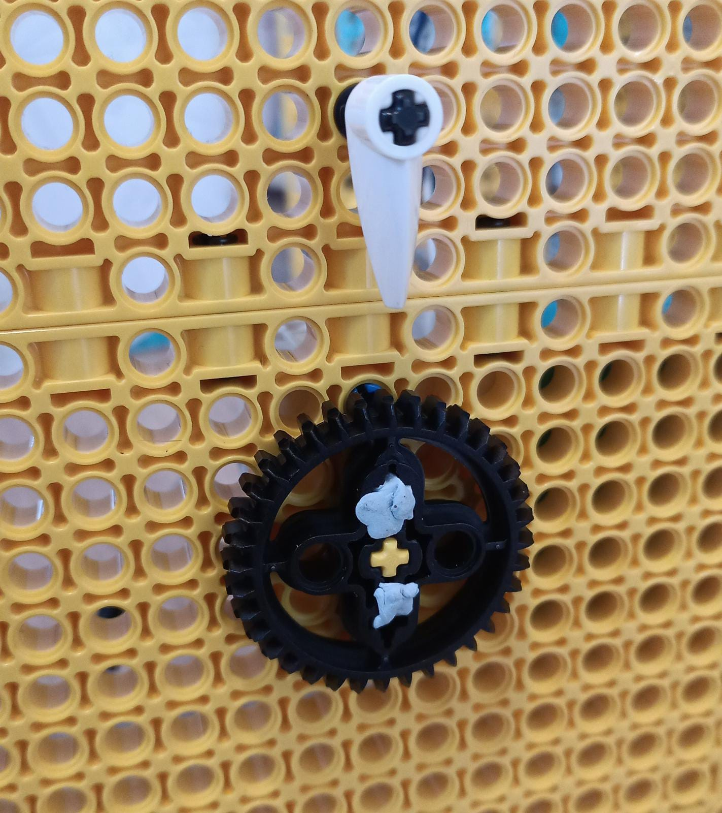

## Mache eine LEGO® Anzeige

Eine andere Möglichkeit, Daten schnell anzuzeigen, ist die Verwendung von **Zifferblättern**, auch bekannt als **Anzeigen**. Du hast sie definitiv schon einmal gesehen; Sie sind normalerweise rund oder halbkreisförmig und haben zwei sichtbare Hauptteile:

+ Das Zifferblatt, auf dem die Skala abgebildet ist
+ Die Nadel, die sich entlang der Skala bewegt, um den Messwert anzuzeigen

Ein Messgerät oder ein Zifferblatt ist die einfachste Art der Datenanzeige, die du mit LEGO® erstellen kannst, da du nur ein Zifferblatt und eine Nadel benötigst. Da die Nadel und das Zifferblatt direkt mit deinem Motor verbunden sind, ist der Aufbau sehr einfach:

--- task ---

Bevor du den Motor an der Rückseite des Messgeräts auf der Achse anbringst, stelle sicher, dass er „genullt“ ist, indem du die beiden Lutschersymbole an der Kante des Motors ausrichtest:

--- /task ---

### Erstelle eine Skala

Um das Messgerät fertig zu bauen, musst du eine Skala aus Papier, Karton oder anderem Künstlerzubehör erstellen. Die Mechanik und das Programm sind genau gleich, aber du musst dir jetzt überlegen, wie dein Messgerät aussehen soll.

 --- task ---

 **Wähle** welche Art von Anzeige du machen möchtest.

 Es gibt zwei einfache Typen, die du mit LEGO® erstellen kannst:

+ Ein Messgerät, bei dem sich die Nadel dreht, um einen Punkt auf der Skala anzuzeigen: 

+ Eine Anzeige, bei der sich das gesamte Zifferblatt dreht, um einen Punkt oben mit einem stationären Indikator anzuzeigen: 

--- /task ---

--- task ---

Zeichne auf einem leeren Blatt Papier einen schönen Kreis in der Größe, die dein Messgerät haben soll. Markiere die Mitte und schneide sie mit einer Schere aus.

--- /task ---

--- task ---

Teile den Kreis in gleich große Segmente (eines für jeden Messwert), indem du Linien durch die Mitte ziehst, oder zeichne deine Skala um den Rand herum.

--- /task ---

--- task ---

Zeichne Symbole oder schreibe in jedes Segment, was es anzeigt.

--- /task ---

Sobald du mit der Erstellung deines Messgeräts fertig bist, musst du es an deinem Armaturenbrett montieren.

--- collapse ---
---
title: Wenn du eine Anzeige mit Zeiger erstellst
---

Um dein Zeigerinstrument fertig zu stellen:

--- task ---

Schiebe das Zifferblatt über deine Achse und kleben sie mit Blu Tack oder Klebeband auf das Armaturenbrett dahinter. Achte darauf, dass es beim Drehen der Achse nicht rutscht. 

--- /task ---

--- task ---

Stecke ein 90-Grad-Winkelstück auf die Achse und stecke eine weitere Achse hinein. Stelle sicher, dass sie lang genug ist um deine Skala zu erreichen und die Messwerte deutlich anzuzeigen.

Es hilft später, wenn deine Achse beim Montieren gerade nach oben zeigt (und dein Motor auf Null gestellt ist), da dies die Berechnung der für die Anzeige erforderlichen Drehung erleichtert.

--- /task ---

--- /collapse ---

--- collapse ---
---
title: Wenn du ein sich drehendes Zifferblatt machst
---

Um deine Drehskala fertig zu stellen:

--- task ---

Montiere ein einzelnes Zahnrad als Abstandshalter hinter deinem Zifferblatt, damit es nicht an deinem Armaturenbrett hängen bleibt. Verwende etwas Blu Tack, um das Zifferblatt an dieses Zahnrad zu kleben. Wenn du eine inkrementelle Skala um das Zifferblatt herum erstellt hast, montiere es mit der Mitte der Skala oben (bei den 'genullten' Lutschersymbolen) und den minimalen und maximalen Werten unten.

--- /task ---

--- /collapse ---

### Teste dein Messgerät

--- task ---

Connect the motor of your gauge to port A on your Build HAT.

--- /task ---

--- task ---

You will be using the BuildHAT Python library, so make sure it is installed:

--- collapse ---
---
title: Installation der buildhat Python-Bibliothek
---

Open a terminal window on your Raspberry Pi by pressing <kbd>Ctrl</kbd>+<kbd>Alt</kbd>+<kbd>T</kbd>.

At the prompt type: `pip3 install buildhat`

Press <kbd>Enter</kbd> and wait for the "installation completed" message.

--- /collapse ---

--- /task ---

--- task ---

Open **Thonny** on your Raspberry Pi from the **Programming menu**.

Enter the following code in a blank tab:

--- code ---
---
language: python filename: gauge_test.py line_numbers: true line_number_start: 1
line_highlights:
---
from buildhat import Motor from time import sleep from random import randint

motor_gauge = Motor('A')

motor_gauge.run_to_position(0,100)

while True: angle = randint(-180, 180) motor_gauge.run_to_position(angle, 100) sleep(0.3)

--- /code ---

Save your work as `gauge_test.py` and press **Run**. You will see your gauge begin to move!

--- /task ---
