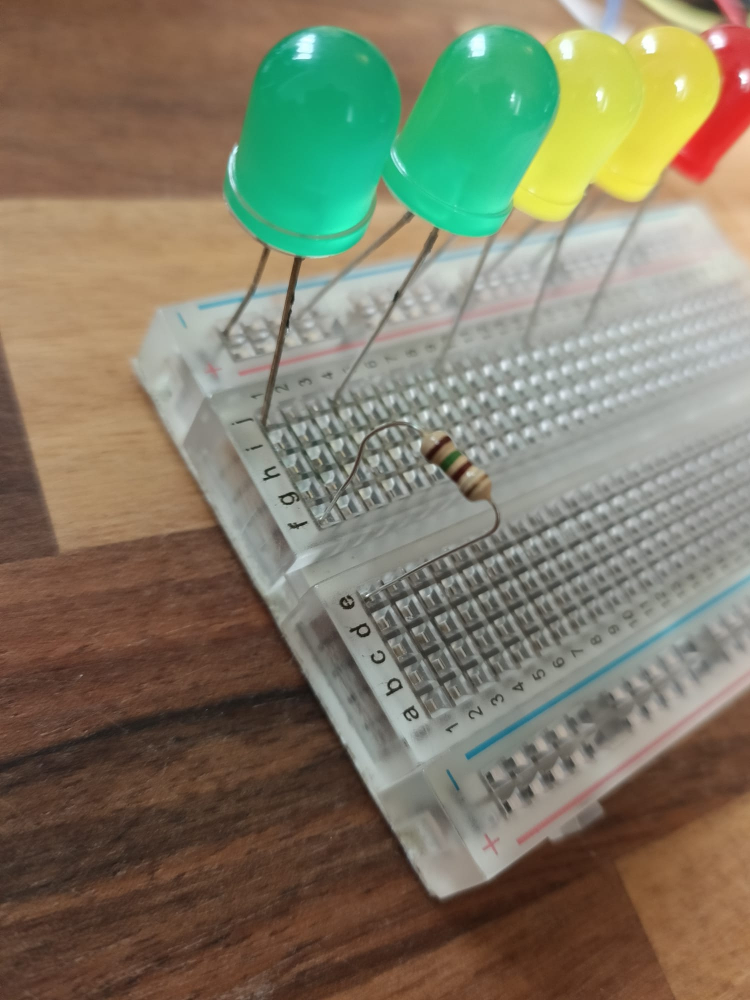
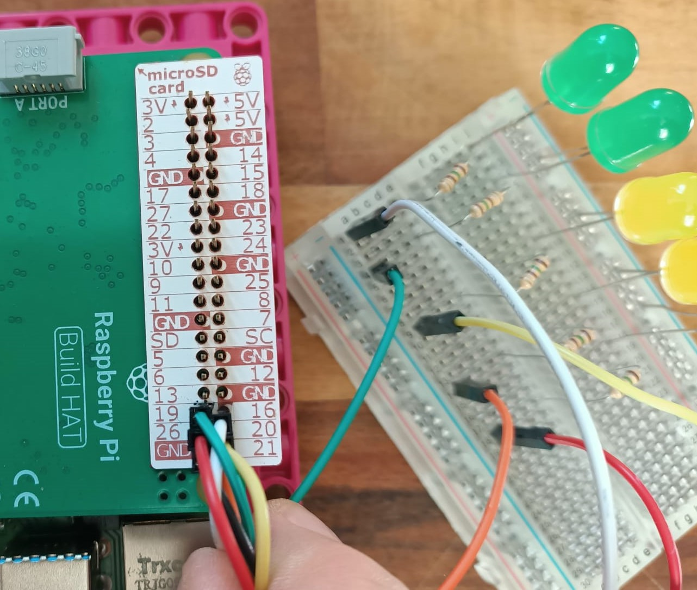

## Mache eine LED-Skala

Eine andere wirklich coole Möglichkeit, Daten anzuzeigen, ist die Verwendung einer Reihe von LEDs, die sich bei Änderung der Messwerte ein- und ausschalten – je höher der Messwert, desto mehr LEDs leuchten. wie ein grafischer Equalizer auf deinem Computer, der die Lautstärke deiner Musik anzeigt.

Um eine LED-Anzeige zu erstellen, benötigst du ein paar LEDs – je mehr LEDs du hast, desto genauer wird deine Skala. Es gibt jedoch eine Obergrenze: Du kannst nur so viele LEDs benutzen, wie GPIO-Pins verfügbar sind. In diesem Beispiel verwenden wir fünf LEDs, aber man **könnte** mehr als zehn anschließen, wenn du möchtest.

**Hinweis:** Aufgrund der Konstruktion des Build HAT **kannst du auf GPIO 14 oder 15 (Pins 8 und 10)**nicht zugreifen.

--- task ---

Besorge deine LEDs, Widerstände, M-F-Überbrückungskabel und ein Steckbrett. 

--- /task ---

--- task ---

Schau dir deine LEDs genau an – du wirst feststellen, dass ein Bein länger ist als das andere. 

--- /task ---

--- task ---

Fügedie **kurzen Beine** deiner LEDs in die **Masseschiene** an der Kante deines Steckbretts ein (es ist diejenige neben der blauen Linie ganz am Rand) und die langen Beine in die nächsten nummerierten Reihen: 

--- /task ---

Du musst der Schaltung Widerstände hinzufügen, um die LEDs vor Überlastung, Durchbrennen oder Zerspringen zu schützen. Jetzt ist ein guter Zeitpunkt, das zu tun.

--- task ---

Nimm einen Widerstand und stecke ein Ende in die **gleiche Reihe** wie die erste LED deiner Anordnung ein. Stecke das andere Ende des Widerstands in dieselbe Reihe ein, aber **auf der anderen Seite der Mittellinie** deines Steckbretts, wie hier gezeigt:

Wiederhole dies für alle LEDs in deinem Aufbau: 

--- /task ---

--- task ---

Stecke die M-Enden (Stift) deiner M-F-Überbrückungskabel in die gleiche Reihe wie die Widerstände, damit du sie mit den Pins auf dem Raspberry Pi verbinden kannst: 

--- /task ---

--- task ---

Nimm das M-Ende eines weiteren Überbrückungskabels und stecke es in das Ende der gemeinsamen Masseschiene: 

--- /task ---

Ihre fertige LED-Anzeige sollte in etwa so aussehen:

Der nächste Schritt besteht darin, sie mit den GPIO-Pins des Raspberry Pi zu verbinden.

--- task ---

Nimm das F-Ende (Buchse) des Überbrückungskabels, das mit deiner gemeinsamen Masseschiene verbunden ist, und verbinde es mit Pin 39. Dies ist einer von mehreren Massestiften auf dem Raspberry Pi, die die Erdung für **alle** LED-Lampen bereitstellen. 

--- /task ---

--- task ---

Schließe die anderen Kabel an GPIO-Pins an und notiere, an welche du deine LEDs angeschlossen hast.

In diesem Beispiel haben wir die Pins 16, 19, 20, 21 und 26 verwendet (um sie der Ordnung halber alle an einem Ende zu haben): 

--- /task ---

Nachdem deine LED-Kette mit deinem Raspberry Pi verbunden ist, musst du sie einschalten und programmieren.

--- task ---

Verbinde das 7,5-V-Netzteil mit der Hohlstecker-Buchse deines Build HAT. Du solltest deinen Raspberry Pi hochfahren und den Raspberry Pi OS Desktop laden sehen.

--- /task ---

--- task ---

Öffne **Thonny** auf deinem Raspberry Pi aus dem Menü **Entwicklung**.

Die ersten Zeilen deines Skripts importieren die gpiozero- und randint-Bibliotheken und richten deine LEDs so ein, dass sie steuerbar sind. Du musst die Werte in Klammern ändern, damit sie mit den Pins übereinstimmen, mit denen deine LEDs verbunden sind. **Hinweis:** Die Reihenfolge dieser Nummern ist wichtig! Die Pin-Nummern sollten vom niedrigsten in deinem "Leuchtbalken" zum höchsten gehen.

Gib in das leere Fenster den folgenden Code ein:

--- code ---
---
language: python 
filename: led_bargraph.py 
line_numbers: true 
line_number_start: 1
line_highlights:
---
from gpiozero import LEDBarGraph 
from random import randint

balken = LEDBarGraph(16,19,20,21,26) # Die Reihenfolge dieser Zahlen sollte mit den verwendeten pins übereinstimmen

--- /code ---

--- /task ---

Da du nun deine LEDs zum Programmieren bereit hast, sollte der nächste Teil deines Codes die Daten abrufen, die du messen möchtestn. Dann musst du, basierend auf dem Ergebnis bestimmen, wie viele LEDs eingeschaltet werden sollen. Zu Testzwecken solltest du Zufallsdaten verwenden.

Die Absicht besteht darin, die LEDs mit zunehmendem Messwert einschalten und mit abnehmendem Messwert ausschalten zu lassen. Wie bei den anderen Anzeigen musst du deine Daten auf deiner Skala abbilden.

--- task ---

Füge den folgenden Code am Ende deines Skripts hinzu:

--- code ---
---
language: python 
filename: led_sequence.py 
line_numbers: true 
line_number_start: 9
line_highlights:
---
while True: 
    daten_wertg = randint(0, 100) 
    graph.value = 1/daten_wert #Das erzeugt eine Dezimalzahl für die Anzeige 
    sleep(0.5)
    
--- /code ---

--- /task ---

--- task ---

Speichere deine Arbeit als `led_sequence.py` und klicke auf **Run**. Dein Balkendiagramm sollte nun zu leuchten beginnen!

--- /task ---

--- save ---
