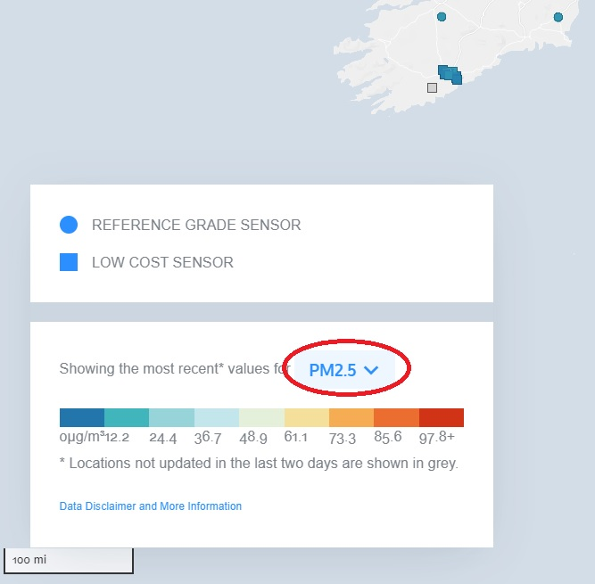
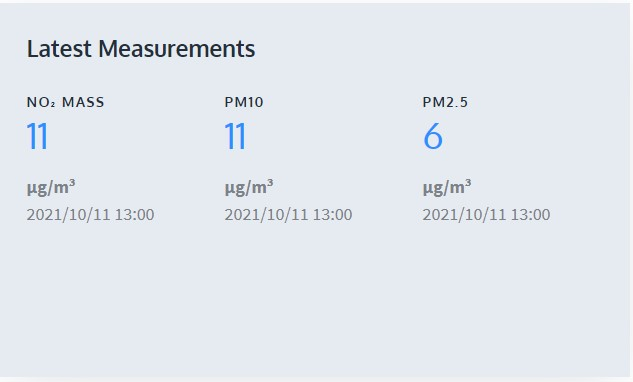

## Greife auf die OpenAQ-API zu

API steht für **Application Programming Interface**; Dies ist eine Software, die es zwei Anwendungen ermöglicht, miteinander zu kommunizieren. Jedes Mal, wenn du eine App wie Facebook verwendest, eine Sofortnachricht sendest oder das Wetter auf deinem Telefon überprüfst, verwendest du eine API.

Immer wenn du eine App auf deinem Telefon verwendest, verbindet sich die App mit dem Internet und sendet Daten über das, was du wissen möchten, an einen Server. Der Server findet und ruft dann die gewünschten Daten ab, interpretiert sie und sendet sie zurück an dein Telefon. Die App übernimmt dann die zurückgegebenen Daten und präsentiert dir die gewünschten Informationen in lesbarer Form. Eine API ist: eine Möglichkeit, andere Maschinen über das Internet zu steuern – all dies geschieht über die **API**.

Der coole Teil ist, dass du deine eigenen Apps schreiben kannst, die Online-Datenbanken nach Informationen durchsuchen und die gewünschten Daten an dein LEGO® Dashboard statt an ein Telefon zurückgeben – Du verwenden deinen Raspberry Pi als Gehirn, um diese Daten abzurufen und dann auf deinen handgefertigten, maßgefertigten LEGO Skalen anzuzeigen!

Dazu musst du dich für einige Dinge entscheiden: du musst den Ort auswählen, von dem du dich über die Luftqualität informieren willst – du kannst jeden Ort auf der Welt wählen! — und du musst entscheiden, welche Kennwerte der Luftqualität du darstellen möchtest.

### OpenAQ – die Open-Source-Datenbank zur Luftqualität

In deiner Beispiel-Instrumententafel verwendest du die API für [**OpenAQ**](https://openaq.org/#/){:target="_blank"}, ein Open-Source-Projekt für globale Luftqualitätsdaten. OpenAQ ermöglicht es dir, viele verschiedene Luftverschmutzungsdaten aus der ganzen Welt einzusehen, die von Tausenden von Messstationen auf der ganzen Welt gesammelt wurden.

Wenn du bereits ein Zauberer mit APIs bist, kannst du alle Daten verwenden, die du in deinem Dashboard darstellen möchtest. Wenn du mit uns mitmachen und OpenAQ zum ersten Mal nutzen möchtest, musst du herausfinden, welche Messstation du erforschen und welche Messungen du einsehen kannst.

--- task ---

**Navigiere** zur OpenAQ-Karte, indem du [hier klickst](https://openaq.org/#/map){:target="_blank"}. Eine Webseite mit einer mit Punkten bedeckten Weltkarte sollte erscheinen.

--- /task --- 

--- task ---

**Entscheide** von wo auf der Welt du Daten zur Luftqualität sammeln möchtest. Dies kann der Bereich in der Nähe deines Wohnortes sein, ein Ort, der dich interessiert oder von dem du glaubst, dass er interessante Daten enthält.

--- /task --- 

Da sich unser Hauptsitz in Cambridge im Vereinigten Königreich befindet, verwenden wir dies hier als Beispiel.

Es gibt viele verschiedene Messungen, die von Messstationen für die Luftqualität durchgeführt werden. Die OpenAQ-Datenbank enthält Informationen zu folgenden Arten von Luftverschmutzung:

 + PM2,5 und PM10 (Partikel): mikroskopisch kleine Partikel, die in der Luft schweben (Rauch, Smog)
 + NO2 (Stickstoffdioxid): verursacht Ozonbildung, verursacht Asthma bei Kindern
 + CO (Kohlenmonoxid): tödlich für den Menschen, Nebenprodukt der Verbrennung fossiler Brennstoffe
 + SO2 (Schwefeldioxid): riecht schlecht, kann Atembeschwerden verursachen, erzeugt sauren Regen, Nebenprodukt industrieller Prozesse
 + O3 (Ozon): entsteht, wenn NO2 auf Sonnenlicht reagiert, verursacht Smog, schädlich für Pflanzen
 + BC (Schwarzer Kohlenstoff): wird an vielen Orten (USA und Polen) nicht gemessen, wird durch ineffiziente Kraftstoffverbrennung verursacht, trägt zur globalen Erwärmung bei, gefährlich für den Menschen

--- task ---

**Entscheide**, welche Art von Luftverschmutzung dich am meisten interessiert. Du kannst aus dem Pulldown-Menü über der Farbskala links auf dem Bildschirm verschiedene Optionen auswählen. 

**Hinweis:** Runde Markierungen stehen für umfangreichere Luftqualitätsmessstationen, die wahrscheinlich mehr verschiedene Schadstoffe messen.

--- /task ---

--- task ---

**Vergrößere** den ausgewählten Bereich auf der Karte und suche den Punkt, der dem Ort am nächsten ist, den du messen möchtest. Klicke auf den nächstgelegenen Punkt, um die Standortdetails anzuzeigen. Klicken Sie im angezeigten Popup auf die Schaltfläche **View Location**.  

--- /task ---

--- task ---

Während die neue Webseite die Details der Messungen an der gewählten Stelle lädt und anzeigt, **notiere** du die Zahl in der URL der neuen Seite. Dies ist die OpenAQ-Identifikationsnummer für deine ausgewählte Luftqualitätsmessstation. (In diesem Beispiel ist es die Messstation Sandy Roadside mit der ID-Nummer **2480**.) 

--- /task ---

--- task ---

Auf der Standortseite siehst du die verschiedenen Schadstoffarten, die an diesem Standort gemessen wurden. **Wähle** zwei aus der Liste aus, die du auf deiner Daten-Instrumententafel darstellen möchtest.  Diese Messstation in der Nähe von Sandy kann NO2, PM10 und PM2,5 anzeigen – daher verwenden wir im Beispiel NO2 und PM2,5.

--- /task ---