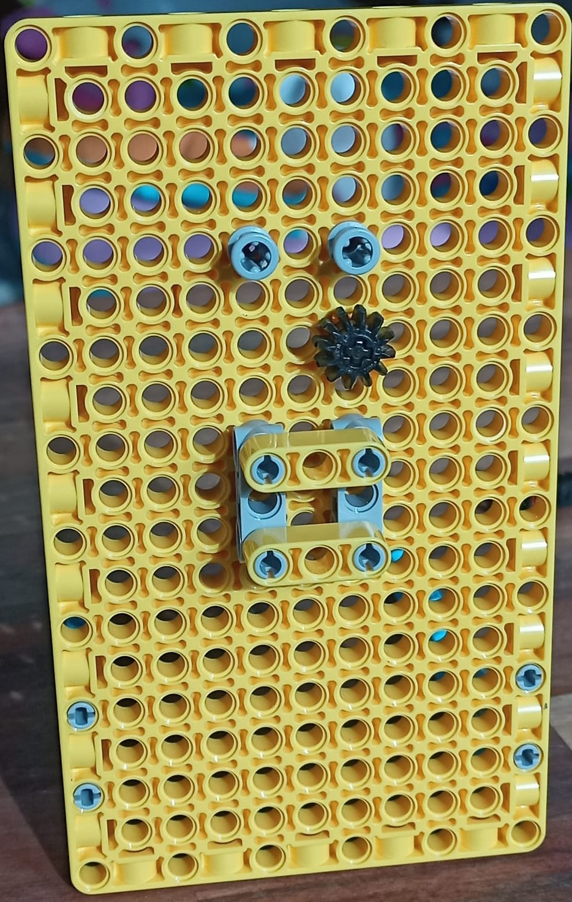

## Make a LEGO® sliding indicator

Now it's time to make a LEGO® sliding indicator! If you don't want to include a sliding indicator, you can skip to the next step, which shows you how to create rotating LEGO dials.

This is what a vertical slider looks like:

Sliding indicators can also run horizontally if you prefer, by rotating the build 90 degrees anti-clockwise.

--- task ---

Follow these build instructions to create a vertical sliding indicator:

To construct this model, follow our handy building guide here or [download it.](resources/lego-data-dash-slider.pdf)
<embed src="resources/lego-data-dash-slider.pdf" width="600" height="500" alt="pdf" pluginspage="https://www.adobe.com/products/acrobat/readstep2.html">

--- /task --- 

--- task ---

Take a yellow plate element and attach two blue beams using 90 degree stud brackets.

--- /task ---

--- task ---

Attach two grey straight brackets, one column apart.

--- /task ---

--- task ---

Attach two grey double length studs with spacers on one end to the plate element above the brackets. 

--- /task ---

--- task ---

Attach two yellow (three-hole) beams horizontally between the two straight brackets. 

--- /task ---

--- task ---

Take a small black gear and a short axle, and join them together. 

--- /task ---

--- task ---

Insert the axle through the Build Plate above the right bracket as shown: 

--- /task ---

--- task ---

Take a toothed bar, a red axle, and an indicator arrow. Insert the axle into one end of the toothed bar, with the indicator arrow pointing toward the toothed side:

--- /task ---

--- task ---

Slide the toothed bar down into the top of the mechanism. 

You will have to pull the gear forward to allow it past, then push the gear back in to fit between the teeth. The mechanism will slide easily up and down while the gear and axle are free. Connecting a motor will hold it steady.

 
--- /task ---

--- task ---

Take a motor and add two studs to the flat side, in the top two holes. 

--- /task ---

--- task ---

Before attaching the motor to the rear of the slider's axle, make sure that it is 'zeroed in', by lining up the two lollipop symbols on the motor's edge:

--- /task ---

--- task ---

Adjust your toothed bar so the gear sits about halfway along it, then mount the motor behind the board using the two studs while holding the toothed bar in place. 
Make sure the axle fits into the hole on the **flat side** of the motor. It should keep the slider held steady now, around halfway along the bar.

--- /task ---

### Test the sliding indicator

To program your sliding indicator, you can reuse some of the code written in the [LEGO® Data plotter](https://projects.raspberrypi.org/en/projects/lego-plotter) project, as they use the same mechanism.

--- task ---

Connect the motor of your slider to port A on your Build HAT.

--- /task ---

--- task ---

You will use the BuildHAT Python library, so make sure it is installed:

--- collapse ---
---
title: Install the BuildHAT Python library
---

Open a terminal window on your Raspberry Pi by pressing <kbd>Ctrl</kbd>+<kbd>Alt</kbd>+<kbd>T</kbd>.

At the prompt type: `sudo pip3 install buildhat`

Press <kbd>Enter</kbd> and wait for the "installation completed" message.

--- /collapse ---

--- /task ---

### Create the scale for your sliding indicator

Now you know it works, you will need to create a scale for the sliding indicator, so you know what it means.

--- task ---

Get a piece of card about as long as your toothed bar. Stick it next to the sliding indicator, under the pointer. Have a marker or pencil ready.

--- /task ---

--- task ---

Open **Thonny** on your Raspberry Pi from the **Programming menu**. 

In the **Shell** (the window at the bottom), next to the three arrows, type:
`from buildhat import Motor` and press <kbd>Enter</kbd>. You should see a new line appear with three more arrows.

--- /task ---

--- task ---

Now type:
`motor = Motor('A')` and press <kbd>Enter</kbd>.
--- /task ---

Now you've set up your slider motor to run, you should send it to the maximum and minimum readings to see how far it can travel — then mark those places on the card.

--- task ---

Type: 
`motor.run_to_position(-180, 100)` and press <kbd>Enter</kbd>. Mark the card at the place the arrow indicates. This is your minimum possible readout.

--- /task ---

--- task ---

Type: 
`motor.run_to_position(180, 100, direction='clockwise')` and press <kbd>Enter</kbd>. Mark the card at the place the arrow indicates. This is your maximum possible readout.

--- /task ---

You now know where your minumum and maximum possible readings are. Once you link the slider to some data, you will be able to create an accurate scale. 

### Program your sliding indicator to show live data

--- task ---

Enter the following code in a blank tab:

--- code ---
---
language: python
filename: slider_test.py
line_numbers: true
line_number_start: 1
line_highlights: 
---
from buildhat import Motor
from time import sleep
from random import randint

motor_slider = Motor('A')

motor_slider.run_to_position(0,100)

while True:
    current_angle = motor_slider.get_aposition()
    new_angle = randint(-175, 175)
    if new_angle > current_angle:
        motor_slider.run_to_position(new_angle, 100, direction="clockwise")
        print('Turning CW')
    elif new_angle < current_angle:
        motor_slider.run_to_position(new_angle, 100, direction="anticlockwise")
        print('Turning ACW')
    sleep(0.1)

--- /code ---

Save your work as `slider_test.py` and click **Run**. You should see your slider move up and down (or back and forth!)

--- /task ---

--- save ---
