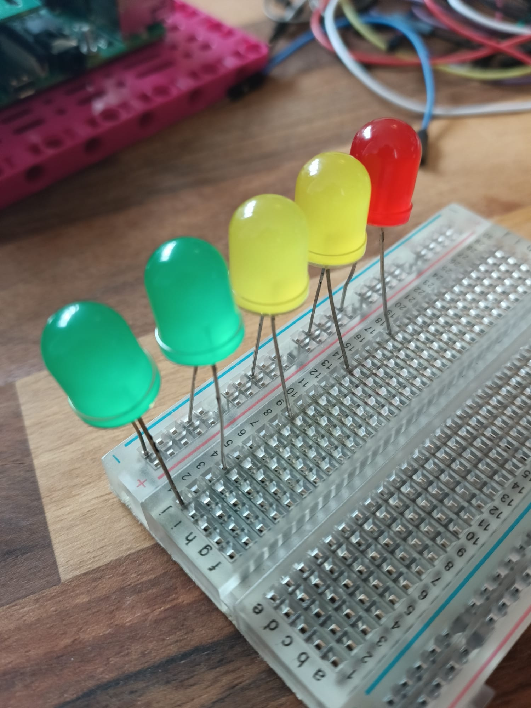

## Make an LED scale

Another really cool way to display data is by using a series of LEDs to turn on and off as readings change - the higher the reading, the more LEDs are lit. Like a graphic equaliser on your computer showing the volume of your music:

To make an LED display, you'll need a few LED bulbs - the more bulbs you have, the more precise your scale will be. There is an upper limit though - you can only have as many LEDs as there are available GPIO pins. In this example we're using 5 LEDs, but you *could* connect more than ten if you choose.

**Note:** Because of the way the BuildHAT is designed, you **can't access GPIO 14 or 15 (pins 8 and 10)**.

--- task ---

Collect your LEDs, resistors, M-F jumper cables and breadboard together. 

--- /task ---

--- task ---

Look closely at your LEDs - you'll notice that one leg is longer than the other. 

--- /task ---

--- task ---

Insert the **short leg** of your LEDs into the **common ground rail** along the edge of your breadboard (it's the one next to the blue line at the very edge), and the long leg into the nearest numbered row:

--- /task ---

You need to add a resistor to the circuit, to protect the LEDs from overloading and burning out or popping. Let's do that now.

--- task ---

Take a resistor and insert one end into the **same row** as the first LED in your sequence. Insert the other end of the resistor into the same row, but **on the other side of the spine** of your breadboard, like this:

Repeat for all the LEDs in your sequence:

--- /task ---

--- task ---

Insert the M end of your M-F jumper cables into the same row as the resistors, so we can connect them up to the pins on the Raspberry Pi: 

--- /task ---

--- task ---

Take the M end of another jumper cable and insert it into the end of the common ground rail:

--- /task ---

Your finished LED scale should look something like this:

The next step is to connect it to the GPIO pins on the Raspberry Pi. 

--- task ---

Take the F end of the jumper cable connected  to your common ground rail, and connect it to Pin 39. This is one of several ground pins on the Raspberry Pi, which will provide the grounding for *all* of our LED bulbs.

--- /task ---

--- task ---

Connect the other cables up to numbered GPIO pins, taking note of which ones you have attached your LEDs to. 

In this example, we have used pins 16, 19, 20,21 and 26 (to keep them all at one end for tidiness):

--- /task ---

Now that your LED sequence is connected to your Raspberry Pi, we need to power it up and program it. 

--- task ---

Connect the 7.5V power supply to the barrel jack on your BuildHAT. You should see your Raspberry Pi power up and load the Raspbian Desktop.

--- /task ---

--- task ---
Open Thonny from your programming menu. 

The first lines of our script will import the gpiozero and randint libraries and set up your LEDs to be controllable. You will need to change the values in brackets to match the numbered pins you are connected to. **Note:** The order of these numbers is important! The pin numbers should go from the lowest on your 'bar graph' to the highest.

In the blank window enter the following code :

--- code ---
---
language: python
filename: led_bargraph.py
line_numbers: true
line_number_start: 1
line_highlights: 
---
from gpiozero import LEDBarGraph
from random import randint

graph = LEDBarGraph(16, 19, 20, 21, 26) # the order of these numbers should match the pins you connected up 

--- /code ---

--- /task ---

Now that we have our LEDs ready to program, the next part of our code should pull the data we want to measure, then determine how many LEDs to switch on based on the result. For testing purposes, we'll use random data.

Our intention is to have the LEDs turn on as the reading increases, and to turn off as it decreases. As with the other indicators, we will need to map our data across our new scale. 

--- task ---

Enter the following code at the end of your open script:

--- code ---
---
language: python
filename: led_sequence.py
line_numbers: true
line_number_start: 9
line_highlights: 
---
while True:
  data_reading = randint(0, 100)
  graph.value = 1/data_reading # this creates a decimal value for the graph to display
  sleep(0.5)
--- /code ---

--- /task ---

--- task ---

Save your work as led_sequence.py and click Run. You should see your bar graph begin to light up!

--- /task ---

--- save ---