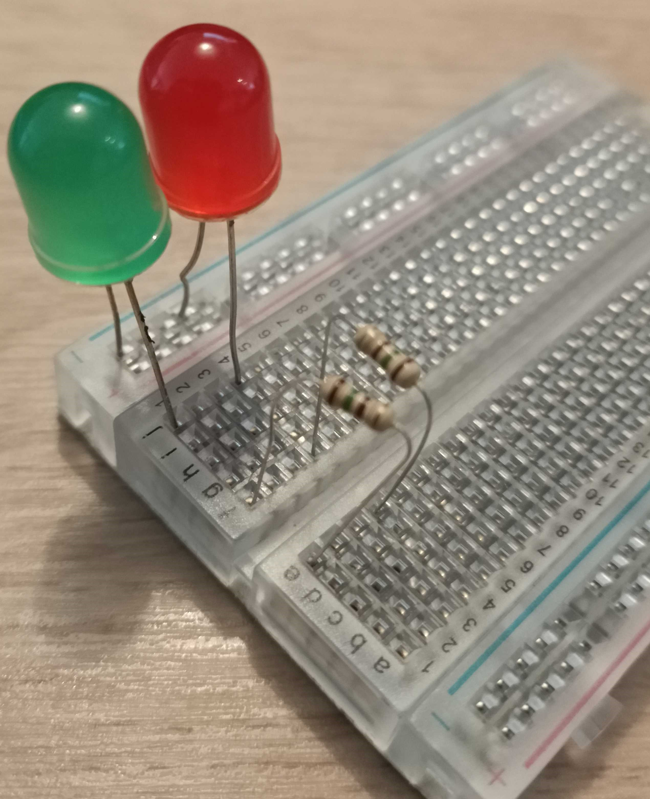

## Choose the time with a LEGO clock

When looking at data readings, it can be helpful to be able to sort by time. This is particularly useful with environmental data, as it allows us to look at historical trends in order to predict future outcomes - like the weather forecast. 

It is possible to use a LEGO motor to simulate a clock face and recall data for a specific time. We can measure the angle of the motor when you move the indicator to a specific time, and then use an external switch to tell us if it's am or pm time. Ie., if the switch is closed, it's pm. It is also possible to make a 24 hour clock face (but less precise and not much easier) so we will make the 12 hour face for this example.

You can create your own clock face on paper and cut it out, or use our printable version which you can [get by clicking here](images/clockface.jpg){:target="_blank"}.

--- task ---
Follow these build instructions to create a LEGO clock:

<mark>INSERT BUILD PDF WHEN DONE</mark>

--- /task --- 

--- task ---

Take a yellow plate element and attach two blue beams using 90 degree stud brackets to make legs.

--- /task ---

--- task ---

Mount two blue extended studs into the side of the motor with the blue rotor, with the short end into the motor's ports.

--- /task ---

--- task ---

Before attaching the motor to the rear of the slider's axle, make sure that it is 'zeroed in', by lining up the two lollipop symbols on the motor's edge:

--- /task ---

--- task ---

Mount the motor about halfway up your plate element, with the rotor against the plate. Make sure the cable extends from the bottom of the motor.

--- /task ---

--- task ---

Insert a short axle into the centre of the motor, through the plate element.

--- /task ---

--- task ---

Place your clock face over the axle, poking it through the centre. Use blu-tac or similar adhesive to stick it down evenly, making sure the 12 is pointing up.
 

--- /task ---

--- task ---

Mount a 90 degree elbow onto the end of the axle, pointing up. Insert a 50mm axle into the elbow to make an indicator.

--- /task ---

--- task ---

Take your LEGO Spark Force Sensor and add a grey double stud bracket to one side, so it is mounted vertically. 

--- /task ---

--- task ---

Add a flat 3x3 element to the top of the force sensor.  

--- /task ---

--- task ---

Clip the force sensor to the side of the yellow build element. 

--- /task ---
--- task ---

Collect your LEDs, resistors, M-F jumper cables and breadboard together. 

--- /task ---

--- task ---

Look closely at your LEDs - you'll notice that one leg is longer than the other. 

--- /task ---

--- task ---

Insert the **short leg** of your LEDs into the **common ground rail** along the edge of your breadboard (it's the one next to the blue line at the very edge), and the long leg into the nearest numbered row:

--- /task ---

You need to add a resistor to the circuit, to protect the LEDs from overloading and burning out or popping. Let's do that now.

--- task ---

Take a resistor and insert one end into the **same row** as the first LED in your sequence. Insert the other end of the resistor into the same row, but **on the other side of the spine** of your breadboard, like this:

Repeat for the other LED:

--- /task ---

--- task ---

Insert the M end of your M-F jumper cables into the same row as the resistors, so we can connect them up to the pins on the Raspberry Pi: 

--- /task ---

--- task ---

Take the M end of another jumper cable and insert it into the common ground rail:

--- /task ---

Your finished LED indicator should look something like this:

The next step is to connect it to the GPIO pins on the Raspberry Pi. 

--- task ---

Take the F end of the jumper cable connected  to your common ground rail, and connect it to Pin 39. This is one of several ground pins on the Raspberry Pi, which will provide the grounding for both of our LED bulbs.

--- /task ---

--- task ---

Attach the 'am bulb' (the bulb that will light when the time is am) to pin 38 (GPIO20) and the 'pm bulb' to pin 40 (GPIO21). 
[Image showing jumper cables trailing from the Raspberry Pi GPIO pins](images/clockbuild15.jpg)

--- /task ---

Your finished clock apparatus should look a little like this: 
[Image showing jumper cables trailing from the Raspberry Pi GPIO pins](images/clockbuild16.jpg)

### Program your clock to recognise the time

Now, we need to program our motor to recognise what angle it is set to, and convert that into time we can use to query our API. Once we know our clock can be used to select the time, we can pass that value into our API query as part of our timestamp.

--- task ---

Connect the motor of your slider to Port A on your BuildHAT. Connect the Force Sensor to Port B on your BuildHAT.

--- /task ---

--- task ---

We will be using the BuildHAT python library, so make sure it is installed:

--- collapse ---
---
title: Installing the BuildHAT python library
---

Open a terminal window on your Raspberry Pi by pressing `Ctrl + Alt + T`.

At the prompt type: `pip3 install buildhat`

Press Enter and wait for the 'installation completed' message.

--- /collapse ---

--- /task ---

The first part of our code imports the libraries we will need, and sets up our motor as an input as well as a force sensor to use as a button which will select whether the time is am or pm. We'll also connect some LEDs to show which one is currently selected.

--- task ---

Open Thonny on your Raspberry Pi from the Programming menu. 

Enter the following code in a blank tab:

--- code ---
---
language: python
filename: clockface.py
line_numbers: true
line_number_start: 1
line_highlights: 
---
from buildhat import Motor, ForceSensor
from time import sleep
from math import floor
from gpiozero import LED

motor_time = Motor('A')
motor_time.run_to_position(0,100)
button = ForceSensor('B')

time = 0
am_led = LED(20)
pm_led = LED(21)

--- /code ---

--- /task ---

Now that we have set up our motors and force sensor button, we need to create a function that will recognised when the button is pressed and change the time to am or pm, then light an LED showing which one is currently selected. 

--- task ---

At the bottom of your script, ass the following code:

--- code ---
---
language: python
filename: clockface.py
line_numbers: true
line_number_start: 14
line_highlights: 
---
def change_time():
    global time
    if time == 0:
        time = 12:
        am_led.off()
        pm_led.on()
    else:
        time = 0
        am_led.on()
        pm_led.off()

--- /code ---

The next part of our code looks at the angle the motor is set to, then converts that into time by working out how far between two hours the hand is, and calculating the minutes. It then prints these values as part of a string, telling you the time. 

--- task ---

At the bottom of your script add the following:

--- code ---
---
language: python
filename: clockface.py
line_numbers: true
line_number_start: 25
line_highlights: 
---
def time_check():
    angle = motor_time.get_aposition() #Find what angle the hand is at
    print(angle)
    
    if angle <0:
        angle += 360 #Convert negative angle to positive
    else:
        pass
    print(angle)

    if time == 0:
        meridian = "am"
    else:
        meridian = "pm"
    
    hour = int(floor(angle/30)) #find the hour by using 30 degree increments
    hour24 = int(floor(angle/30))+ time  #find 24 hour time by adding 12
    minute = int(((angle - (30*hour))/30)*60) #calculate the minutes by working out the decimal remainder as a portion of 60 mins
    
    if angle == 0:
        print("Choose a time on the clock! Press the button to switch between am and pm!")
    else:
        print(f'The time is ' + (str(hour).zfill(2)) +':'+(str(minute).zfill(2)) +' ' + meridian)
    sleep(1)

--- /code ---

--- /task ---

Now that we have defined the two functions that will allow us to switch between am and pm times, as well as use the clock face to check the time - we just need to call them when we want them to run.

--- task ---
At the bottom of your code add the following lines:

--- code ---
---
language: python
filename: clockface.py
line_numbers: true
line_number_start: 50
line_highlights: 
---
while True:
    button.when_pressed = change_time
    button.when_released = time_check
    pause()

--- /code ---

--- /task ---

--- task ---

Save your code as clockface.py and click Run. Your clock should set itself to 12. Adjust it to new positions then press the button, and you should see a readout of the indicated time in your console.

--- /task ---

--- save ---