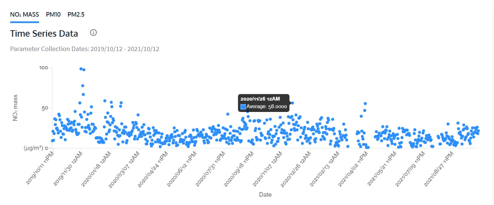

## Display pollution data with your dashboard

At the moment, your dash uses random integers between -175 and 175; these numbers are used because they are the motor's limits of travel in each direction. (We don't go to 180 as it can cause problems with travel around a full rotation.) The data coming in from your API won't have this same range, so you need to make it fit the motors.

**Calibrating** the indicators means mapping the maximum and minimum possible data values from your API to between -175° and 175° on your motor. The highest possible reading will be at -175°, whereas the lowest possible reading will be at 175°. (Because you have mounted the motors in reverse!)

For our example, we will display the **fine particles (PM2.5)** measurement on the gauge, while the slider will display the nitrogen dioxide (NO2) level. The term **fine particles**, or particulate matter 2.5 (PM2.5), refers to tiny particles or droplets in the air that are two and a half microns (or less) in width. The particles measured by PM2.5 are what make up most smoke and smog, and make it hard to see.

Like inches, metres, and millimetres, a micron is a unit of measurement for distance. There are about 25,000 microns in an inch. The widths of the larger particles in the PM2.5 size range would be about thirty times smaller than that of a human hair. These particles are so small that several thousand of them could fit on the full stop at the end of this sentence.
 

In our example, the slider will display the nitrogen dioxide (NO2) level. The maximum possible reading on your slider will depend on your chosen location, because urban areas will always have higher readings than rural ones. The minimum reading possible is obviously 0, but you will want to consider what the normal range is for what you are measuring and add a bit to that.  

To work out what the maximum likely reading should be, you can see the historical data from your chosen location on the webpage you opened earlier:

Here, you can see that while there are some major outliers, around 60% (or 0.6) should be more than enough as your maximum value for most readings from the Sandy Roadside air quality station. (If you want to simply make your scale from 1 to 100, you can do that too — just make `max_value = 100`.)

--- task ---

Connect your sliding indicator motor to port A on the Build HAT. 
Connect your gauge indicator motor to port B.

--- /task ---

--- task ---

In a new Thonny window, type the following:

--- code ---
---
language: python
filename: data_dash.py
line_numbers: true
line_number_start: 1
line_highlights: 
---
from buildhat import Motor
from time import sleep
from datetime import datetime, timedelta
import requests

no2_motor = Motor('A')           #Set up slider motor
no2_motor.run_to_position(0,100) #Reset slider position
pm25_motor = Motor('B')           #Set up gauge motor
pm25_motor.run_to_position(0,100) # Reset gauge position

no2_min_value = 0         #The lowest NO2 reading you think you will get (this should hopefully be around 0)
no2_max_value = 60        #The highest NO2 reading you think you will get 
no2_min_angle = 175       #Minimum motor travel
no2_max_angle = -175      #Maximum motor travel

pm25_min_value = 0        #The lowest PM2.5 reading you think you will get (this should hopefully be around 0)
pm25_max_value = 100      #The highest PM2.5 reading you think you will get 
pm25_min_angle = 175      #Minimum motor travel
pm25_max_angle = -175     #Maximum motor travel

--- /code ---

--- /task ---

Now that you have imported the necessary libraries and set up your measurement details, you can set up your query to the API by making a few **dictionaries** of terms you will use.

--- task ---

In your Thonny window, add this code to the end of your script:

--- code ---
---
language: python
filename: data_dash.py
line_numbers: true
line_number_start: 21
line_highlights: 
---
base_url = 'https://docs.openaq.org/v2/measurements'

payload = {                    #Create a dictionary for the API request
    'date_from':'',
    'date_to':'',
    'location_id':'2480',      #This number should be the ID number taken from the URL earlier
    'order_by':'datetime',
    'sort':'asc',
    'has_geo':'true',
    'limit':'100',
    'offset':'0',
}

pollution = {                  #Create a dictionary for the pollution readings
    'no2' : 0,                 #Here we are looking for NO2 and PM25 — yours may differ!
    'pm25': 0,
    }

--- /code ---

--- /task ---

The next function you need to write will query the API using the parameters you have set up. 

--- task ---
 
At the end of your script, add this code:

--- code ---
---
language: python
filename: data_dash.py
line_numbers: true
line_number_start: 39
line_highlights: 
---
def check_air():
    now = datetime.now()           #Gets the time now
    delta = datetime.now() - timedelta(days=1)         #Creates a time difference of one day
    
    payload['date_from'] = f'{delta:%Y-%m-%d}T{delta:%H:%M:%S}+00:00'  #Inserts your date and time into the dictionary above
    payload['date_to'] = f'{now:%Y-%m-%d}T{now:%H:%M:%S}+00:00'
    
    response = requests.get(base_url, params=payload)          #Queries the API database
    
    if response.status_code != 200:          #Check for connection to API
        print('no response from server')
        return
    
    data = response.json()
        
    for reading in data['results']:
        if reading['parameter'] == 'no2':       #This will depend upon what pollutant you are measuring
            pollution['no2'] = reading['value']
            print(pollution['no2'])
        if reading['parameter'] == 'pm25':      #This will depend upon what pollutant you are measuring
            pollution['pm25'] = reading['value']
            print(pollution['pm25'])

    output_results()   
    sleep(1)

 --- /code ---

 --- /task ---

The next part you will write will do some clever maths to map your data range across the motor range. (It's basically the same as the function used in the [LEGO Data plotter project](https://learning-admin.raspberrypi.org/en/projects/lego-plotter/6).)
 
--- task ---

Add this function beneath your existing code:

--- code ---
---
language: python
filename: data_dash.py
line_numbers: true
line_number_start: 65
line_highlights: 
---
def remap(min_value, max_value, min_angle, max_angle, sensor_data):                    #Create function
    value_range = (max_value - min_value)                                              #Work out how wide your value range is
    motor_range = (max_angle - min_angle)                                              #Work out how wide your motor range is
    mapped = (((sensor_data - min_value) * motor_range) / value_range) + min_angle     #Stretch your value range across your motor range
    return int(mapped)                                           #Give back a number that shows the value as an angle on the motor

--- /code ---

--- /task ---

Now that your function has been created, you need to make a loop that will:

+ Find the angle the motor is currently at
+ Pull the pollutant data from the `remap` function to use as the new angle for your motors
+ Move to the new angle to display the reading

--- task ---

Add the following code to the end of your script, on a new line:

--- code ---
---
language: python
filename: data_dash.py
line_numbers: true
line_number_start: 73
line_highlights: 
---
def output_results():
    print(f'NO2 = {pollution['no2']}')
    no2_current_angle = no2_motor.get_aposition()
    no2_sensor_data = int(pollution['no2'])
    no2_new_angle = remap(no2_min_value, no2_max_value, no2_min_angle, no2_max_angle, no2_sensor_data)
    print(no2_new_angle)
    if no2_new_angle > no2_current_angle:
        no2_motor.run_to_position(no2_new_angle, 100, direction='anticlockwise')
        print('Turning CW')
    elif no2_new_angle < no2_current_angle:
        no2_motor.run_to_position(no2_new_angle, 100, direction='clockwise')
        print('Turning ACW')
    sleep(0.1)
    pm25_sensor_data = int(pollution['pm25'])
    print(f"PM2.5 = {pollution['pm25']}")
    pm25_current_angle = pm25_motor.get_aposition()
    print(pm25_current_angle)
    pm25_new_angle = remap(pm25_min_value, pm25_max_value, pm25_min_angle, pm25_max_angle, pm25_sensor_data)
    pm25_motor.run_to_position(pm25_new_angle, 100)

--- /code ---

--- /task ---

The last part of your code now needs to call your `check_air()` function to make it all go, and periodically check the API for updated data. 

--- task ---

At the end of your script, on a new line (make sure it isn't indented), type:

--- code ---
---
language: python
filename: data_dash.py
line_numbers: true
line_number_start: 93
line_highlights: 
---
while True:
    check_air()
    sleep(3600)   #Wait an hour before checking again (make this smaller for testing purposes)
--- /code ---

--- /task ---

--- task ---

Save your work as `data_dash.py` and click **Run**. Your slider should move to display the current NO2 reading from your chosen OpenAQ station, and your gauge should move to display the PM2.5 reading. Well done!

--- /task ---

--- save ---
