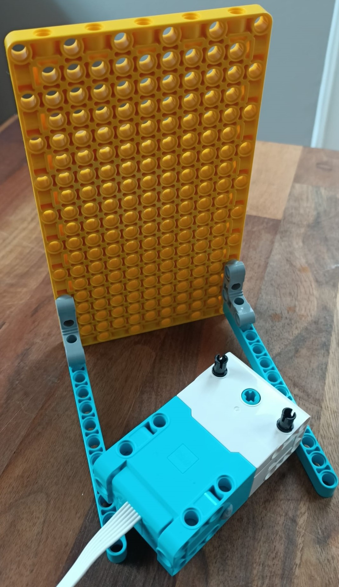
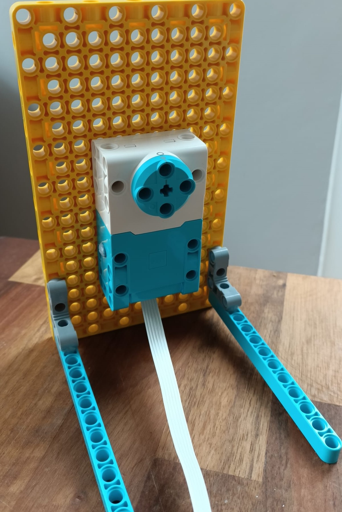
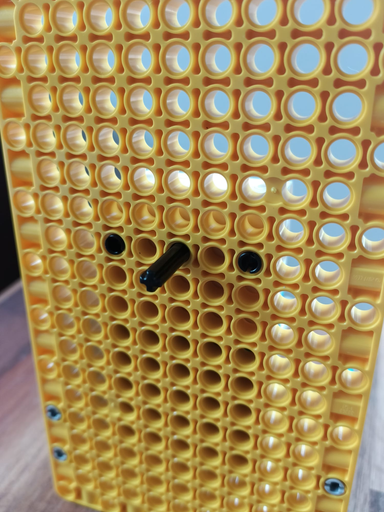

## Choose the time with a LEGO clock

When looking at data readings, it can be helpful to be able to sort by time. This is particularly useful with environmental data, as it allows us to look at historical trends in order to predict future outcomes - like the weather forecast. 

It is possible to use a LEGO motor to simulate a clock face and recall data for a specific time. We can measure the angle of the motor when you move the indicator to a specific time, and then use an external switch to tell us if it's am or pm time. Ie., if the switch is closed, it's pm. It is also possible to make a 24 hour clock face (but less precise and not much easier) so we will make the 12 hour face for this example.

--- task ---
Follow these build instructions to create a vertical sliding indicator:

<mark>INSERT BUILD PDF WHEN DONE</mark>

--- /task --- 

--- task ---

Take a yellow plate element and attach two blue beams using 90 degree stud brackets to make legs.

--- /task ---

--- task ---

Mount two blue extended studs into the side of the motor with the blue rotor, with the short end into the motor's ports.

--- /task ---

--- task ---

Before attaching the motor to the rear of the slider's axle, make sure that it is 'zeroed in', by lining up the two lollipop symbols on the motor's edge:

--- /task ---

--- task ---

Mount the motor about halfway up your plate element, with the rotor against the plate. Make sure the cable extends from the bottom of the motor.

--- /task ---

--- task ---

Insert a short axle into the centre of the motor, through the plate element.

--- /task ---

--- task ---

Place your clock face over the axle, poking it through the centre. Use blu-tac or similar adhesive to stick it down evenly, making sure the 12 is pointing up.
 

--- task ---

Mount a 90 degree elbow onto the end of the axle, pointing up. Insert a 50mm axle into the elbow to make an indicator.

--- /task ---

### Program your clock to recognise the time

Now, we need to program our motor to recognise what angle it is set to, and convert that into time we can use to query our API. Once we know our clock can be used to select the time, we can pass that value into our API query as part of our timestamp.

--- task ---

Connect the motor of your slider to Port A on your BuildHAT.

--- /task ---

--- task ---

We will be using the BuildHAT python library, so make sure it is installed:

--- collapse ---
---
title: Installing the BuildHAT python library
---

Open a terminal window on your Raspberry Pi by pressing `Ctrl + Alt + T`.

At the prompt type: `pip3 install buildhat`

Press Enter and wait for the 'installation completed' message.

--- /collapse ---

--- /task ---

The first part of our code imports the libraries we will need, and sets up our motor as an input.

--- task ---

Open Thonny on your Raspberry Pi from the Programming menu. 

Enter the following code in a blank tab:

--- code ---
---
language: python
filename: clockface.py
line_numbers: true
line_number_start: 1
line_highlights: 
---
from buildhat import Motor
from time import sleep
from math import floor
from gpiozero import Button

motor_time = Motor('A')
motor_time.run_to_position(0,100)
button = Button(21)

--- /code ---

--- /task ---

THe next part of our code looks at the angle the motor is set to, then converts that into time by working out how far between two hours the hand is, and calculating the minutes. It then prints these values as part of a string, telling you the time. 

--- task ---

At the bottom of your script add the following:

--- code ---
---
language: python
filename: clockface.py
line_numbers: true
line_number_start: 10
line_highlights: 
---
while True:
    angle = motor_time.get_aposition() #Find what angle the hand is at
    print(angle)
    
    if angle <0:
        angle += 360 #Convert negative angle to positive
    else:
        pass
    print(angle)

    if button.is_pressed:
        meridian = "am"
    else:
        meridian = "pm"
    
    hour = int(floor(angle/30)) #find the hour by using 30 degree increments
    minute = int(((angle - (30*hour))/30)*60) #calculate the minutes by working out the decimal remainder as a portion of 60 mins
    
    if angle == 0:
        print("Choose a time on the clock! Flip the switch closed for am, open for pm!")
    else:
        print('The time is ' + (str(hour).zfill(2)) +':'+(str(minute).zfill(2)) +' ' + meridian)
    sleep(1)

--- code ---

--- /task ---

--- task ---

Save your code as clockface,py and click Run. Your clock should set itself to 12. Adjust it to new positions and you should see a readout of the indicated time in your console.

--- /task ---

--- save ---