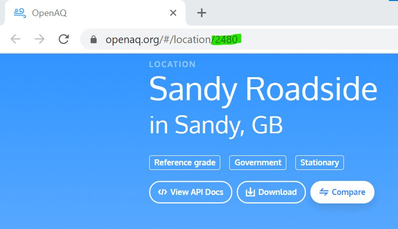

## Accessing your chosen API

API is the acronym for **Application Programming Interface**, which is software that allows two applications to talk to each other. Each time you use an app like Facebook, send an instant message, or check the weather on your phone, you’re using an API.
 

Whenever you use an app on your phone, the app connects to the Internet and sends data about what you want to know to a server. The server then finds and retrieves the data you want, interprets it and sends it back to your phone. The app then takes that data that has been returned and presents you with the information you wanted in a readable way. This is what an API is; a way to control other machines over the internet - all of this happens through the **API**.

The cool part is; we can write our own apps that investigate online databases of information and return them to our LEGO data dashboard instead of a phone - we'll use our Raspberry Pi as the brains to get that data, then display it on our hand made, custom LEGO indicators!

### OpenAQ - the open source air quality database

In our example dashboard we're going to be using the API for [**OpenAQ**](https://openaq.org/#/){:target="_blank"}, an open-source, global air quality data project. OpenAQ allows us to look at lots of different air pollution data from all over the globe, collected by thousands of measurement stations around the world. 

If you're already a wizard with APIs, you can use any data you like to represent on your dashboard. If you want to follow along with us and use OpenAQ for your first try, we'll need to find out which measurement station you want to investigate and which measurements you are able to view.

--- task ---

**Navigate** to the OpenAQ map by [clicking here](https://openaq.org/#/map){:target="_blank"}. A webpage showing a world map covered in dots should appear.

--- /task --- 

--- task ---

**Decide** where in the world you would like to gather data about air quality. This could be the area near where you live, somewhere that interests you, or somewhere that you think might have interesting data.

--- /task --- 

As our Headquarters is in Cambridge, in the United Kingdom, we will use that as the example here.  

There are many different measurements taken by air quality monitoring stations. The OpenAQ database has information on the following types of air pollution:

 + PM 2.5 and PM10 - Particulate Matter: microscopic particles floating in the air (smoke, smog)
 + NO2 - Nitrogen Dioxide: causes ozone creation, causes asthma in children
 + CO - Carbon Monoxide: deadly to humans, side effect of burning fossil fuels
 + SO2 - Sulfur Dioxide: smells bad, can cause breathing problems, creates acid rain, side effect of industrial treatments
 + o3 - Ozone: created when NO2 reacts to sunlight, causes smog, harmful to plants
 + BC - Black Carbon: not measured in many places (US & Poland), caused by inefficient fuel burning, adds to global warming, dangerous to humans

--- task ---

**Decide** upon what kind of air pollution you are most interested in measuring. You can choose different options from the pulldown menu near the coloured scale on the left of the screen.

--- task ---

**Zoom in** to your chosen area on the map, and find the dot closest to the place you would like to measure. Click on that nearest dot, to see the location details. In the pop-up that appears, click the button that says **View Location**. 

--- /task ---

--- task ---

When the new webpage loads showing the details of the measurements taken at the location, **make a note** of the number in the URL of the new page. This is the OpenAQ identification number for your chosen air quality station. (In this example it is the Sandy Roadside measurement station, with ID number **2480**.)

--- /task ---

--- task ---

On the location page, you will see the different types of pollutants measured by that location. **Choose** two from that list that you would like to represent on your data dashboard.

This measurement station near Sandy can show NO2, PM10 and PM2.5 - so we'll use NO2 and PM2.5 in the example.  

--- /task ---

