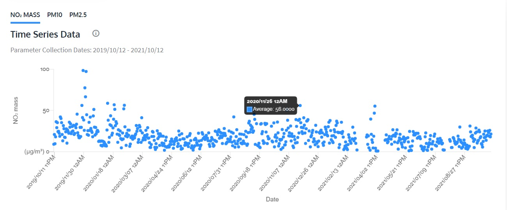

## Display pollution data with your Dashboard

### Program your slider to display the NO2 level

At the moment your slider is running off of random integers between -175 and 175. (We don't go to 180 as it can cause problems with travel around a full rotation.) We picked these numbers because they are the motor's limits of travel in each direction. The data coming in from your API won't have this same range - we need to make it fit the motor.

**Calibrating** the indicator will mean mapping the maximum and minimum possible data values from your API between -175° and 175° on your motor. The highest possible reading will be at 175°, while the lowest possible reading will be at -175°. 

For example: if it's displaying the Nitrogen Dioxide (NO2) level, the minimum and maximum possible reading on your slider will depend on where you live. The minimum reading possible is obviously 0, and we will want to consider what the normal range for what we are attempting to measure and add a bit to that.  

In order to work out what the maximum likely reading should be, you can see the historical data from your chosen location on the webpage you opened earlier:

Here we can see that while there are some major outliers, around 60% (or 0.6) should be more than enough as our maximum value for most readings from Sandy Roadside.

--- task ---

Connect your sliding indicator motor to Port 'A'.

--- /task ---

--- task ---

In a new Thonny window, type the following:

--- code ---
---
language: python
filename: data_dash.py
line_numbers: true
line_number_start: 1
line_highlights: 
---
from buildhat import Motor
from time import sleep
from datetime import datetime
import requests

no2_motor = Motor('A')
no2_min_value = 0 # the lowest NO2 reading you think you will get (This should hopefully be around 0)
no2_max_value = 0.6 #the highest NO2 reading you think you will get 
no2_min_angle = -175
no2_max_angle = 175

--- /code ---

--- /task ---

Now that we have imported the necessary libraries and set up our measurement details, we will set up our query to the API by making a few **dictionaries** of terms we will use.

--- task ---
 In your window add this code to the end of your script:

--- code ---
---
language: python
filename: data_dash.py
line_numbers: true
line_number_start: 12
line_highlights: 
---
base_url = "https://docs.openaq.org/v2/measurements"

payload = {
    'date_from':'',
    'date_to':'',
    'location_id':'70977',
    'order_by':'datetime',
    'sort':'asc',
    'has_geo':'true',
    'limit':'100',
    'offset':'0',
}

pollution = {
    'pm25': 0,
    'pm10': 0,
    'o3' : 0,
    }

--- /code ---

--- /task ---

The next function we need to write will query the API using the parameters we have set up. 

--- task ---
 
At the end of your script, add this code:

--- code ---
---
language: python
filename: data_dash.py
line_numbers: true
line_number_start: 11
line_highlights: 
---
def check_weather():
    now = datetime.now()

    time_from = int(floor(angle/30)) + time  #find 24 hour time by adding 12
    time_to = time_from + 1

    payload['date_from'] = f'{now:%Y-%m-%d}T{now:%H-%M:%S}+00:00'
    payload['date_to'] = f'{now:%Y-%m-%d}T{now:%H:%M:%S}+00:00'
    print(payload['date_from'])
    print(payload['date_to'])
    
    response = requests.get(base_url, params=payload)
    
    if response.status_code != 200:
        return
    
    data = response.json()
    
    for reading in data['results']:
        if reading['parameter'] == 'no2': # This will depend upon what pollutant you are measuring
            pollution['no2'] = reading['value']
        if reading['parameter'] == 'pm25': # This will depend upon what pollutant you are measuring
            pollution['pm25'] = reading['value']

    output_results()   
    sleep(1)
 --- /code ---

 --- /task ---

The next part we will write will do some clever maths to map our data range across the motor range. (It's basically the same as the function used in the [LEGO Data Plotter project](https://learning-admin.raspberrypi.org/en/projects/lego-plotter/6).)
 
--- task ---

Add this function beneath your existing code:

--- code ---
---
language: python
filename: data_dash.py
line_numbers: true
line_number_start: 11
line_highlights: 
---
def no2_remap(no2_min_value, no2_max_value, no2_min_angle, no2_max_angle, no2_sensor_data):
    no2_value_range = (no2_max_value - no2_min_value)
    no2_motor_range = (no2_max_angle - no2_min_angle)
    no2_mapped = (((no2_sensor_data - no2_min_value) * no2_motor_range) / no2_value_range) + no2_min_angle
    return int(no2_mapped)
    print(no2_mapped)

--- /code ---

--- /task ---

Now that our function has been created, we need to make a loop that will:

+ pull the pollutant data from the API
+ find the angle the motor is currently at
+ move to the new angle to display the reading

--- task ---

Add the following code to the end of your script, on a new line:

--- code ---
---
language: python
filename: data_dash.py
line_numbers: true
line_number_start: 18
line_highlights: 
---
def output_results():
    print(f"NO2 = {pollution['no2']}")
    print(f"PM2.5 = {pollution['pm25']}")
    current_angle = motor_slider.get_aposition()
    no2_sensor_data = int({pollution['no2']})
    new_angle = no2_remap(no2_min_value, no2_max_value, no2_min_angle, no2_max_angle, no2_sensor_data)
    print(new_angle)
    if new_angle > current_angle:
        motor_slider.run_to_position(new_angle, 100, direction="clockwise")
        print('Turning CW')
    elif new_angle < current_angle:
        motor_slider.run_to_position(new_angle, 100, direction="anticlockwise")
        print('Turning ACW')
    sleep(0.1)

--- /code ---

--- /task ---

--- task ---

Save your work as `data_dash.py` and click Run. Your slider should move to display the current NO2 reading. 

--- /task ---

## Program your gauge to show air pollution level

### Calibrate your gauge

At the moment your gauge is running off of random integers between -175 and 175. Calibrating it will mean mapping the maximum and minimum possible data values from your API between -175 and 175 on your motor. The highest possible reading will be at 175 degrees, while the lowest possible reading will be at -175.

For our example we will measure the **fine particles (PM2.5)** measurement.The term **fine particles**, or particulate matter 2.5 (PM2.5), refers to tiny particles or droplets in the air that are two and a half microns (or less) in width. The particles measured by PM2.5 are what make up most smoke and smog, and make it hard to see.

Like inches, meters and miles, a micron is a unit of measurement for distance. There are about 25,000 microns in an inch. The widths of the larger particles in the PM2.5 size range would be about thirty times smaller than that of a human hair.  These particles are so small that several thousand of them could fit on the full stop at the end of this sentence.
 

--- task ---

Connect the motor from your gauge to port B on the BuildHAT.

--- /task ---

--- task ---

Change your `data_dash.py` script to match the following, filling in the variables with your own information as you go:

`pm25_min_value` is the lowest pm25 air pollution reading you think you will get (This should hopefully be around 0)
`pm25_max_value` is the highest pm25 air pollution reading you think you will get (The maximum possible is 100, but more than about 65 and you'll have trouble seeing!)

--- code ---
---
language: python
filename: gauge_test.py
line_numbers: true
line_number_start: 1 
line_highlights: 11-15, 24-29, 36-38
---
from buildhat import Motor
from time import sleep

no2_motor = Motor('A')
no2_min_value = 0
no2_max_value = 0.3
no2_min_angle = -175
no2_max_angle = 175

pm25_motor = Motor('B')
pm25_min_value = 0 
pm25_max_value = 100
pm25_min_angle = -175
pm25_max_angle = 175

def no2_remap(no2_min_value, no2_max_value, no2_min_angle, no2_max_angle, no2_sensor_data):
    no2_value_range = (no2_max_value - no2_min_value)
    no2_motor_range = (no2_max_angle - no2_min_angle)
    no2_mapped = (((no2_sensor_data - no2_min_value) * no2_motor_range) / no2_value_range) + no2_min_angle
    return int(no2_mapped)
    print(no2_mapped)

def pm25_remap(pm25_min_value, pm25_max_value, pm25_min_angle, pm25_max_angle, pm25_sensor_data):
    pm25_value_range = (pm25_max_value - pm25_min_value)
    pm25_motor_range = (pm25_max_angle - pm25_min_angle)
    pm25_mapped = (((pm25_sensor_data - pm25_min_value) * pm25_motor_range) / pm25_value_range) + pm25_min_angle
    return int(pm25_mapped)
    print(pm25_mapped)

while True:
    no2_sensor_data  =  API command to pull the NO2 data()
    no2_current_angle = no2_motor.get_aposition()
    no2_new_angle = no2_remap(no2_min_value, no2_max_value, no2_min_angle, no2_max_angle, no2_sensor_data)
    sleep(0.5)
    pm25_sensor_data  =  API command to pull the pm25 data()
    pm25_current_angle = pm25_motor.get_aposition()
    pm25_new_angle = pm25_remap(pm25_min_value, pm25_max_value, pm25_min_angle, pm25_max_angle, pm25_sensor_data)

--- /code ---

--- /task ---

--- task ---

Save your work by pressing `Ctrl + s` and click Run. You should see your dash begin displaying your data!

--- /task ---

In the next step, we will use the LEGO clock to choose data by time!

--- save ---