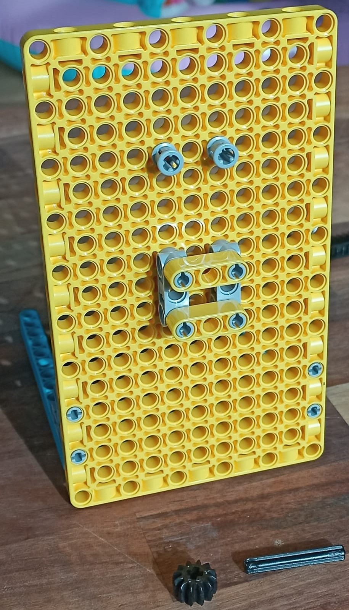
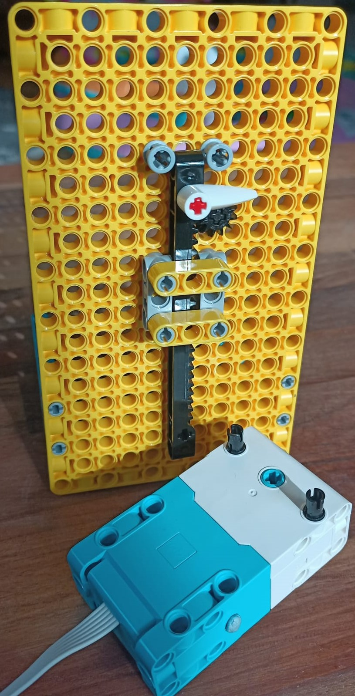

## Haz un indicador deslizante LEGO®

¡Ahora es el momento de hacer un indicador deslizante LEGO®! Si no deseas incluir un indicador deslizante, puedes pasar al siguiente paso, que te muestra cómo crear diales LEGO giratorios.

Así es como se ve un control deslizante vertical:

Los indicadores deslizantes también se pueden ejecutar horizontalmente si lo prefiere, girando la construcción 90 grados en sentido antihorario.

--- task ---

Sigue estas instrucciones de construcción para crear un indicador deslizante vertical:

Para construir este modelo, sigue nuestra útil guía de construcción aquí o [descárgala.](resources/lego-data-dash-slider.pdf)
<embed src="resources/lego-data-dash-slider.pdf" width="600" height="500" alt="pdf" pluginspage="https://www.adobe.com/products/acrobat/readstep2.html">
  
 
  
  

    --- /task ---
  

  
  

    --- task ---
  

  
  

    Toma un elemento de placa amarilla y coloca dos vigas azules usando soportes de pernos de 90 grados. 
  

  
  

    --- /task ---
  

  
  

    --- task ---
  

  
  

    Coloca dos soportes rectos grises, separados por una columna. 
  

  
  

    --- /task ---
  

  
  

    --- task ---
  

  
  

    Fija dos postes grises de doble longitud con espaciadores en un extremo al elemento de placa sobre los soportes. 
  

  
  

    --- /task ---
  

  
  

    --- task ---
  

  
  

    Coloca dos vigas amarillas (de tres orificios) horizontalmente entre los dos soportes rectos. 
  

  
  

    --- /task ---
  

  
  

    --- task ---
  

  
  

    Toma un engranaje negro pequeño y un eje corto y únelos. 
  

  
  

    --- /task ---
  

  
  

    --- task ---
  

  
  

    Inserta el eje a través de la placa de construcción sobre el soporte derecho como se muestra: 
  

  
  

    --- /task ---
  

  
  

    --- task ---
  

  
  

    Toma una barra dentada, un eje rojo y una flecha indicadora. Inserta el eje en un extremo de la barra dentada, con la flecha indicadora apuntando hacia el lado dentado: 
  

  
  

    --- /task ---
  

  
  

    --- task ---
  

  
  

    Desliza la barra dentada hacia abajo en la parte superior del mecanismo.
  

  
  

    Tendrás que tirar del engranaje hacia delante para dejarlo pasar, y luego volver a empujarlo para que encaje entre los dientes. El mecanismo se deslizará fácilmente hacia arriba y hacia abajo mientras el engranaje y el eje estén libres. Conectar un motor lo mantendrá estable. 
  

  
  

    --- /task ---
  

  
  

    --- task ---
  

  
  

    Toma un motor y agrega dos pernos al lado plano, en los dos orificios superiores. 
  

  
  

    --- /task ---
  

  
  

    --- task ---
  

  
  

    Antes de conectar el motor a la parte trasera del eje del control deslizante, asegúrate de que esté "puesto a cero", alineando los dos símbolos en forma de paleta en el borde del motor:
  

  
  

    
  

  
  

    --- /task ---
  

  
  

    --- task ---
  

  
  

    Ajusta la barra dentada de modo que el engranaje se asiente aproximadamente a la mitad de su recorrido, luego monta el motor detrás de la placa usando los dos pernos mientras sostienes la barra dentada en su lugar. Asegúrate de que el eje encaje en el agujero del <strong x-id="1">lado plano</strong> del motor. Deberías mantener el deslizador estable, alrededor de la mitad de la barra. 
  

  
  

    --- /task ---
  

<h3 spaces-before="0">
  Prueba el indicador deslizante
</h3>

  Para programar tu indicador deslizante, puedes reutilizar parte el código escrito en el proyecto <a href="https://projects.raspberrypi.org/en/projects/lego-plotter">Trazador LEGO®</a>, ya que utilizan el mismo mecanismo.

  --- task ---

  Conecta el motor de tu control deslizante al puerto A en tu Build HAT.

  --- /task ---

  --- task ---

  Utilizarás la biblioteca BuildHAT de Python, así que asegúrate de que esté instalada:

  --- collapse ---

<h2 spaces-before="0">
  title: Instala la biblioteca BuildHAT Python
</h2>

  Abre una ventana de terminal en tu Raspberry Pi presionando <kbd>Ctrl</kbd>+<kbd>Alt</kbd>+<kbd>T</kbd>.

  En el indicador, escribe: <code>sudo pip3 install buildhat</code>

  Presiona <kbd>Entrar</kbd> y espera el mensaje "installation completed".

  --- /collapse ---

  --- /task ---

<h3 spaces-before="0">
  Crea la escala para tu indicador deslizante
</h3>

  Ahora que sabes que funciona, deberás crear una escala para el indicador deslizante, para saber lo que significa.

  --- task ---

  Consigue un trozo de cartón del tamaño de tu barra dentada. Pégalo al lado del indicador deslizante, debajo del puntero. Ten listo un marcador o un lápiz.

  --- /task ---

  --- task ---

  Abre <strong x-id="1">Thonny</strong> en tu Raspberry Pi desde el <strong x-id="1">menú de programación</strong>.

  En el <strong x-id="1">Shell</strong> (la ventana en la parte inferior), junto a las tres flechas, escribe: <code>from buildhat import Motor</code> y presiona <kbd>Entrar</kbd>. Deberías ver una nueva línea que aparece con tres flechas más.

  --- /task ---

  --- task ---

  Ahora escribe: <code>motor = = Motor('A')</code> y presiona <kbd>Entrar</kbd>. --- /task ---

  Ahora que has configurado su motor deslizante para que funcione, debes enviarlo a las lecturas máxima y mínima para ver qué tan lejos puede viajar, luego marca esas posiciones en la tarjeta.

  --- task ---

  Escribe: <code>motor.run_to_position (-180, 100)</code> y presiona <kbd>Entrar</kbd>. Marca la tarjeta en el lugar que indica la flecha. Esta es su mínima lectura posible.

  --- /task ---

  --- task ---

  Escribe: <code>motor.run_to_position (180, 100, direction=clockwise)</code> y presiona <kbd>Entrar</kbd>. Marca la tarjeta en el lugar que indica la flecha. Esta es su máxima lectura posible.

  --- /task ---

  Ahora ya sabes dónde están tus lecturas mínima y máxima. Una vez que vincules el deslizador con algunos datos, podrás crear una escala precisa.

<h3 spaces-before="0">
  Programe su indicador deslizante para mostrar datos en vivo
</h3>

  --- task ---

  Ingresa el siguiente código en una pestaña en blanco:

  --- code ---

  language: python filename: slider_test.py line_numbers: true line_number_start: 1

<h2 spaces-before="0">
  line_highlights:
</h2>

  from buildhat import Motor from time import sleep from random import randint

  motor_deslizador = Motor('A')

  motor_deslizador.run_to_position(0,100)

  while True: angulo_actual = motor_slider.get_aposition() nuevo_angulo = randint(-175, 175) print(sensor_data) if nuevo_angulo > angulo_actual: motor_deslizador.run_to_position(nuevo_angulo, 100, direction="clockwise") print('Girando en sentido horario') elif nuevo_angulo < angulo_actual: motor_deslizador.run_to_position(nuevo_angulo, 100, direction="anticlockwise") print('Girando en sentido antihorario') sleep(0.1)

  --- /code ---

  Guarda tu trabajo como <code>slider_test.py</code> y haz clic en <strong x-id="1">Ejecutar</strong>. Deberías ver que tu deslizador se mueva hacia arriba y hacia abajo (¡o hacia atrás!)

  --- /task ---

  --- save ---

