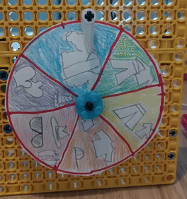

## Haz un medidor LEGO®

Otra forma de mostrar datos rápidamente es utilizando **diales**, también conocidos como **indicadores**. Definitivamente los has visto antes; suelen ser redondos o semicirculares y tienen dos partes principales visibles:

+ La cara, que tiene la escala que se muestra en ella.
+ La aguja, que se mueve a lo largo de la escala para mostrar la lectura de datos.

Un indicador o un cuadrante es el tipo de lectura de datos más simple que puede crear con LEGO®, ya que solo se basa en la creación de la cara y la aguja. Debido a que la aguja o el dial se conectan directamente a su motor, la construcción es muy simple:

--- task ---

Antes de acoplar el motor a la parte trasera del eje del medidor, asegúrese de que esté 'puesto a cero', alineando los dos símbolos de paleta en el borde del motor:

--- /task ---

### Crea una escala

Para terminar de construir el medidor, deberá crear una escala con papel, cartulina u otros materiales de arte. La mecánica y la codificación son exactamente las mismas, pero piense ahora cómo le gustaría que se viera su medidor.

 --- task ---

 **Elige** qué tipo de dial harás.

 Hay dos tipos simples que puedes crear con LEGO®:

+ Un indicador donde la aguja gira para indicar un punto en la cara: 

+ Un indicador donde toda la cara gira para mostrar un punto en la parte superior con un indicador estacionario: 

--- /task ---

--- task ---

En un pedazo de papel en blanco, traza un círculo del tamaño que quieres que sea tu medidor. Marca el centro, y córtalo usando tijeras.

--- /task ---

--- task ---

Divide el círculo en segmentos iguales (uno para cada lectura) dibujando líneas a través del centro, o dibuja tu escala alrededor del borde.

--- /task ---

--- task ---

Dibuja un icono o escribe dentro de cada segmento lo que indica.

--- /task ---

Una vez que hayas terminado de crear la cara del medidor, necesitarás montarla en tu tablero.

--- collapse ---
---
título: Si está creando un calibre de aguja
---

Para terminar de construir tu medidor de aguja:

--- task ---

Desliza la cara hacia abajo sobre tu eje, usando Blu Tack o cinta adhesiva por detrás para pegarla al tablero y evitar que se deslice cuando el eje gira. 

--- /task ---

--- task ---

Agrega un codo de 90 grados al final del eje y coloca otro eje en él. Asegúrate de que es lo suficientemente largo para alcanzar tu escala e indicar claramente las lecturas.

Ayudará más tarde si tu eje apunta derecho hacia arriba (y tu motor está "puesto a cero") cuando lo montas, ya que facilitará el cálculo de la cantidad de rotación necesaria para una lectura.

--- /task ---

--- /collapse ---

--- collapse ---
---
título: Si estás creando un dial de cara giratoria
---

Para terminar de construir un medidor de aguja:

--- task ---

Monta un solo engranaje detrás de cara del medidor como espaciador, para evitar que se enganche en tu tablero. Usa un poco de Blu Tack para pegar la cara a este engranaje. Si has creado una escala incremental alrededor del medidor, móntala con el centro de la escala en la parte superior (en línea con los símbolos de paleta "puestos a cero") y los valores mínimo y máximo en la parte inferior.

--- /task ---

--- /collapse ---

### Prueba tu medidor

--- task ---

Conecta el motor de tu medidor al puerto A de tu Build HAT.

--- /task ---

--- task ---

Utilizarás la biblioteca BuildHAT de Python, así que asegúrate de que esté instalada:

--- collapse ---
---
title: Instala la biblioteca BuildHAT de Python
---

Abre una ventana de terminal en tu Raspberry Pi presionando <kbd>Ctrl</kbd>+<kbd>Alt</kbd>+<kbd>T</kbd>.

En el indicador, escribe: `sudo pip3 install buildhat`

Presiona <kbd>Entrar</kbd> y espera el mensaje "installation completed".

--- /collapse ---

--- /task ---

--- task ---

Abre **Thonny** en tu Raspberry Pi desde el **menú de programación**.

Ingresa el siguiente código en una pestaña en blanco:

--- code ---
---
language: python filename: gauge_test.py line_numbers: true line_number_start: 1
line_highlights:
---
from buildhat import Motor from time import sleep from random import randint

motor_medidor = Motor('A')

motor_medidor.run_to_position(0,100)

while True: angulo = randint(-180, 180) motor_medidor.run_to_position(angulo, 100) sleep(0.3)

--- /code ---

Guarda tu trabajo como `medidor_test.py` y haz clic en **Ejecutar**. ¡Verás que tu medidor empieza a moverse!

--- /task ---
