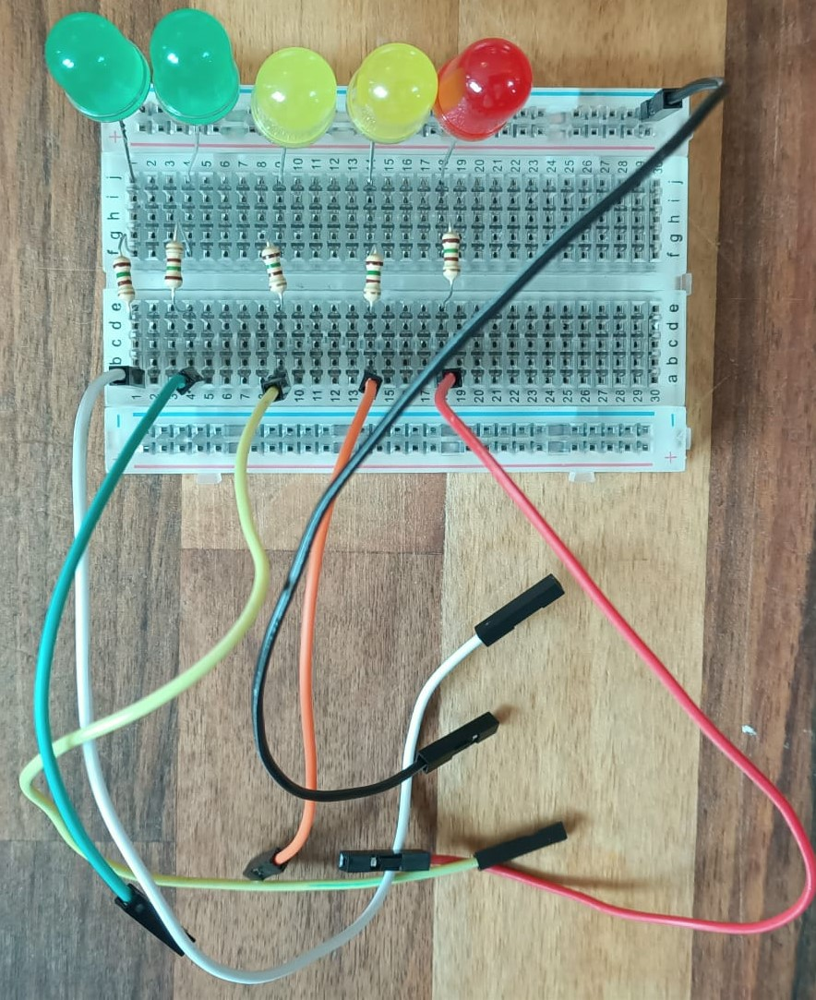
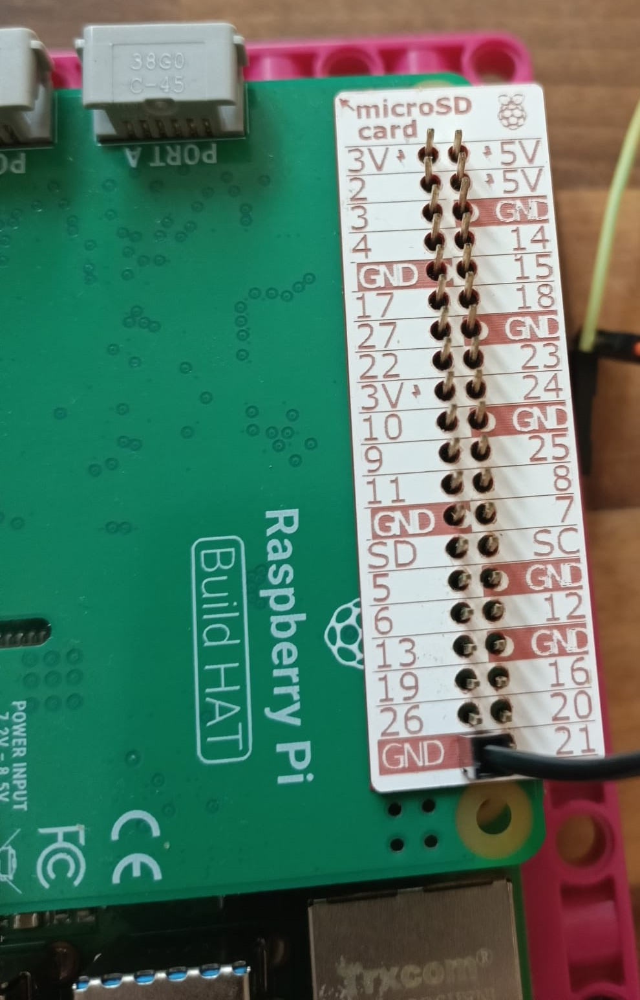
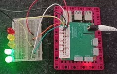

## Haz una escala LED

Otra forma realmente interesante de mostrar datos es mediante el uso de una serie de LEDs que se encienden y apagan a medida que cambian las lecturas: cuanto mayor es la lectura, más LEDs se encienden; como un ecualizador gráfico en tu computadora que muestra el volumen de tu música.

Para hacer una pantalla LED, necesitarás algunas bombillas LED; cuantas más bombillas tengas, más precisa será tu escala. Sin embargo, hay un límite superior: solo puedes tener tantos LEDs como pines GPIO disponibles. En este ejemplo, estamos usando cinco LEDs, pero **podrías** conectar más de diez si lo deseas.

**Nota:** Debido a la forma en que está diseñado Build HAT, **no puedes acceder a GPIO 14 o 15 (pines 8 y 10)**.

--- task ---

Reúne tus LEDs, resistencias, cables de puente M – F y la placa de pruebas. 

--- /task ---

--- task ---

Mira de cerca sus LEDs: notarás que una pata es más larga que la otra. 

--- /task ---

--- task ---

Inserta la **pata corta** de tus LEDs en el **riel de tierra común** a lo largo del borde de tu tablero (es el que está al lado de la línea azul en el borde mismo), y la pata larga en la fila numerada más cercana: 

--- /task ---

Debes agregar una resistencia al circuito para proteger los LEDs de sobrecargas, quemaduras o estallidos. Ahora es un buen momento para hacerlo.

--- task ---

Toma una resistencia e inserta un extremo en la **misma fila** que el primer LED de tu secuencia. Inserta el otro extremo de la resistencia en la misma fila, pero **en el otro lado del lomo** de tu tablero, así:

Repite para todos los LEDs de tu secuencia: 

--- /task ---

--- task ---

Inserta el extremo M de los cables de puente M – F en la misma fila que las resistencias, para que puedas conectarlos a los pines de la Raspberry Pi: 

--- /task ---

--- task ---

Toma el extremo M de otro cable puente e insértalo en el extremo del riel de tierra común: 

--- /task ---

Tu escala de LED terminada debería verse así:

El siguiente paso es conectarlo a los pines GPIO de la Raspberry Pi.

--- task ---

Toma el extremo F del cable de puente conectado a su riel de tierra común y conéctelo al Pin 39. Este es uno de los varios pines de tierra en la Raspberry Pi, que proporcionará la conexión a tierra para **todas las** de sus bombillas LED. 

--- /task ---

--- task ---

Conecta los otros cables a los pines GPIO numerados, tomando nota de a cuáles ha conectado sus LED.

En este ejemplo, hemos utilizado los pines 16, 19, 20, 21 y 26 (para mantenerlos todos en un extremo para que estén ordenados): 

--- /task ---

Ahora que tu secuencia de LED está conectada a su Raspberry Pi, debes encenderla y programarla.

--- task ---

Conecta la fuente de alimentación de 7,5 V al conector de barril de tu Build HAT. Debería ver que tu Raspberry Pi se enciende y carga el escritorio del sistema operativo Raspberry Pi.

--- /task ---

--- task ---

Abre **Thonny** en tu **menú de programación**.

Las primeras líneas de tu script importarán las librerías gpiozero y randint y configurarán tus LEDs para que sean controlables. Necesitarás cambiar los valores entre corchetes para que coincidan con los números de los pines a los que conectaste tus LEDs. **Nota:** ¡El orden de estos números es importante! Los números de pin deben ir desde los más bajos de tu "gráfico de barras" a los más altos.

En la ventana en blanco ingresa el siguiente código:

--- code ---
---
language: python filename: led_bargraph.py line_numbers: true line_number_start: 1
line_highlights:
---
from gpiozero import LEDBarGraph from random import randint

grafico = LEDBarGraph(16, 19, 20, 21, 26) #El orden de estos números debe coincidir con los pines que conectaste

--- /code ---

--- /task ---

Ahora que tienes tus LEDs listos para programar, la siguiente parte del código debería extraer los datos que quieres medir, luego determinar cuántos LEDs encender basado en el resultado. Para fines de prueba, debes utilizar datos aleatorios.

La intención es que los LEDs se enciendan a medida que aumenta la lectura, y que se apaguen a medida que disminuye. Al igual que con los otros indicadores, necesitarás mapear tus datos a través de tu escala.

--- task ---

Agrega el siguiente código al final de tu programa:

--- code ---
---
language: python filename: led_sequence.py line_numbers: true line_number_start: 9
line_highlights:
---
while True: lectura = randint(0, 100) grafico.value = 1/lecture #Esto crea un valor decimar para que el grafico muestre sleep(0.5) --- /code ---

--- /task ---

--- task ---

Guarda tu trabajo como `led_sequence.py` y haz clic en **Ejecutar**. ¡Deberías ver que tu gráfico de barras se empieza a encender!

--- /task ---

--- save ---
