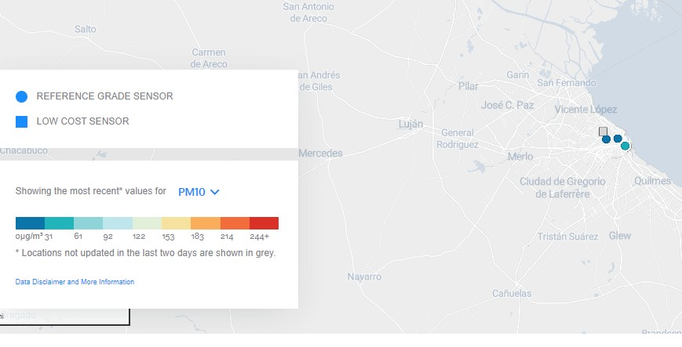
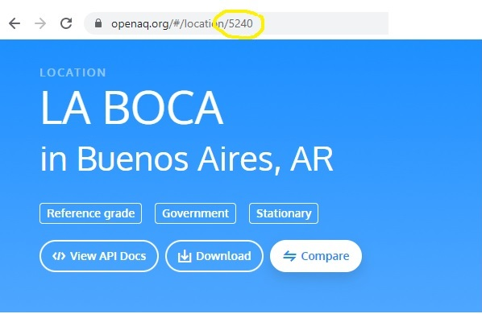
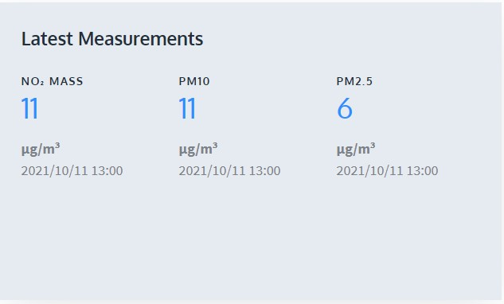

## Accede a la API de OpenAQ

API significa **Interfaz de programación de aplicaciones**; este es un software que permite que dos aplicaciones se comuniquen entre sí. Cada vez que usas una aplicación como Facebook, envías un mensaje instantáneo o verificas el clima en tu teléfono, estás usando una API.

Siempre que usas una aplicación en tu teléfono, la aplicación se conecta a Internet y envía datos sobre lo que deseas saber a un servidor. Luego, el servidor busca y recupera los datos que deseas, los interpreta y los envía de regreso a tu teléfono. Luego, la aplicación toma los datos que se han devuelto y te presenta la información que deseabas de manera legible. Esto es lo que es una API: una forma de controlar otras máquinas a través de Internet; todo esto sucede a través de la **API**.

Lo bueno es que puedes escribir tus propias aplicaciones que investiguen bases de datos de información en línea y devolver los datos deseados a tu tablero LEGO® en lugar de a un teléfono; ¡usarás tu Raspberry Pi como cerebro para obtener esos datos y luego mostrarlos. en tus indicadores LEGO personalizados hechos a mano!

Para hacer eso, deberá decidir algunas cosas: deberá elegir la ubicación donde encontrarás información sobre la calidad del aire; ¡puedes elegir en cualquier parte del mundo! - y deberás decidir qué marcadores de la calidad del aire deseas representar.

### OpenAQ: la base de datos de calidad del aire de código abierto

En tu panel de ejemplo, utilizarás la API de [**OpenAQ**](https://openaq.org/#/){:target="_blank"}, un proyecto de datos de calidad del aire global de código abierto. OpenAQ te permite ver muchos datos diferentes de contaminación del aire de todo el mundo, recopilados por miles de estaciones de medición en todo el mundo.

Si ya eres un experto con APIs, puedes utilizar cualquier dato que desees representar en tu panel de control. Si deseas seguir lo que hacemos y utilizar OpenAQ para tu primer intento, deberás averiguar qué estación de medición deseas investigar y qué mediciones puedes ver.

--- task ---

**Navega** al mapa de OpenAQ [haciendo clic aquí](https://openaq.org/#/map){:target="_blank"}. Debería aparecer una página web mostrando un mapa del mundo cubierto de puntos.

--- /task --- 

--- task ---

**Decide** en qué parte del mundo te gustaría recopilar datos sobre la calidad del aire. Esta podría ser el área cercana a donde vives, algún lugar que te interese o algún lugar que creas que podría tener datos interesantes.

--- /task --- 

Como nuestra sede se encuentra en Cambridge, en el Reino Unido, lo usaremos como ejemplo.

Hay muchas medidas diferentes tomadas por las estaciones de monitoreo de la calidad del aire. La base de datos de OpenAQ tiene información sobre los siguientes tipos de contaminación del aire:

 + PM2.5 y PM10 (material particulado): partículas microscópicas que flotan en el aire (humo, smog)
 + NO2 (dióxido de nitrógeno): causa la creación de ozono, causa asma en los niños
 + CO (monóxido de carbono): mortal para los humanos, efecto secundario de la quema de combustibles fósiles
 + SO2 (dióxido de azufre): huele mal, puede causar problemas respiratorios, genera lluvia ácida, efecto secundario de los tratamientos industriales
 + O3 (ozono): creado cuando el NO2 reacciona a la luz solar, causa smog, dañino para las plantas
 + BC (carbono negro): no se mide en muchos lugares (EE. UU. Y Polonia), causado por la quema ineficiente de combustible, se suma al calentamiento global, es peligroso para los humanos

--- task ---

**Decide** qué tipo de contaminación del aire estás más interesado en medir. Puedes elegir diferentes opciones del menú desplegable cerca de la escala de colores a la izquierda de la pantalla. 

**Nota:** marcadores redondos representan las estaciones de calidad del aire más importantes que probablemente midan contaminantes más variados.

--- /task ---

--- task ---

**Agranda** al área elegida en el mapa y busca el punto más cercano al lugar que te gustaría medir. Haz clic en el punto más cercano para ver los detalles de la ubicación. En la ventana emergente que aparece, ha clic en el botón que dice **Ver ubicación**.  

--- /task ---

--- task ---

Cuando se carga la nueva página web que muestran los detalles de las medidas tomadas en el lugar, **haz una nota** del número en la URL de la nueva página. Este es el número de identificación de OpenAQ para la estación de calidad del aire que elegiste. (En este ejemplo, es la estación de medición Sandy Roadside, con número de identificación **2480**). 

--- /task ---

--- task ---

En la página de ubicación, verás los diferentes tipos de contaminantes medidos en esa ubicación. **Elije** dos de la lista que le gustaría representar en tu panel de datos.  Esta estación de medición cerca de Sandy puede mostrar NO2, PM10 y PM2.5, por lo que usaremos NO2 y PM2.5 en el ejemplo.

--- /task ---