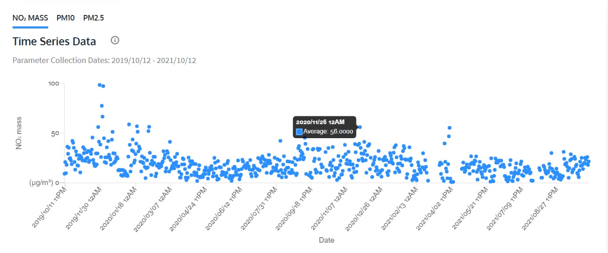

## Muestra los datos de contaminación con tu tablero

Por el momento, tu tablero usa números enteros aleatorios entre -175 y 175; estos números se utilizan porque son los límites de recorrido del motor en cada dirección. (No vamos a 180, ya que puede causar problemas con el desplazamiento alrededor de una rotación completa). Los datos provenientes de tu API no tendrán este mismo rango, por lo que debes ajustarlo a los motores.

**Calibrar** los indicadores significa mapear los valores de datos máximos y mínimos posibles de tu API entre -175 ° y 175 ° en tu motor. La lectura más alta posible estará en -175 °, mientras que la lectura más baja posible será en 175 °. (¡Porque has montado los motores al revés!)

Para nuestro ejemplo, mostraremos **partículas finas (PM2.5)** en el medidor, mientras que el control deslizante mostrará el nivel de dióxido de nitrógeno (NO2). El término **partículas finas**, o material particulado 2.5 (PM2.5), se refiere a partículas diminutas o gotitas en el aire que tienen dos micrones y medio (o menos) de ancho. Las partículas medidas por PM2.5 son las que componen la mayor parte del humo y el smog, y dificultan la visualización.

Al igual que en pulgadas, metros y milímetros, micrones es una unidad de medida para la distancia. Hay alrededor de 25.000 micrones en una pulgada. Los anchos de las partículas más grandes en el rango de tamaño de PM2.5 serían unas treinta veces más pequeñas que las de un cabello humano. Estas partículas son tan pequeñas que varios miles de ellas podrían caber en el punto al final de esta oración.

En nuestro ejemplo, el control deslizante mostrará el nivel de dióxido de nitrógeno (NO2). La lectura máxima posible en tu control deslizante dependerá de la ubicación que has elegido, porque las áreas urbanas siempre tendrán lecturas más altas que las rurales. La lectura mínima posible es obviamente 0, pero querrás considerar cuál es el rango normal para lo que estás midiendo y agregarle un poco.

Para determinar cuál debería ser la lectura máxima probable, puedes ver los datos históricos de la ubicación elegida en la página web que abriste anteriormente:

Aquí, puedes ver que, si bien hay algunos valores atípicos importantes, alrededor del 60% debería ser más que suficiente como valor máximo para la mayoría de las lecturas de la estación de calidad del aire de Sandy Roadside. (Si simplemente deseas hacer tu escala de 0 a 100, también puedes hacerlo, simplemente haz `max_valor = 100`)

--- task ---

Conecta el motor del indicador deslizante al puerto A del Build HAT. Conecta el motor del medidor al puerto B.

--- /task ---

--- task ---

En una nueva ventana de Thonny, escribe lo siguiente:

--- code ---
---
language: python 
filename: data_dash.py 
line_numbers: true 
line_number_start: 1
line_highlights:
---
from buildhat import Motor 
from time import sleep 
from datetime import datetime, timedelta 
import requests

no2_motor = Motor ('A') #Configura el motor del deslizador 
no2_motor.run_to_position (0,100) #Restablece la posición del deslizador 
pm25_motor = Motor ('B') #Configura el motor del medidor 
pm25_motor.run_to_position (0,100) # Restablece la posición del medidor

no2_min_valor = 0 #La lectura de NO2 más baja que crees que obtendrás (con suerte debería ser alrededor de 0) 
no2_max_valor = 60 #La lectura de NO2 más alta que crees que obtendrá 
no2_min_angulo = 175 # Recorrido mínimo del motor 
no2_max_angulo = -175 #Máximo viaje del motor

pm25_min_valor = 0 #La lectura de PM2.5 más baja que crees que obtendrás (con suerte debería ser alrededor de 0) 
pm25_max_valor = 100 #La lectura de PM2.5 más alta que crees que obtendrá 
pm25_min_angulo = 175 # Recorrido mínimo del motor 
pm25_max_angulo = -175 # Recorrido máximo del motor

--- /code ---

--- /task ---

Ahora que has importado las bibliotecas necesarias y configurado los detalles de medición, puedes configurar tu consulta a la API creando unos **diccionarios** de términos que utilizarás.

--- task ---

En tu ventana de Thonny, agrega este código al final de tu secuencia de comandos:

--- code ---
---
language: python 
filename: data_dash.py 
line_numbers: true 
line_number_start: 21
line_highlights:
---
base_url = 'https://docs.openaq.org/v2/measurements'

payload = {                     #Crea un diccionario para la solicitud de API 
    'date_from': '', 
    'date_to': '', 
    'location_id': '2480',      #Este número debe ser el número de identificación tomado de la URL anteriormente 
    'order_by': 
    'datetime', 
    'sort': 'asc', 
    'has_geo': 'true', 
    'limit': '100', 
    'offset': '0', 
}

contaminacion = {               #Crea un diccionario para las lecturas de contaminación 
    'no2': 0,                   #Aquí estamos buscando NO2 y PM25 - ¡el tuyo puede ser diferente! 
    'pm25': 0, 
}

--- /code ---

--- /task ---

La siguiente función que necesitas escribir consultará la API utilizando los parámetros que has configurado.

--- task ---

Al final de tu secuencia de comandos, agrega este código:

--- code ---
---
language: python 
filename: data_dash.py 
line_numbers: true 
line_number_start: 39
line_highlights:
---
def calidad_aire (): 
    ahora = datetime.now ()         #Obtiene la hora de este momento 
    delta = datetime.now () - timedelta (days = 1)      #Crea una diferencia horaria de un día

    payload ['date_from'] = f '{delta:%Y-%m-%d} T {delta:%H:%M:%S} +00: 00' #Inserta tu fecha y hora en el diccionario de arriba
    payload ['date_to'] = f '{ahora:%Y-%m-%d} T {ahora:%H:%M:%S} +00: 00 '
    
    respuesta = solicitudes.get (base_url, params = payload)        #Consulta la base de datos
    
    if respuesta.status_code != 200:            #Compruebe la conexión a API
        print (' no hay respuesta del servidor ')
        return
    
    data = respuesta.json ()
    
    for lectura in datos['resultados']:
        if lectura['parametro'] ==' no2 ':          #Esto dependerá del contaminante que estés midiendo
            contaminacion['no2'] = lectura['value']
            print(contaminacion ['no2'])
        if lectura['parametro'] == 'pm25':          #Esto dependerá del contaminante que estés midiendo
            contaminacion [ 'pm25'] = lectura['value']
            print (contaminacion ['pm25'])
    
    mostrar_resultado()   
    sleep (1)

 --- /code ---

 --- /task ---

La siguiente parte que escribirá hará algunos cálculos matemáticos inteligentes para mapear su rango de datos en todo el rango del motor. (Básicamente es la misma que la función utilizada en el [proyecto trazador de datos LEGO ](https://learning-admin.raspberrypi.org/es-ES/projects/lego-plotter/6))

--- task ---

Agrega esta función debajo de tu código existente:

--- code ---
---
language: python 
filename: data_dash.py 
line_numbers: true 
line_number_start: 65
line_highlights:
---
def remap(min_valor, max_valor, min_angulo, max_angulo, sensor_datos):                      #Crea la función 
    valor_rango = (max_valor - min_valor)                                                   #Calcula qué tan amplio es tu rango de valores 
    motor_rango = (max_angulo - min_angulo)                                                 #Calcula qué tan amplio es el rango de tu motor 
    mapeado = (((sensor_datos - min_valor) * motor_rango) / valor_rango) + min_angulo   #Estira tu rango de valores a lo largo de tu rango de motor 
    return int (mapeado)        #Devuelve un número que muestre el valor como un ángulo en el motor

--- /code ---

--- /task ---

Ahora que creaste tu función, necesitas hacer un bucle que:

+ Encuentre el ángulo en el que se encuentra actualmente el motor
+ Extraiga los datos de contaminantes de la función `remap` para usarlos como el nuevo ángulo para tus motores
+ Mover al nuevo ángulo para mostrar la lectura

--- task ---

Agrega el siguiente código al final de tu secuencia de comandos, en una nueva línea:

--- code ---
---
language: python 
filename: data_dash.py 
line_numbers: true 
line_number_start: 73
line_highlights:
---
def mostrar_resultado(): 
    print (f'NO2 = {contaminacion ['no2']} ') 
    no2_angulo_actual = no2_motor.get_aposition () 
    no2_sensor_datos = int (contaminacion [' no2 ']) 
    no2_nuevo_angulo = remap(no2_min_valor, no2_max_valor, no2_min_angulo, no2_max_angulo, no2_sensor_datos) 
    print(no2_nuevo_angulo) 
    if no2_nuevo_angulo > no2_angulo_actual: 
        no2_motor.run_to_position (no2_nuevo_angulo, 100, direction='anticlockwise') 
        print ( 'Girando en sentido horario') 
    elif no2_nuevo_angulo < no2_angulo_actual: 
        no2_motor. run_to_position (no2_nuevo_angulo, 100, direction='clockwise') 
        print ('Girando en sentido antihorario') 
    sleep (0.1) 
    pm25_sensor_datos = int(contaminacion ['pm25']) 
    print (f "PM2.5 = {contaminacion ['pm25']} ") 
    pm25_angulo_actual = pm25_motor.get_aposition() 
    print (pm25_angulo_actual) 
    pm25_nuevo_angulo = remap(pm25_min_valor, pm25_max_valor, pm25_min_angulo, pm25_max_angulo, pm25_sensor_datos) 
    pm25_motor.run_to_position(pm25_nuevo_angulo, 100)

--- /code ---

--- /task ---

Ahora la última parte de tu código necesita llamar a tu función `calidad_aire()` para hacer que todo funcione, y verificar periódicamente la API para obtener datos actualizados.

--- task ---

Al final de tu secuencia de comandos, en una nueva línea (asegúrate de que no tenga sangría), escribe:

--- code ---
---
language: python 
filename: data_dash.py 
line_numbers: true 
line_number_start: 93
line_highlights:
---
while True: 
    calidad_aire() 
    sleep (3600)    #Espere una hora antes de verificar nuevamente (haz este número más pequeño para propósitos de prueba) 

--- /code ---

--- /task ---

--- task ---

Guarda tu trabajo como `data_dash.py` y haz clic en **Ejecutar**. Tu control deslizante debe moverse para mostrar la lectura actual de NO2 de tu estación OpenAQ elegida, y tu medidor debe moverse para mostrar la lectura de PM2.5. ¡Bien hecho!

--- /task ---

--- save ---
