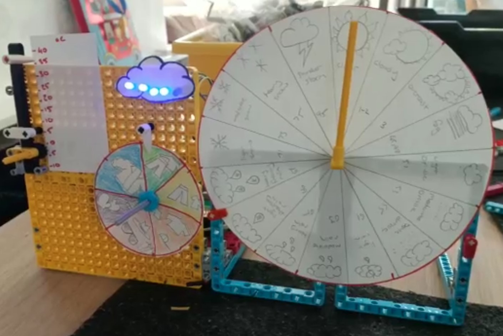

## はじめに

このプロジェクトでは、データを視覚化するダッシュボードを作成します。さまざまなオンラインのソースから表示するデータを選べます。 データダッシュボードは、**プロジェクトの概要**に合っている必要があります。

ダッシュボード は、重要な情報についての現時点の要約を、グラフィカルまたは読みやすいかたちで提供するユーザーインターフェイスです。 ダッシュボードという言葉は、車の運転手が大きくて明るい文字盤やメーターで車両の現在の状態を確認できるものに由来しています。

本項で学ぶこと:
+ LEGO® モーターとエレメントを使用して自動のインジケーターを作成する
+ オンラインの **API** (Application Programming Interface) に Python を使用してアクセスし、興味のあるデータを取得する
+ LEGO を使用して作成したダッシュボード上に、取得したデータを表示する

--- no-print ---

--- /no-print ---

--- collapse ---
---
title: 必要なもの
---
### ハードウェア

+ Raspberry Pi コンピューター
+ Raspberry Pi Build HAT
+ Raspberry Pi Build HAT 7.5V 電源アダプター
+ 2つの LEGO® Technic™ モーター (3つ以上でも)
+ LEGO® SPIKE™ フォースセンサー
+ LEGO® 製品 (本項では [LEGO® SPIKE™ プライムキット](https://education.lego.com/en-gb/product/spike-prime){:target="_blank"} から選んで使用します)
+ 紙またはカード
+ カードを貼り付けるための画鋲やテープ
+ マーカーまたは鉛筆
+ はさみまたはカッターナイフ

オプション:
+ LED
+ 抵抗
+ ジャンパー線
+ ブレッドボード
+ M2ボルトとナット (Raspberry Pi を LEGO® ビルドプレートに取り付けるためにそれぞれ2つ)

### ソフトウェア

+ Build HAT を制御するための Build HAT Python ライブラリ
+ Thonny Python IDE

### ダウンロード

+ このプロジェクトの最終的なスクリプトは、 [ここ]((https://rpf.io/p/en/lego-data-dash-go){:target="_blank"}) から入手できます

--- /collapse ---

開始する前に、Raspberry Piのセットアップと、Build HATの装着をしてください:

--- task ---

M2のボルトとナットを使用して、 LEGO ビルドプレートの上にRaspberry Piを取り付けます。 Raspberry Piはふちがない方の面に載せます:

 

--- /task ---

写真のとおりにRaspberry Piを固定することで、SDカードスロットが扱いやすくなります。 ビルドプレートを使うことで、 ダッシュボードのおもな構造に、より簡単に Raspberry Pi を接続できます。

--- task ---

`This way up` の文字が見えるようにBuild HATをRaspberry Piと並べます。 全部のGPIOピンがHATにかぶるよう合わせて、しっかり押し下げてください。 (例ではピンが長くなる [スタッキングヘッダー](https://www.adafruit.com/product/2223){:target="_blank"} を使用しています。)

 

--- /task ---

モーターを使用するためには、Build HAT上のバレルジャックに7.5Vの電源を接続してRaspberry Piに電源を供給する必要があります。

--- task ---

まだRaspberry Piのセットアップが済んでいない場合は、次の手順に従ってセットアップしてください:

[Raspberry Piのセットアップ](https://projects.raspberrypi.org/en/projects/raspberry-pi-setting-up){:target="_ blank"}

--- /task ---

--- task ---

Raspberry Piが起動したら、Raspberry Piメニューをクリックして“Preferences”と “Raspberry Pi Configuration”の順に選択して、Raspberry Pi Configuration toolを起動します。

“interfaces”タブをクリックして、シリアルの設定を以下のとおりに設定します:

--- /task ---

--- task ---

また、以下の手順に従って、buildhat pythonライブラリのインストールも必要になります。

--- collapse ---
---
title: buildhat Python ライブラリのインストール
---

<kbd>Ctrl</kbd>+<kbd>Alt</kbd>+<kbd>T</kbd> を押して、Raspberry Pi上にターミナルウィンドウを開きます。

プロンプトで次の通りに入力します: `sudo pip3 install buildhat`

<kbd>Enter</kbd> キーを入力して "installation completed" のメッセージが表示されるまで待ちます。

--- /collapse ---

--- /task ---

### プロジェクトの概要: LEGO® データダッシュボード

あなたのタスクは、あなたの選択したデータを表示する LEGO ダッシュボードを作成することです。 データのソースは好きな API にすることができますが、今回の例では、最小限のサインアップまたはサインアップが不要な OpenAQ にアクセスする方法を説明します。 

例のデータでは、以下のデータが計測できます:
+ 選択した場所の **NO2** のレベル。 二酸化窒素 (NO2) は、窒素酸化物や NOx として知られる、反応性の高いガスの一種です。 NO2 は、主に燃料の燃焼によって大気中に放出されます。
+ 選択した場所の **微粒子 (PM2.5) ** のレベル。 **微粒子** または粒子状物質 2.5 (PM2.5) という用語は、サイズが 2.5 ミクロン (またはそれ以下) の、空気中の小さな粒子または液滴を指します。 PM2.5 に分類される粒子は、煙とスモッグを構成するものです。

このプロジェクトで使用している API の例は、「オープンデータを通じて空気の不平等と戦う」国際的な非営利組織 [OpenAQ](https://openaq.org/#/) のものです。 世界的に、 **8人に1人が亡くなっている** のは大気質の悪さによるものであり、 OpenAQ は世界の大気質データを収集して、世界の一部地域で増加する大気汚染の問題について、より多くの人々に知ってもらうのに役立てています。 

ダッシュボードで、以下の要件を満たしてください:
+ LEGO® を使って、選んだデータを明確に表示すること
+ オンラインの API にアクセスして、最新のデータを取得すること
+ 最低2つのインジケータを LEGO® で作成すること

ダッシュボードで、可能なら以下も行ってください:
+ 他の電子部品 (LED、ブザー) を使用する
+ 物理的なユーザー入力装置を用意する (LEGO® Technic™ モーター、 LEGO® フォースセンサー、 GPIO ボタン、距離センサー)
  

--- no-print ---

### インスピレーションを得る

--- task ---

これらのサンプルプロジェクトを調べてもっとアイデアを得るために、ダッシュボードに表示したい情報について考えましょう。

この例では、垂直のスライダーに現在の温度を表示する天気のダッシュボード、LEDスケールを使った雲のカバー、 そして回転するダイヤルは、体感温度 (風や温度の他の天気を含む) に基づいたちょうどよい衣類を提案したり、世界気象コード (WMO コード) を使用した詳細な天気予報をレポートしたりします 。

--- /task ---

--- /no-print ---

--- print-only ---

--- /print-only ---

