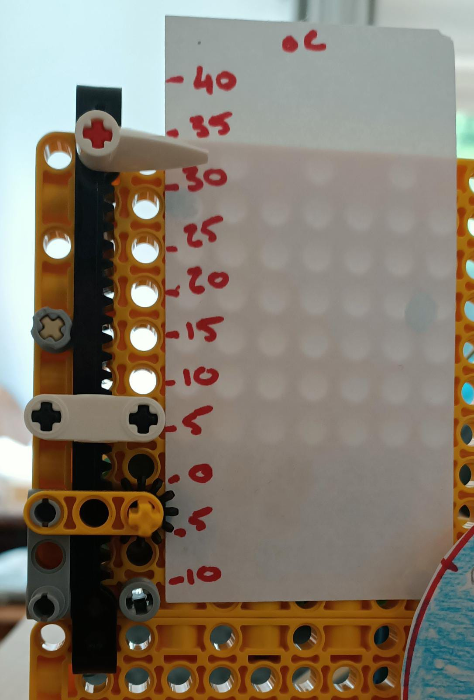
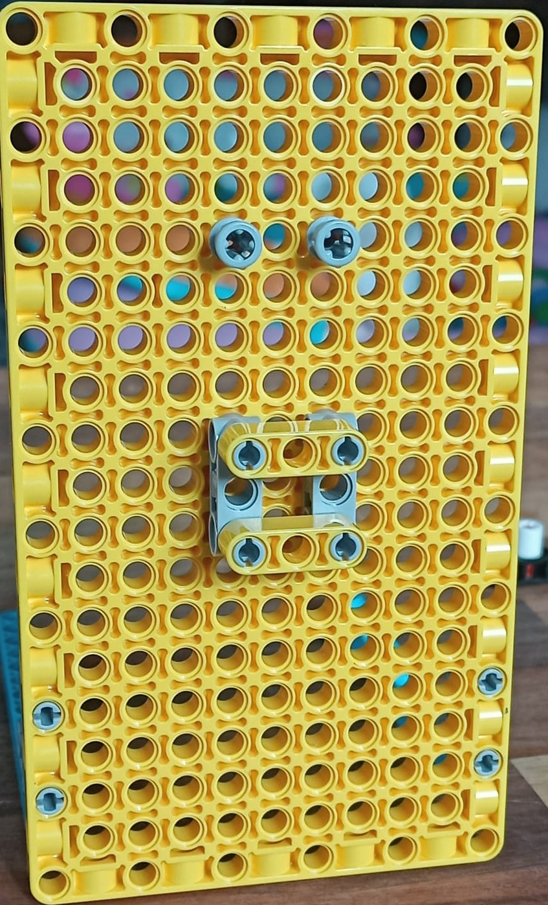

## LEGO® でスライドインジケーターを作る

それでは、 LEGO® でスライドインジケーターを作成しましょう。 If you don't want to include a sliding indicator, you can skip to the next step, which shows you how to create rotating LEGO dials.

垂直スライダーは次のようなものです:

必要なら、反時計回りに90度回転させることで、スライドインジケーターを水平方向に使うこともできます。

--- task ---

次の組み立て手順に従って、垂直なスライドインジケーターを作成しましょう。

モデルを組み立てるには、次の組み立てガイドに沿って作成します。[また、ガイドはこちらからダウンロードできます。](resources/lego-data-dash-slider.pdf)
<embed src="resources/lego-data-dash-slider.pdf" width="600" height="500" alt="pdf" pluginspage="https://www.adobe.com/products/acrobat/readstep2.html">
  
 
  
  

    --- /task ---
  

  
  

    --- task ---
  

  
  

    黄色の板のエレメントを取り出して、 90 度のスタッドブラケットを使用して 2 本の青い梁を取り付けます。 
  

  
  

    --- /task ---
  

  
  

    --- task ---
  

  
  

    2 つの灰色のストレートブラケットを 1 列離して付けます。 
  

  
  

    --- /task ---
  

  
  

    --- task ---
  

  
  

    灰色で、片方の端にスペーサーが付いていて長さが倍のスタッドを、ブラケットの上に 2 つ取り付けます。 
  

  
  

    --- /task ---
  

  
  

    --- task ---
  

  
  

    ストレートブラケットの間に黄色 (3 穴) の梁を 2 つ水平に取り付けます。 
  

  
  

    --- /task ---
  

  
  

    --- task ---
  

  
  

    小さな黒の歯車と、短い軸を取り出して、組み合わせます。 
  

  
  

    --- /task ---
  

  
  

    --- task ---
  

  
  

    図のように、ビルドプレート上の、右側のブラケットの上に車軸を差し込みます: 
  

  
  

    --- /task ---
  

  
  

    --- task ---
  

  
  

    歯型バー、赤い車軸、インジケーター用の矢印を用意します。 Insert the axle into one end of the toothed bar, with the indicator arrow pointing toward the toothed side: 
  

  
  

    --- /task ---
  

  
  

    --- task ---
  

  
  

    Slide the toothed bar down into the top of the mechanism.
  

  
  

    You will have to pull the gear forward to allow it past, then push the gear back in to fit between the teeth. The mechanism will slide easily up and down while the gear and axle are free. Connecting a motor will hold it steady. 
  

  
  

    --- /task ---
  

  
  

    --- task ---
  

  
  

    モーターを取り出して、平らな側の上部にある 2 つの穴に、スタッドを 2 つ追加します。 
  

  
  

    --- /task ---
  

  
  

    --- task ---
  

  
  

    モーターをスライダーの軸の後ろに取り付ける前に、モーターの端にある 2 つのロリポップの記号を並べて、モーターが「ゼロ調整」されていることを確認してください。
  

  
  

    
  

  
  

    --- /task ---
  

  
  

    --- task ---
  

  
  

    Adjust your toothed bar so the gear sits about halfway along it, then mount the motor behind the board using the two studs while holding the toothed bar in place. 車軸がモーターの<strong x-id="1">平らな側</strong>の穴に入っていることを確認してください。 It should keep the slider held steady now, around halfway along the bar. 
  

  
  

    --- /task ---
  

<h3 spaces-before="0">
  Test the sliding indicator
</h3>

  To program your sliding indicator, you can reuse some of the code written in the <a href="https://projects.raspberrypi.org/en/projects/lego-plotter">LEGO® Data plotter</a> project, as they use the same mechanism.

  --- task ---

  Connect the motor of your slider to port A on your Build HAT.

  --- /task ---

  --- task ---

  You will use the BuildHAT Python library, so make sure it is installed:

  --- collapse ---

<h2 spaces-before="0">
  title: Install the BuildHAT Python library
</h2>

  Open a terminal window on your Raspberry Pi by pressing <kbd>Ctrl</kbd>+<kbd>Alt</kbd>+<kbd>T</kbd>.

  At the prompt type: <code>sudo pip3 install buildhat</code>

  Press <kbd>Enter</kbd> and wait for the "installation completed" message.

  --- /collapse ---

  --- /task ---

<h3 spaces-before="0">
  Create the scale for your sliding indicator
</h3>

  Now you know it works, you will need to create a scale for the sliding indicator, so you know what it means.

  --- task ---

  Get a piece of card about as long as your toothed bar. Stick it next to the sliding indicator, under the pointer. Have a marker or pencil ready.

  --- /task ---

  --- task ---

  Open <strong x-id="1">Thonny</strong> on your Raspberry Pi from the <strong x-id="1">Programming menu</strong>.

  In the <strong x-id="1">Shell</strong> (the window at the bottom), next to the three arrows, type: <code>from buildhat import Motor</code> and press <kbd>Enter</kbd>. You should see a new line appear with three more arrows.

  --- /task ---

  --- task ---

  Now type: <code>motor = Motor('A')</code> and press <kbd>Enter</kbd>. --- /task ---

  Now you've set up your slider motor to run, you should send it to the maximum and minimum readings to see how far it can travel — then mark those places on the card.

  --- task ---

  Type: <code>motor.run_to_position(-180, 100)</code> and press <kbd>Enter</kbd>. Mark the card at the place the arrow indicates. This is your minimum possible readout.

  --- /task ---

  --- task ---

  Type: <code>motor.run_to_position(180, 100, direction=clockwise)</code> and press <kbd>Enter</kbd>. Mark the card at the place the arrow indicates. This is your maximum possible readout.

  --- /task ---

  You now know where your minumum and maximum possible readings are. Once you link the slider to some data, you will be able to create an accurate scale.

<h3 spaces-before="0">
  Program your sliding indicator to show live data
</h3>

  --- task ---

  Enter the following code in a blank tab:

  --- code ---

  language: python filename: slider_test.py line_numbers: true line_number_start: 1

<h2 spaces-before="0">
  line_highlights:
</h2>

  from buildhat import Motor from time import sleep from random import randint

  motor_slider = Motor('A')

  motor_slider.run_to_position(0,100)

  while True: current_angle = motor_slider.get_aposition() new_angle = randint(-175, 175) if new_angle > current_angle: motor_slider.run_to_position(new_angle, 100, direction="clockwise") print('Turning CW') elif new_angle < current_angle: motor_slider.run_to_position(new_angle, 100, direction="anticlockwise") print('Turning ACW') sleep(0.1)

  --- /code ---

  Save your work as <code>slider_test.py</code> and click <strong x-id="1">Run</strong>. You should see your slider move up and down (or back and forth!)

  --- /task ---

  --- save ---

