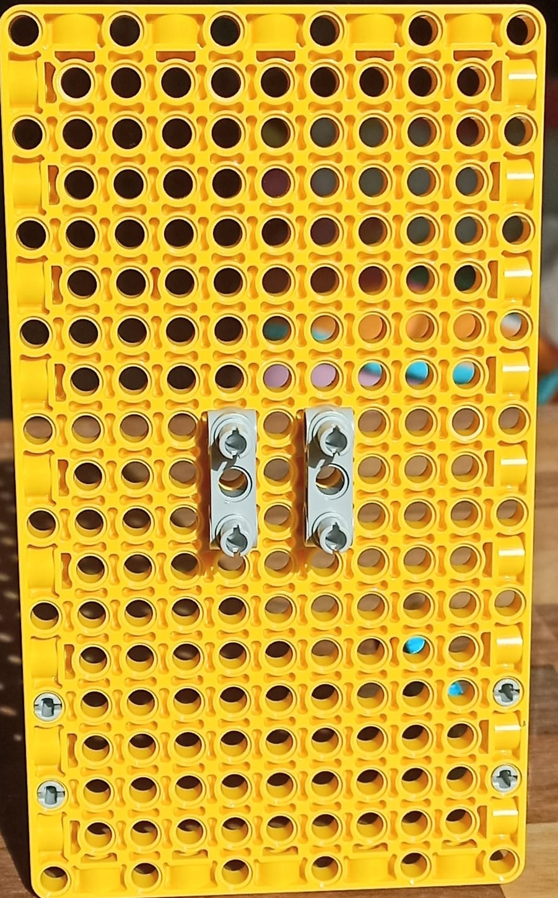

## LEGO® でスライドインジケーターを作る

それでは、 LEGO® でスライドインジケーターを作成しましょう。 スライドインジケーターを使わない場合はここをスキップして次のステップ、回転する LEGO ダイヤルを作成する方法に進むことができます。

垂直スライダーは次のようなものです:

必要なら、反時計回りに90度回転させることで、スライドインジケーターを水平方向に使うこともできます。

--- task ---

次の組み立て手順に従って、垂直なスライドインジケーターを作成しましょう。

モデルを組み立てるには、次の組み立てガイドに沿って作成します。[また、ガイドはこちらからダウンロードできます。](resources/lego-data-dash-slider.pdf)
<embed src="resources/lego-data-dash-slider.pdf" width="600" height="500" alt="pdf" pluginspage="https://www.adobe.com/products/acrobat/readstep2.html">
  
 
  
  

    --- /task ---
  

  
  

    --- task ---
  

  
  

    黄色の板のエレメントを取り出して、 90 度のスタッドブラケットを使用して 2 本の青い梁を取り付けます。 
  

  
  

    --- /task ---
  

  
  

    --- task ---
  

  
  

    2 つの灰色のストレートブラケットを 1 列離して付けます。 
  

  
  

    --- /task ---
  

  
  

    --- task ---
  

  
  

    灰色で、片方の端にスペーサーが付いていて長さが倍のスタッドを、ブラケットの上に 2 つ取り付けます。 
  

  
  

    --- /task ---
  

  
  

    --- task ---
  

  
  

    ストレートブラケットの間に黄色 (3 穴) の梁を 2 つ水平に取り付けます。 
  

  
  

    --- /task ---
  

  
  

    --- task ---
  

  
  

    小さな黒の歯車と、短い軸を取り出して、組み合わせます。 
  

  
  

    --- /task ---
  

  
  

    --- task ---
  

  
  

    図のように、ビルドプレート上の、右側のブラケットの上に車軸を差し込みます: 
  

  
  

    --- /task ---
  

  
  

    --- task ---
  

  
  

    歯型バー、赤い車軸、インジケーター用の矢印を用意します。 歯型バーの端に軸を差し込み、インジケータ用の矢印が歯の側を指すように組み合わせます。 
  

  
  

    --- /task ---
  

  
  

    --- task ---
  

  
  

    歯型バーを機構の上から下に差し込みます。
  

  
  

    一度ギアを前に引き出す必要があります。そして、歯と噛み合うようにギアを押して戻しましょう。 歯車と軸が固定されていない間は、機構は上下に簡単にスライドできます。 モーターを接続すると安定して固定されるようになります。 
  

  
  

    --- /task ---
  

  
  

    --- task ---
  

  
  

    モーターを取り出して、平らな側の上部にある 2 つの穴に、スタッドを 2 つ追加します。 
  

  
  

    --- /task ---
  

  
  

    --- task ---
  

  
  

    モーターをスライダーの軸の後ろに取り付ける前に、モーターの端にある 2 つのロリポップの記号を並べて、モーターが「ゼロ調整」されていることを確認してください。
  

  
  

    
  

  
  

    --- /task ---
  

  
  

    --- task ---
  

  
  

    歯型バーを歯車のだいたい半分のあたりにあるように調整して、バーをその位置で押さえながら、2つのスタッドが付いたモーターをボードの後ろに取り付けます。 車軸がモーターの<strong x-id="1">平らな側</strong>の穴に入っていることを確認してください。 これで、スライダーはバーのほぼ半分のあたりに安定した状態で固定されるようになります。 
  

  
  

    --- /task ---
  

<h3 spaces-before="0">
  スライドインジケーターのテスト
</h3>

  スライドインジケーターのプログラムを書くとき、 <a href="https://projects.raspberrypi.org/en/projects/lego-plotter">LEGO® データプロッター</a> で書いた、同じ仕組みを使用している一部のコードが再利用できます。

  --- task ---

  スライダー用のモーターを Build HAT のポート A に接続します。

  --- /task ---

  --- task ---

  BuildHAT Python ライブラリを使うため、インストールされていることを確認してください:

  --- collapse ---

<h2 spaces-before="0">
  title: BuildHat Python ライブラリのインストール
</h2>

  <kbd>Ctrl</kbd>+<kbd>Alt</kbd>+<kbd>T</kbd> を押して、Raspberry Pi上でターミナルウィンドウを開きます。

  プロンプトで次の通りに入力します: <code>sudo pip3 install buildhat</code>

  <kbd>Enter</kbd> キーを入力して "installation completed" のメッセージが表示されるまで待ちます。

  --- /collapse ---

  --- /task ---

<h3 spaces-before="0">
  スライドインジケーターの目盛りを作成する
</h3>

  これでスライダーを動かせるようになったので、スライドインジケーターの目盛りに意味をもたせましょう。

  --- task ---

  歯型バーと同じくらいの長さの紙を用意しましょう。 スライドインジケーターの横で、ポインターの下に貼り付けます。 そして、マーカーまたは鉛筆を用意します。

  --- /task ---

  --- task ---

  Raspberry Pi上で、 <strong x-id="1">プログラミングメニュー</strong> から <strong x-id="1">Thonny</strong> を開きます。

  <strong x-id="1">シェル</strong> (ウィンドウの下部) で、 3 つの矢印のあとに次のように入力します: <code>from buildhat import Motor</code> そして <kbd>Enter</kbd>を押します。 すると、新しい行にまた3本の矢印が現れます。

  --- /task ---

  --- task ---

  次を入力します: <code>motor = Motor('A')</code> そして、 <kbd>Enter</kbd> を押します。 --- /task ---

  スライダーのモーターを実行できるように設定できたので、モーターを最大値と最小値の位置に動かして、どこまで動くかを確認します。そして、動いた場所をカードにマークします。

  --- task ---

  次を入力します: <code>motor.run_to_position(-180, 100)</code> そして <kbd>Enter</kbd> を押します。 矢印が示す場所で、紙にマークを付けます。 ここが最小値になります。

  --- /task ---

  --- task ---

  次を入力します: <code>motor.run_to_position(180, 100, direction="clockwise")</code> そして <kbd>Enter</kbd> を押します。 矢印が示す場所で、紙にマークを付けます。 ここが最大値になります。

  --- /task ---

  これで、最小値と最大値がどこにあるかがわかりました。 スライダーをいくつかのデータにリンクすると、正確なスケールを作成できるようになります。

<h3 spaces-before="0">
  スライドインジケーターをプログラムして、ライブデータを表示する
</h3>

  --- task ---

  次のコードを空白のタブに入力します:

  --- code ---

  language: python filename: slider_test.py line_numbers: true line_number_start: 1

<h2 spaces-before="0">
  line_highlights:
</h2>

  from buildhat import Motor from time import sleep from random import randint

  motor_slider = Motor('A')

  motor_slider.run_to_position(0,100)

  while True: current_angle = motor_slider.get_aposition() new_angle = randint(-175, 175) if new_angle > current_angle: motor_slider.run_to_position(new_angle, 100, direction="clockwise") print('Turning CW') elif new_angle < current_angle: motor_slider.run_to_position(new_angle, 100, direction="anticlockwise") print('Turning ACW') sleep(0.1)

  --- /code ---

  コードを <code>slider_test.py</code> として保存して、 <strong x-id="1">Run</strong>をクリックします。 スライダーが上下 (または前後) に動くのが見られるでしょう。

  --- /task ---

  --- save ---

