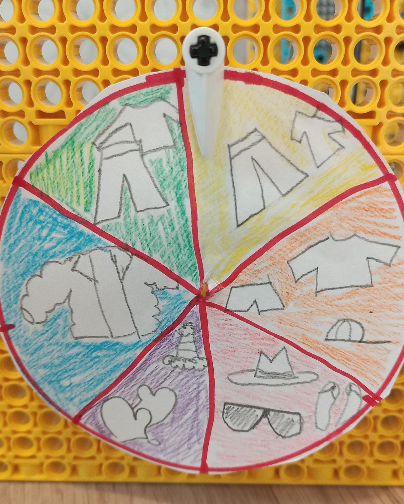

## LEGO® でゲージを作る

データを手軽に表示するもう1つの方法は、**ダイヤル** (または**ゲージ**とも呼ばれます) を使うことです。 あなたは間違いなく前にそれらを見たことがあります。それらは通常円形または半円形であり、2つの主要な目に見える部分があります。

+ 目盛りが表示されている面
+ 目盛りに沿って移動し、データの読み取り値を表示する針

ゲージまたはダイヤルは、面と針を作成するだけなので、 LEGO® を使って作成できる一番シンプルなデータの読み出し方法です。 針またはダイヤルはモーターに直接接続するため、組み立てはとても簡単です:

--- task ---

モーターをゲージの軸の後ろに取り付ける前に、モーターの端にある 2 つのロリポップの記号を並べて、モーターが「ゼロに調整」されていることを確認してください。

--- /task ---

### スケールを作成する

ゲージを完成させるためには、紙・カード・またはその他の画材を使って、スケールを作る必要があります。 仕組みとコーディングはまったく同じですが、ゲージをどう見せたいか考えてみましょう。

 --- task ---

 作りたいダイヤルの種類を**選んでください**。

 LEGO® で簡単に作成できるのは 2 種類あります。

+ 針が回転して面にある点を示すゲージ: 

+ A gauge where the whole face turns to display a point at the top with a stationary indicator: 

--- /task ---

--- task ---

On a blank piece of paper, trace a neat circle the size you want your gauge to be. Mark the centre, and cut it out using scissors.

--- /task ---

--- task ---

Split the circle into equal segments (one for each reading) by drawing lines through the centre, or draw your scale around the edge.

--- /task ---

--- task ---

Draw an icon or write inside each segment what it indicates.

--- /task ---

Once you have finished creating your gauge face, you will need to mount it to your dashboard.

--- collapse ---
---
title: If you are creating a needle gauge
---

To finish building your needle gauge:

--- task ---

Slide the face down over your axle, using Blu Tack or tape to stick it down to the dashboard behind it and prevent it from sliding as the axle turns. 

--- /task ---

--- task ---

Add a 90 degree elbow to the end of your axle and place another axle into it. Make sure it is long enough to reach your scale and clearly indicate the readings.

It will help later if your axle is pointing straight up (and your motor is 'zeroed') when you mount it, as it will make it easier to calculate the amount of rotation required for a reading.

--- /task ---

--- /collapse ---

--- collapse ---
---
title: If you are creating a spinning face dial
---

To finish building a spinning gauge:

--- task ---

Mount a single gear behind your dial face as a spacer, to prevent it from catching on your dashboard. Use some Blu Tack to stick the face to this gear. If you have created an incremental scale around the gauge, mount it with the middle of the scale at the top (in line with the 'zeroed' lollipop symbols) and the minimum and maximum values at the bottom.

--- /task ---

--- /collapse ---

### Test your gauge

--- task ---

Connect the motor of your gauge to port A on your Build HAT.

--- /task ---

--- task ---

You will be using the BuildHAT Python library, so make sure it is installed:

--- collapse ---
---
title: Install the BuildHAT Python library
---

Open a terminal window on your Raspberry Pi by pressing <kbd>Ctrl</kbd>+<kbd>Alt</kbd>+<kbd>T</kbd>.

At the prompt type: `pip3 install buildhat`

Press <kbd>Enter</kbd> and wait for the "installation completed" message.

--- /collapse ---

--- /task ---

--- task ---

Open **Thonny** on your Raspberry Pi from the **Programming menu**.

Enter the following code in a blank tab:

--- code ---
---
language: python filename: gauge_test.py line_numbers: true line_number_start: 1
line_highlights:
---
from buildhat import Motor from time import sleep from random import randint

motor_gauge = Motor('A')

motor_gauge.run_to_position(0,100)

while True: angle = randint(-180, 180) motor_gauge.run_to_position(angle, 100) sleep(0.3)

--- /code ---

Save your work as `gauge_test.py` and press **Run**. You will see your gauge begin to move!

--- /task ---
