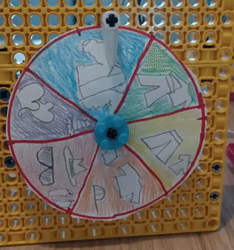
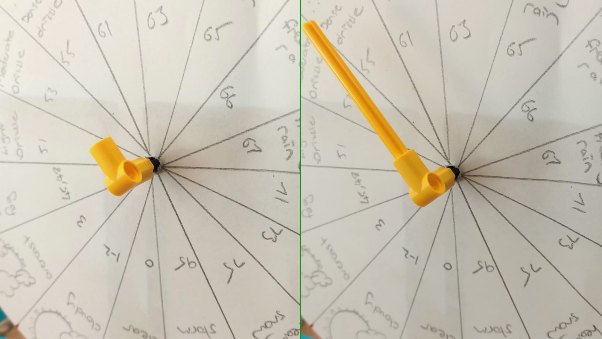

## LEGO® でゲージを作る

データを手軽に表示するもう1つの方法は、**ダイヤル** (または**ゲージ**とも呼ばれます) を使うことです。 あなたは間違いなく前にそれらを見たことがあります。それらは通常円形または半円形であり、2つの主要な目に見える部分があります。

+ 目盛りが表示されている面
+ 目盛りに沿って移動し、データの読み取り値を表示する針

ゲージまたはダイヤルは、面と針を作成するだけなので、 LEGO® を使って作成できる一番シンプルなデータの読み出し方法です。 針またはダイヤルはモーターに直接接続するため、組み立てはとても簡単です:

--- task ---

モーターをゲージの軸の後ろに取り付ける前に、モーターの端にある 2 つのロリポップの記号を並べて、モーターが「ゼロに調整」されていることを確認してください。

--- /task ---

### スケール（目盛り）を作成する

ゲージを完成させるためには、紙・カード・またはその他の画材を使って、スケールを作る必要があります。 仕組みとコーディングはまったく同じですが、ゲージをどう見せたいか考えてみましょう。

 --- task ---

 作りたいダイヤルの種類を**選んでください**。

 LEGO® で簡単に作成できるのは 2 種類あります。

+ 針が回転して、面の上のある一点を示すゲージ: 

+ 面全体が回転して、上部に固定されたインジケーターである一点を示すゲージ: 

--- /task ---

--- task ---

ゲージにしたいサイズの円を、白紙にきれいになぞります。 中央に印を付け、はさみで切り取ります。

--- /task ---

--- task ---

中心を通る線を引いて円を等間隔 (各読み取り値に1つ) に分割するか、円の端にスケールを描きます。

--- /task ---

--- task ---

各セグメントが示す内容を、アイコンや文字でそれぞれ書き込みます。

--- /task ---

ゲージの面を作り終えたら、ダッシュボードに取り付けていきしましょう。

--- collapse ---
---
title: ニードルゲージを作る場合
---

ニードルゲージを完成させるには:

--- task ---

面を軸に通し、軸が回転したときに面がずれないように、ブル・タックかテープを使って面の後ろとダッシュボードを固定します。 

--- /task ---

--- task ---

軸の端に 90 度のエルボを追加し、別の軸をそこに取り付けます。 スケールを指すのに十分な長さで、測定値がわかりやすく示されることを確認してください。

軸を取り付けるときに軸が真上を向いている (そしてモーターが「ゼロに調整」されている) と、測定値に対して必要な回転量の計算が簡単になるため、後で便利です。

--- /task ---

--- /collapse ---

--- collapse ---
---
title: 回転するフェイスダイヤルを作る場合
---

回転するゲージを完成させるには:

--- task ---

ダッシュボードに引っ掛からないように、ダイヤル面の後ろにスペーサーとして歯車を1つ取り付けます。 ブル・タックを使用して、面を歯車に貼り付けます。 ゲージのまわりにインクリメンタルスケールを作ったときは、スケールの中間値が上 (「ゼロに調整」されたロリポップ記号に合わせる) 、最小値と最大値が下になるように面を取り付けます。

--- /task ---

--- /collapse ---

### ゲージをテストする

--- task ---

ゲージ用のモーターを Build HAT のポート A に接続します。

--- /task ---

--- task ---

BuildHAT Python ライブラリを使うため、インストールされていることを確認してください:

--- collapse ---
---
title: BuildHat Python ライブラリのインストール
---

<kbd>Ctrl</kbd>+<kbd>Alt</kbd>+<kbd>T</kbd> を押して、Raspberry Pi上にターミナルウィンドウを開きます。

プロンプトで次の通りに入力します: `pip3 install buildhat`

<kbd>Enter</kbd> キーを入力して "installation completed" のメッセージが表示されるまで待ちます。

--- /collapse ---

--- /task ---

--- task ---

Raspberry Pi上で、 **プログラミングメニュー** から **Thonny** を開きます。

次のコードを空白のタブに入力します:

--- code ---
---
language: python filename: gauge_test.py line_numbers: true line_number_start: 1
line_highlights:
---
from buildhat import Motor from time import sleep from random import randint

motor_gauge = Motor('A')

motor_gauge.run_to_position(0,100)

while True: angle = randint(-180, 180) motor_gauge.run_to_position(angle, 100) sleep(0.3)

--- /code ---

コードを `gauge_test.py` として保存して、 **Run**をクリックします。 するとゲージが動き始めるでしょう！

--- /task ---
