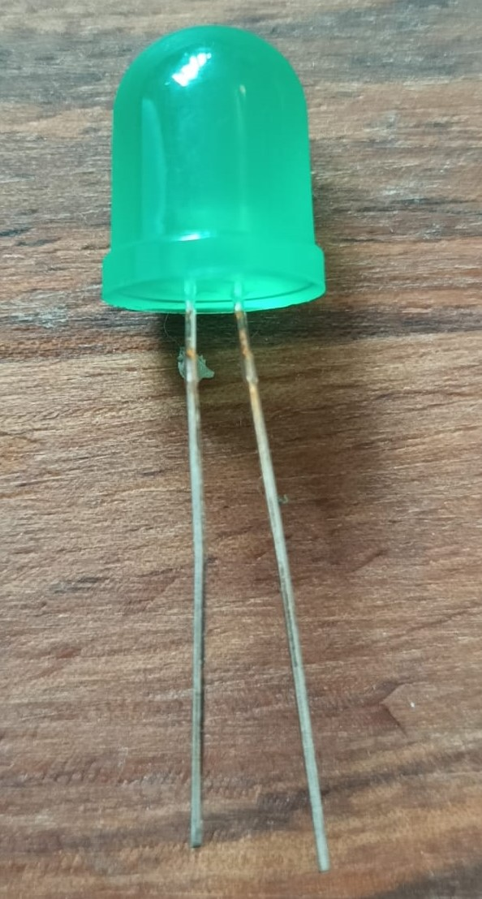
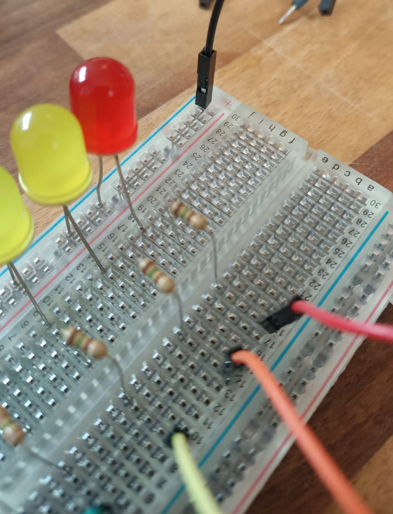

## LED でスケールを作る

データを表示するもう1つのとても良い方法は、1列に並んだLEDを使用して、読み取り値の変化に応じてLEDのオンとオフを切り替えることです。読み取り値が高いほどたくさんのLEDが点灯します。コンピュータが音楽の音量を表示するグラフィックイコライザーのようなものです。

To make an LED display, you'll need a few LED bulbs — the more bulbs you have, the more precise your scale will be. ただし上限があり、使用可能なGPIOピンの数だけLEDが使用できます。 In this example, we're using five LEDs, but you **could** connect more than ten if you choose.

**注:** Build HATの設計により、 **GPIO 14 と 15(ピン 8 と 10) にはアクセスできません**。

--- task ---

LED 、抵抗、 オス-メスのジャンパーケーブル、ブレッドボードを用意します。 

--- /task ---

--- task ---

LEDをよく見ると、片方の脚がもう片方の脚よりも長いことがわかります。 

--- /task ---

--- task ---

Insert the **short leg** of your LEDs into the **common ground rail** along the edge of your breadboard (it's the one next to the blue line at the very edge), and the long leg into the nearest numbered row: 

--- /task ---

LED が過負荷になって、焼けたり破裂するのを防ぐために、回路に抵抗を追加する必要があります。 今やるのがちょうどいいタイミングです。

--- task ---

抵抗を取り出し、並びの最初にあるLEDと**同じ行**に、片方を差し込みます。 Insert the other end of the resistor into the same row, but **on the other side of the spine** of your breadboard, like this:

並んでいる他のLEDも同じように取り付けます: 

--- /task ---

--- task ---

Insert the M end of your M–F jumper cables into the same row as the resistors, so you can connect them to the pins on the Raspberry Pi: 

--- /task ---

--- task ---

Take the M end of another jumper cable and insert it into the end of the common ground rail: 

--- /task ---

完成したLEDスケールは次のようになります:

次のステップは、 Raspberry Pi の GPIO ピンに接続することです。

--- task ---

Take the F end of the jumper cable connected to your common ground rail, and connect it to Pin 39. これは Raspberry Pi にいくつかある グラウンドピンの1つで、**すべての** LED 電球にアースを提供します。 

--- /task ---

--- task ---

Connect the other cables to numbered GPIO pins, taking note of which ones you have attached your LEDs to.

In this example, we have used Pins 16, 19, 20, 21, and 26 (to keep them all at one end for tidiness): 

--- /task ---

LED の列が Raspberry Pi に接続されたので、電源を入れてプログラムを作成しましょう。

--- task ---

7.5V 電源を Build HAT のバレルジャックに接続します。 Raspberry Pi の電源がオンになり、 Raspberry Pi OS のデスクトップが読み込まれます。

--- /task ---

--- task ---

**プログラミングメニュー** から **Thonny** を開きます。

スクリプトの最初の数行では、 gpiozero と randint ライブラリをインポートし、 LED を制御できるように設定します。 LED が接続されているピン番号と一致するように、かっこ内の値を変更する必要があります。 **注:** これらの番号の順序は重要です！ ピン番号は、「棒グラフ」の最小値から最大値の順になります。

空白のウィンドウに、次のコードを入力します。

--- code ---
---
language: python filename: led_bargraph.py line_numbers: true line_number_start: 1
line_highlights:
---
from gpiozero import LEDBarGraph from random import randint

graph = LEDBarGraph(16, 19, 20, 21, 26) #The order of these numbers should match the pins you connected up

--- /code ---

--- /task ---

LED のプログラムを作成する準備ができたので、測定したいデータの取得を作成するためのコードを作成します。そして、取得した結果に応じて点灯させる LED の数を決めます。 テストするだけのときは、ランダムなデータを使用しましょう。

やることは、読み取り値が増加したらLEDをオンにして、読み取り値が減少したらオフにすることです。 他のインジケータと同様に、データをスケール全体にマッピングする必要があります。

--- task ---

スクリプトの最後に次のコードを入力しましょう:

--- code ---
---
language: python filename: led_sequence.py line_numbers: true line_number_start: 9
line_highlights:
---
while True: data_reading = randint(0, 100) graph.value = 1/data_reading #ここで表示するグラフのための10進数の値が作成されます sleep(0.5) --- /code ---

--- /task ---

--- task ---

コードを `led_sequence.py` として保存して、 **Run**をクリックします。 棒グラフが点灯し始めるでしょう！

--- /task ---

--- save ---
