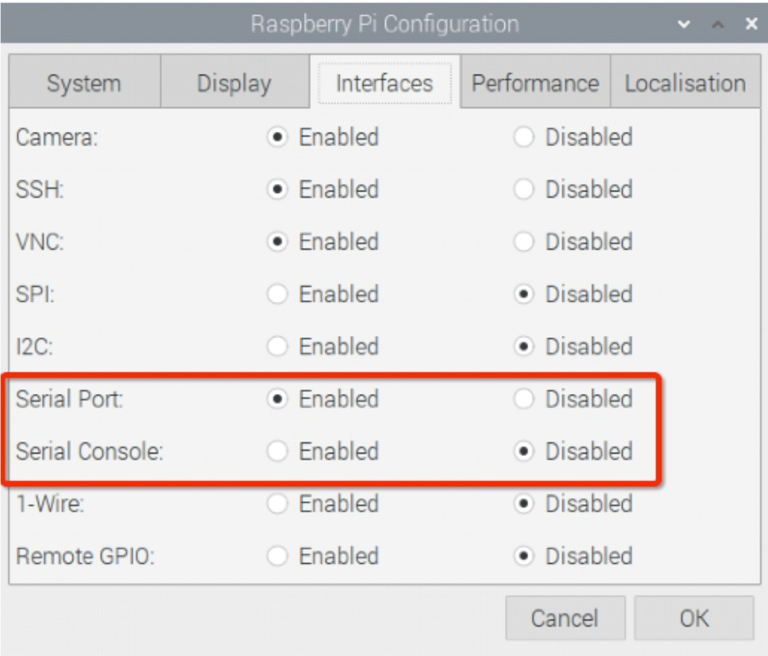
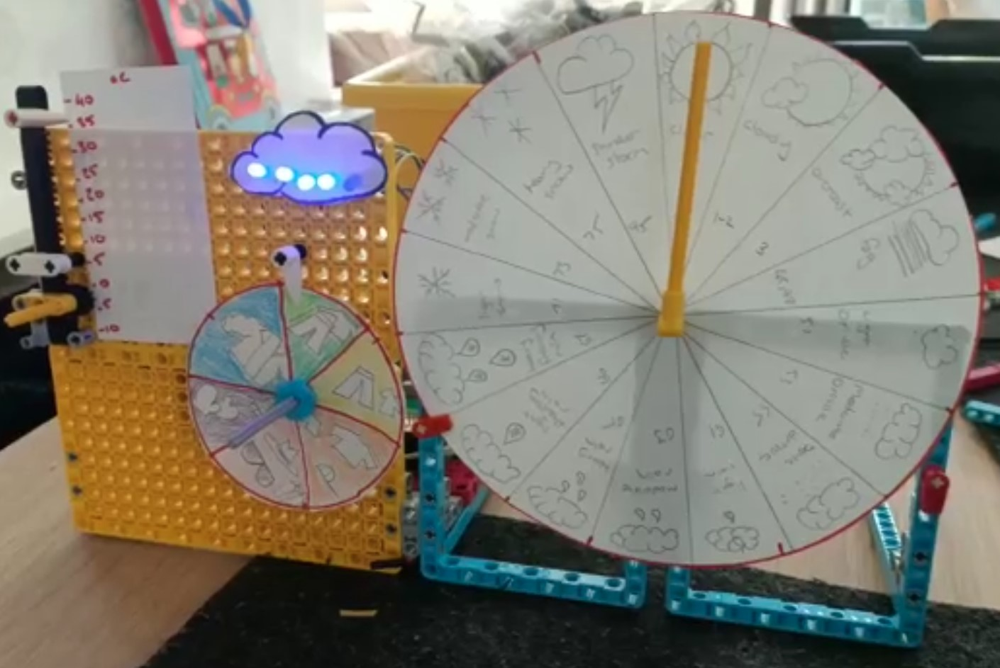

## 소개

이 프로젝트에서는 데이터를 시각화할 대시보드를 만들 것입니다. 다양한 온라인 소스에서 표시할 데이터를 선택할 수 있습니다. 데이터 대시보드는 **프로젝트 개요**를 충족해야 합니다.

대시보드는 일반적으로 그래픽 또는 읽기 쉬운 형식으로 중요한 정보의 현재 요약을 제공하는 사용자 인터페이스 입니다. 이 용어는 자동차에서 나온 용어인데, 운전자가 크고 밝은 속도계와 계기판으로 차량의 현재 상태를 볼 수 있는 것에서 유래했답니다.

여러분은:
+ LEGO® 모터와 부품을 사용하여 자동화된 인디케이터 구축하기
+ 온라인 **API** (응용 프로그래밍 인터페이스)에 액세스하고, Python을 사용하여 흥미로운 데이터 검색하기
+ LEGO를 사용하여 만든 대시보드에 선택한 데이터 표시하기

--- no-print ---

--- /no-print ---

--- collapse ---
---
title: 준비물
---
### 하드웨어

+ Raspberry Pi
+ Raspberry Pi Build HAT
+ Raspberry Pi Build HAT 7.5V PSU
+ 2개의 LEGO® Technic™ 모터(추가 옵션)
+ LEGO® SPIKE™ 힘 센서
+ 다양한 LEGO®([LEGO® SPIKE™ Prime 키트](https://education.lego.com/en-gb/product/spike-prime){:target="_blank"}에서 선택 사용)
+ 종이나 카드
+ 카드를 붙이기 위한 압정 또는 테이프
+ 마커 또는 연필
+ 가위 또는 공예 칼

선택 사항:
+ LED
+ 저항기
+ 점퍼 와이어
+ 브레드보드
+ M2 볼트 및 너트(Raspberry Pi를 LEGO® Build Plate에 장착하기 위해 각각 2개씩)

### 소프트웨어

+ Build HAT 제어를 위한 BuildHAT Python 라이브러리
+ Thonny Python IDE

### 다운로드

+ 이 프로젝트의 최종 스크립트는 [여기]((https://rpf.io/p/en/lego-data-dash-go){:target="_blank"})에서 다운로드 받을 수 있습니다.

--- /collapse ---

시작하기 전에 Raspberry Pi 컴퓨터를 설정하고 Build HAT를 연결해야 합니다.

--- task ---

M2 볼트와 너트를 사용하여 LEGO Build Plate에 Raspberry Pi를 장착하고 Raspberry Pi가 '가장자리'가 없는 쪽에 있는지 확인합니다.

 

--- /task ---

이런 식으로 Raspberry Pi를 장착하면 포트와 SD 카드 슬롯에 쉽게 액세스할 수 있습니다. Build Plate를 사용하면 Raspberry Pi를 대시보드의 주요 구조에 더 쉽게 연결할 수 있습니다.

--- task ---

Build HAT를 Raspberry Pi와 정렬하여 `This way up` 레이블을 볼 수 있도록 합니다. 모든 GPIO 핀이 HAT로 덮여 있는지 확인하고 단단히 누릅니다. (이 예에서는 [스택 헤더](https://www.adafruit.com/product/2223){:target="_blank"}을 사용하므로 핀이 더 길어집니다.)

 

--- /task ---

이제 Build HAT의 7.5V 배럴 잭을 사용하여 Raspberry Pi에 전원을 공급해야 합니다. 그러면 모터를 사용할 수 있습니다.

--- task ---

아직 설정하지 않았다면 다음 지침에 따라 Raspberry Pi를 설정하세요.

[Raspberry Pi 설정하기](https://projects.raspberrypi.org/en/projects/raspberry-pi-setting-up){:target="_blank"}

--- /task ---

--- task ---

Raspberry Pi가 부팅되면 Raspberry 메뉴 버튼을 클릭하고 "기본 설정(Preferences)"를 선택한 다음 "Raspberry Pi Configuration"을 선택하여 Raspberry Pi Configuration 도구를 엽니다.

"interfaces" 탭을 클릭하고 아래와 같이 시리얼 설정을 조정합니다.

--- /task ---

--- task ---

또한 다음 지침에 따라 buildhat python 라이브러리를 설치해야 합니다:

--- collapse ---
---
title: buildhat Python 라이브러리 설치
---

<kbd>Ctrl</kbd>+<kbd>Alt</kbd>+<kbd>T</kbd>를 눌러 Raspberry Pi에서 터미널 창을 엽니다.

커맨드 창에서 다음을 입력합니다: `sudo pip3 install buildhat`

<kbd>Enter</kbd> 를 누르고 "설치 완료" 메시지를 확인합니다.

--- /collapse ---

--- /task ---

### 프로젝트 요약: LEGO® 데이터 대시보드

여러분이 할 프로젝트는 여러분이 고른 데이터를 표시할 LEGO 대시보드를 만드는 것입니다. 데이터 소스는 원하는 모든 API일 수 있지만 이 예에서는 최소한의 가입 또는 가입 없이 OpenAQ에 액세스하는 방법을 보여줍니다. 

예제 데이터의 경우:
+ 선택한 위치의 **NO2** 수준을 측정합니다. 이산화질소(NO2)는 질소 산화물 또는 NOx로 알려진 반응성이 높은 가스 중 하나입니다. NO2는 주로 연료 연소로 인해 공기 중으로 방출됩니다.
+ **미세 입자(PM2.5)**는 선택한 위치에서 수준을 유지합니다. **미세 입자** 또는 미립자 물질 2.5(PM2.5)라는 용어는 크기가 2.5마이크론(또는 그 미만)인 공기 중의 작은 입자 또는 액적을 나타냅니다. PM2.5로 분류되는 입자는 연기와 스모그를 구성합니다.

이 프로젝트에서 사용하는 API는 '오픈 데이터를 통해 공기 불평등과 싸우는' 글로벌 비영리 단체인 [OpenAQ](https://openaq.org/#/)의 API를 사용합니다.  전 세계적으로 **8명 중 1명**은 나쁜 공기질로 인한 사망하였으며, OpenAQ는 세계 일부 지역에서 증가하는 대기 오염 문제에 대해 더 많은 사람들에게 알리기 위해 전 세계 공기질 데이터를 수집합니다. 

대시보드는 다음과 같아야 합니다:
+ LEGO®를 사용하여 선택한 데이터를 명확하게 표시
+ 온라인 API에 액세스하여 최신 데이터 검색
+ 최소 2개의 LEGO® 표시기 보유

대시보드의 기능:
+ 기타 사용 전자 부품(LED, 부저)
+ 물리적 사용자 입력이 있음(LEGO® Technic™ 모터, LEGO® 힘 센서, GPIO 버튼, 거리 센서)
  

--- no-print ---

### 영감을 얻다

--- task ---

더 많은 아이디어를 얻기 위해 이러한 예제 프로젝트를 조사하면서 대시보드에 표시하고 싶은 정보에 대해 생각해 보세요.

이 예는 수직 슬라이더에 현재 온도를 표시하는 기상 계기판, LED 눈금이 있는 구름 덮개, 회전 버튼에 감지된 온도(온도에서 바람과 날씨를 고려함)를 기반으로 하는 적절한 의복 수준을 보여줍니다. 세계 기상 코드를 사용한 자세한 기상 보고 또한 가능합니다(일명 WMO 코드라 불립니다).

--- /task ---

--- /no-print ---

--- print-only ---

--- /print-only ---

