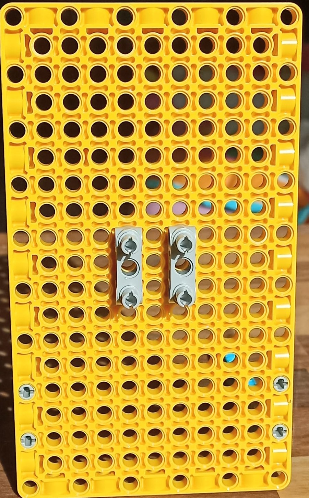
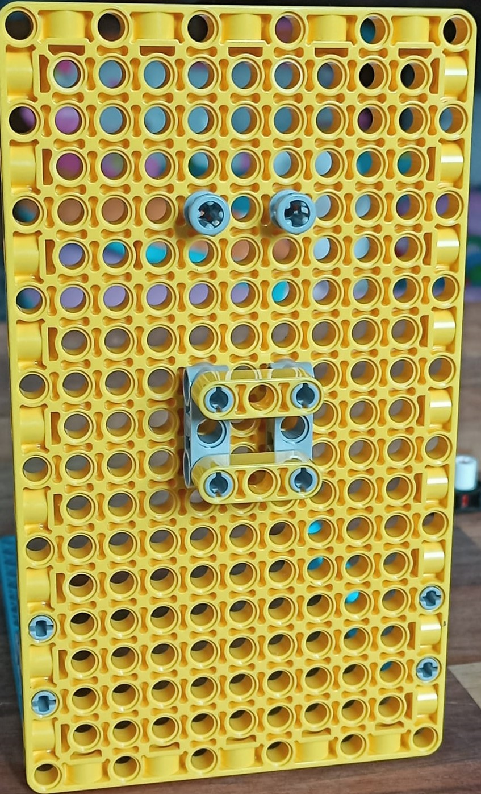
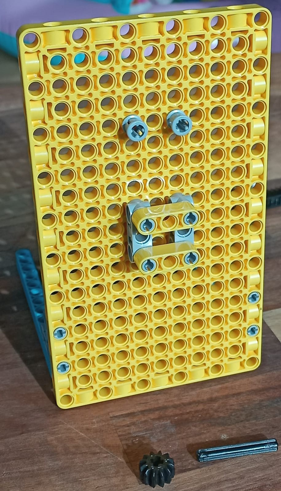
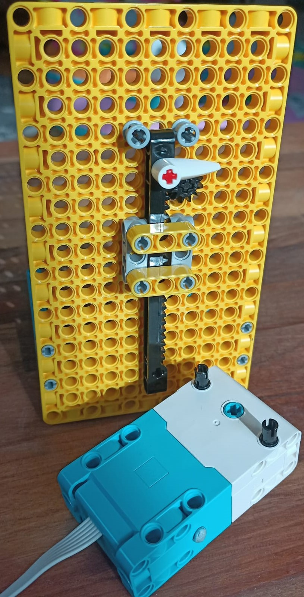

## LEGO® 슬라이딩 표시기 만들기

이제 LEGO® 슬라이딩 표시기를 만들 차례입니다! 슬라이딩 표시기를 포함하지 않으려면 회전하는 LEGO 다이얼을 만드는 방법을 보여주는 다음 단계로 건너뛸 수 있습니다.

수직 슬라이더는 다음과 같습니다.

슬라이딩 표시기는 원하는 경우 빌드를 시계 반대 방향으로 90도 회전하여 수평으로 실행할 수도 있습니다.

--- task ---

수직 슬라이딩 표시기를 만들려면 다음 빌드 지침을 따르세요.

이 모델을 구축하기 위해,  [다운로드](resources/lego-data-dash-slider.pdf) 하거나 쉬운 건물 설명서를 따라하세요.
<embed src="resources/lego-data-dash-slider.pdf" width="600" height="500" alt="pdf" pluginspage="https://www.adobe.com/products/acrobat/readstep2.html">
  
 
  
  

    --- /task ---
  

  
  

    --- task ---
  

  
  

    노란색 플레이트 요소를 잡고 90도 스터드 브래킷을 사용하여 두 개의 파란색 빔을 설치합니다.
  

  
  

    --- /task ---
  

  
  

    --- task ---
  

  
  

    한 열 간격으로 두 개의 회색 직선 브래킷을 연결합니다. 
  

  
  

    --- /task ---
  

  
  

    --- task ---
  

  
  

    브래킷 위의 플레이트 요소에 한쪽 끝에 스페이서가 있는 회색의 두 배 길이의 스터드를 장착합니다.
  

  
  

    --- /task ---
  

  
  

    --- task ---
  

  
  

    두 개의 직선 브래킷 사이에 두 개의 노란색(3개 구멍) 빔을 수평으로 부착합니다. 
  

  
  

    --- /task ---
  

  
  

    --- task ---
  

  
  

    작은 검은 기어와 짧은 차축을 가지고 그들을 결합합니다.
  

  
  

    --- /task ---
  

  
  

    --- task ---
  

  
  

    Insert the axle through the Build Plate above the right bracket as shown: 
  

  
  

    --- /task ---
  

  
  

    --- task ---
  

  
  

    톱니 막대, 빨간색 샤프트 및 포인터 화살표를 가져옵니다. 표시 화살표가 톱니 면을 가리키도록 하여 톱니 막대의 한쪽 끝에 샤프트를 삽입합니다. 
  

  
  

    --- /task ---
  

  
  

    --- task ---
  

  
  

    랙을 메커니즘 상단으로 밀어 넣습니다.
  

  
  

    You will have to pull the gear forward to allow it past, then push the gear back in to fit between the teeth. The mechanism will slide easily up and down while the gear and axle are free. Connecting a motor will hold it steady. 
  

  
  

    --- /task ---
  

  
  

    --- task ---
  

  
  

    Take a motor and add two studs to the flat side, in the top two holes. 
  

  
  

    --- /task ---
  

  
  

    --- task ---
  

  
  

    Before attaching the motor to the rear of the slider's axle, make sure that it is 'zeroed in', by lining up the two lollipop symbols on the motor's edge:
  

  
  

    
  

  
  

    --- /task ---
  

  
  

    --- task ---
  

  
  

    Adjust your toothed bar so the gear sits about halfway along it, then mount the motor behind the board using the two studs while holding the toothed bar in place. Make sure the axle fits into the hole on the <strong x-id="1">flat side</strong> of the motor. It should keep the slider held steady now, around halfway along the bar. 
  

  
  

    --- /task ---
  

<h3 spaces-before="0">
  Test the sliding indicator
</h3>

  To program your sliding indicator, you can reuse some of the code written in the <a href="https://projects.raspberrypi.org/en/projects/lego-plotter">LEGO® Data plotter</a> project, as they use the same mechanism.

  --- task ---

  Connect the motor of your slider to port A on your Build HAT.

  --- /task ---

  --- task ---

  You will use the BuildHAT Python library, so make sure it is installed:

  --- collapse ---

<h2 spaces-before="0">
  title: Install the BuildHAT Python library
</h2>

  Open a terminal window on your Raspberry Pi by pressing <kbd>Ctrl</kbd>+<kbd>Alt</kbd>+<kbd>T</kbd>.

  At the prompt type: <code>pip3 install buildhat</code>

  Press <kbd>Enter</kbd> and wait for the "installation completed" message.

  --- /collapse ---

  --- /task ---

<h3 spaces-before="0">
  Create the scale for your sliding indicator
</h3>

  Now you know it works, you will need to create a scale for the sliding indicator, so you know what it means.

  --- task ---

  Get a piece of card about as long as your toothed bar. Stick it next to the sliding indicator, under the pointer. Have a marker or pencil ready.

  --- /task ---

  --- task ---

  Open <strong x-id="1">Thonny</strong> on your Raspberry Pi from the <strong x-id="1">Programming menu</strong>.

  In the <strong x-id="1">Shell</strong> (the window at the bottom), next to the three arrows, type: <code>from buildhat import Motor</code> and press <kbd>Enter</kbd>. You should see a new line appear with three more arrows.

  --- /task ---

  --- task ---

  이제 다음을 입력합니다: <code>motor = = Motor('A')</code> 명령을 입력하고 <kbd>Enter</kbd> 키를 누르세요. --- /task ---

  푸셔 모터를 설정한 후 최대 및 최소 판독값으로 보내 얼마나 멀리 갈 수 있는지 확인해야 합니다. 그런 다음 판지에 이러한 장소를 표시하십시오.

  --- task ---

  다음을 입력하세요: <code>motor.run_to_position(-180, 100)</code> 명령을 입력하고 <kbd>Enter</kbd> 를 누르세요. 화살표로 표시된 위치에 카드를 표시하세요. 이것은 가능한 최소 판독값입니다.

  --- /task ---

  --- task ---

  다음을 입력하세요: <code>motor.run_to_position(180, 100, direction=clockwise)</code> 명령을 입력하고 <kbd>Enter</kbd> 를 누르세요. 화살표로 표시된 위치에 카드를 표시하세요. 이것은 가능한 최대 판독값입니다.

  --- /task ---

  이제 최소 판독값 및 최대 판독값이 어디에 있는지 알 수 있습니다. 슬라이더를 일부 데이터에 연결하면, 정확한 척도를 만들 수 있습니다.

<h3 spaces-before="0">
  라이브 데이터를 표시하도록 슬라이딩 표시기를 프로그래밍하십시오.
</h3>

  --- task ---

  빈 탭에 다음 코드를 입력하세요:

  --- code ---

  language: python filename: slider_test.py line_numbers: true line_number_start: 1

<h2 spaces-before="0">
  line_highlights:
</h2>

  from buildhat import Motor from time import sleep from random import randint

  motor_slider = Motor('A')

  motor_slider.run_to_position(0,100)

  while True: current_angle = motor_slider.get_aposition() new_angle = randint(-175, 175) print(sensor_data) if new_angle > current_angle: motor_slider.run_to_position(new_angle, 100, direction="clockwise") print('Turning CW') elif new_angle < current_angle: motor_slider.run_to_position(new_angle, 100, direction="anticlockwise") print('Turning ACW') sleep(0.1)

  --- /code ---

  Save your work as <code>slider_test.py</code> and click <strong x-id="1">Run</strong>. 슬라이더가 위 또는 아래로(또는 앞뒤로!) 미끄러지는 것을 볼 수 있습니다.

  --- /task ---

  --- save ---

