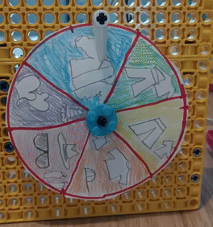
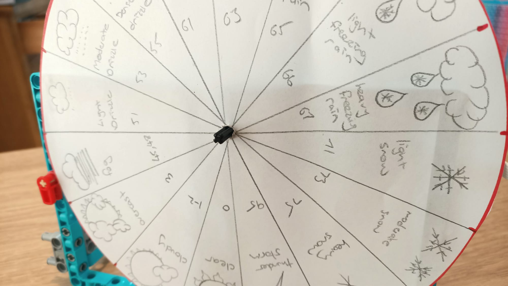
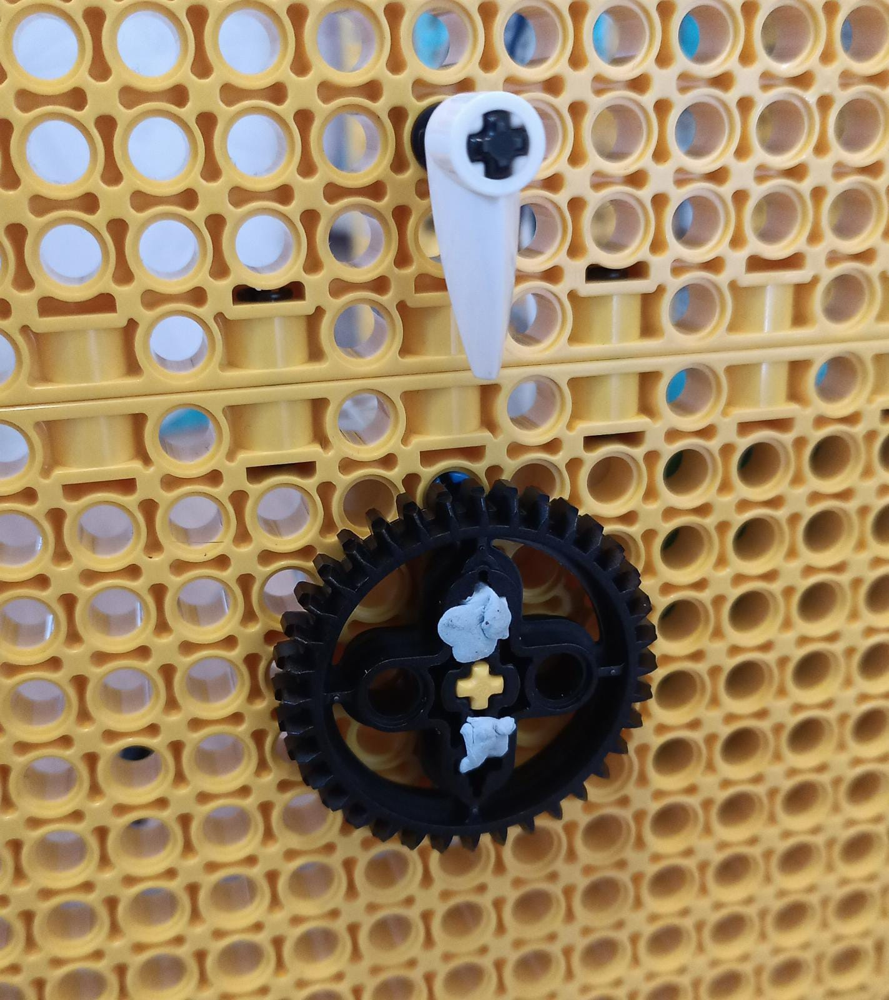

## LEGO® 게이지 만들기

데이터를 빠르게 표시하는 또 다른 방법은 **다이얼** (또는 **게이지** 라고도 함)을 사용하는 것입니다. 당신은 확실히 전에 그들을 본 적이 있습니다. 그들은 일반적으로 원형 또는 반원형이며 두 가지 주요 눈에 보이는 부분이 있습니다.

+ 눈금이 표시된 판
+ 눈금을 따라 이동하여 데이터 판독값을 표시하는 바늘

게이지 또는 다이얼은 얼굴과 바늘만 만드는 데 의존하기 때문에 LEGO®를 사용하여 만들 수 있는 가장 간단한 데이터 판독 유형입니다. 바늘이나 다이얼이 모터에 직접 연결되기 때문에 빌드가 매우 간단합니다.

--- task ---

모터를 게이지 액슬의 뒤쪽에 부착하기 전에 모터 가장자리에 두 개의 막대 사탕 기호를 정렬하여 '영점 조정'되었는지 확인하십시오.

--- /task ---

### 스케일 생성

게이지 생성을 완료하려면 종이, 카드 또는 기타 그림을 사용하여 스케일을 만들어야 합니다. 메커니즘과 코딩은 정확히 동일하지만 게이지를 어떻게 보여주고 싶은지 생각해 봅시다.

 --- task ---

 어떤 종류의 게이지를 만들지 **선택** 하세요.

 LEGO®로 만들 수 있는 두 가지 간단한 유형이 있습니다:

+ 바늘이 회전하여 페이스 점을 나타내는 게이지:

+ 페이스 전체가 회전하여 정지된 표시등이 있는 상단 점을 표시하는 게이지:

--- /task ---

--- task ---

빈 종이에 게이지를 만들어 봅시다. 원하는 크기의 멋진 원을 그립니다. 중앙을 표시하고 가위로 잘라내세요.

--- /task --- 

--- task ---

중앙을 통해 선을 그리거나 가장자리 주위에 눈금을 그려서 원을 동일한 세그먼트(각 판독값에 대해 하나씩)로 나눕니다.

--- /task ---

--- task ---

아이콘을 그리거나 각 세그먼트 안에 아이콘이 나타내는 내용을 쓰십시오.

--- /task ---

게이지 판(미터 페이스) 생성이 완료되면 보드에 마운트해야 합니다.

--- collapse ---
---
title: 바늘 게이지를 만드는 경우
---

포인터 도구를 완성하려면:

--- task ---

Blu Tack 또는 백 테이프를 사용하여 액슬에 미터 페이스를 아래로 밀어 대쉬에 붙이고 액슬이 회전할 때 미끄러지는 것을 방지합니다.

--- /task ---

--- task ---

샤프트 끝에 90도 엘보우를 추가하고 그 위에 다른 샤프트를 배치합니다. 눈금에 도달할 만큼 충분히 길고 판독값을 명확하게 표시하도록 하세요.

차축을 장착할 때 차축이 똑바로 위를 가리키고 있고 모터가 "0"이면 판독에 필요한 회전량을 더 쉽게 계산할 수 있으므로 나중에 도움이 됩니다.

--- /task ---

--- /collapse ---

--- collapse ---
---
title: 회전하는 페이스 다이얼을 만드는 경우
---

바늘 게이지 제작을 마치려면:

--- task ---

계기판 뒤에 단일 기어를 스페이서로 장착하여 계기판에 걸리는 것을 방지합니다. Blu Tack을 사용하여 이 장비에 미터 페이스를 붙입니다. 미터 주위에 증가하는 눈금을 만든 경우 눈금의 중심이 위쪽에 있고("0으로 설정된" 팔레트 기호와 일치) 아래쪽에 최소값과 최대값이 오도록 장착합니다.

--- /task ---

--- /collapse ---

### 게이지 테스트

--- task ---

미터의 모터를 Build HAT의 포트 A에 연결합니다.

--- /task ---

--- task ---

BuildHAT Python 라이브러리가 필요하므로 다음과 같이 설치되어 있는지 확인하세요:

--- collapse ---
---
title: buildhat Python 라이브러리 설치
---

<kbd>Ctrl</kbd>+<kbd>Alt</kbd>+<kbd>T</kbd>를 눌러 Raspberry Pi에서 터미널 창을 엽니다.

커맨드 창에서 다음을 입력합니다: `pip3 install buildhat`

<kbd>Enter</kbd> 를 누르고 "설치 완료" 메시지를 확인합니다.

--- /collapse ---

--- /task ---

--- task ---

**개발** 메뉴에서 Raspberry Pi의 **Thonny**를 엽니다.

빈 탭에 다음 코드를 입력하세요:

--- code ---
---
language: python 
filename: gauge_test.py 
line_numbers: true 
line_number_start: 1
line_highlights:
---
from buildhat import Motor 
from time import sleep 
from random import randint

motor_gauge = Motor('A')

motor_gauge.run_to_position(0,100)

while True: 
    angle = randint(-180, 180) 
    motor_gauge.run_to_position(angle, 100) 
    sleep(0.3)

--- /code ---

작업을 `gauge_test.py` 로 저장하고 **Run** 을 클릭하십시오. 게이지가 움직이기 시작하는 것을 볼 수 있습니다!

--- /task ---
