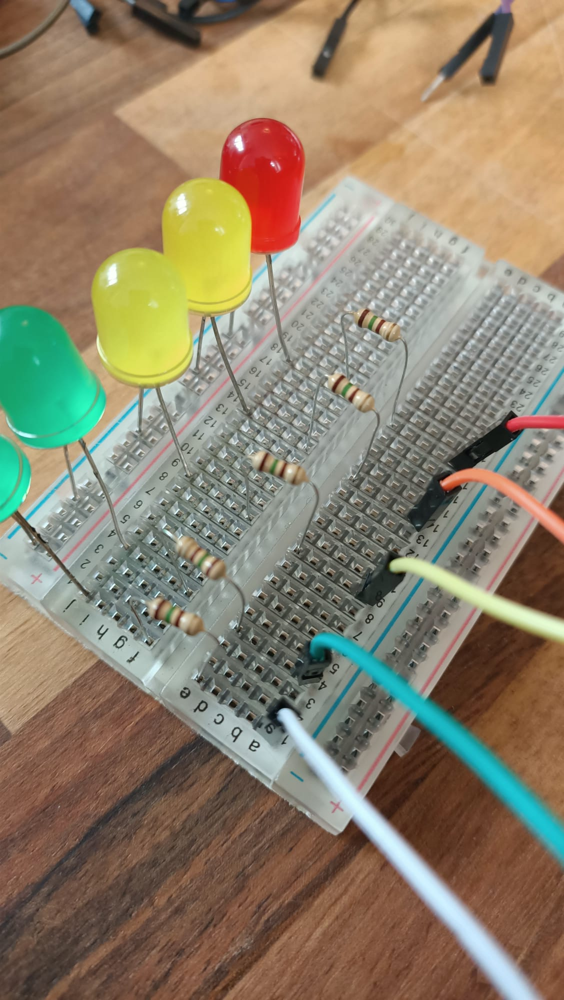

## LED 저울 만들기

데이터를 표시하는 또 다른 멋진 방법은 결과 값이 변경됨에 따라 켜지고 꺼지는 LED를 사용하는 것입니다. 결과 값이 높을수록 더 많은 LED가 켜집니다. 음악의 볼륨을 보여주는 컴퓨터의 그래픽 이퀄라이저와 같습니다.

LED 디스플레이를 만들려면 몇 개의 LED 전구가 필요합니다. 전구가 많을수록 스케일이 더 정확해집니다. 하지만 사용할 수 있는 LED에도 한계가 있습니다. 사용 가능한 GPIO 핀 수만큼만 LED를 사용할 수 있습니다. 이 예에서는 다섯 개의 LED를 사용하지만, 여러분은 열 개 이상의 LED를 장착하는 **것을 선택할 수 있습니다.**

**참고:** build HAT 설계 방법으로 인해 **GPIO 14 또는 15(핀 8 및 10)에 액세스할 수 없습니다.**

--- task ---

LED, 저항기, M-F 점퍼 케이블 및 브레드보드를 정리하세요.

--- /task ---

--- task ---

LED를 잘 살펴보십시오. 한쪽 다리는 다른 한쪽 다리보다 길다는 것을 알 수 있습니다.

--- /task ---

--- task ---

LED ** 짧은 다리 ** 를 ** 공통 접지 레일 **에 삽입하고 (가장 가장자리의 파란색 선 옆에 있음) 긴 다리를 가장 가까운 번호 핀에 삽입합니다. 

--- /task ---

LED가 과부하되어 타거나 또는 터지는 상황을 방지하려면 회로에 저항을 추가해야 합니다. 지금이 딱 좋은 때입니다.

--- task ---

저항을 가지고 어레이의 첫 번째 LED와 **동일한 행 **에 한쪽 끝을 연결하세요. 다음과 같이 저항기의 다른 쪽 끝을 같은 행에 연결하지만 브레드보드의 ** 중심선 반대쪽 **에 연결합니다.

시퀀스의 모든 LED에 대해 반복합니다.

--- /task ---

--- task ---

M-F 점퍼 케이블의 M단(핀)을 저항과 같은 행에 배치하여 Raspberry Pi의 핀에 연결할 수 있도록 합니다:

--- /task ---

--- task ---

다른 점퍼 케이블의 M 쪽 끝을 잡고 공통 접지 레일 끝에 연결합니다:

--- /task ---

완성된 LED 디스플레이는 다음과 같아야 합니다:

다음 단계는 Raspberry Pi의 GPIO 핀에 연결하는 것입니다.

--- task ---

공통 접지 레일에 연결된 점퍼 케이블의 F 쪽(암)을 핀 39에 연결합니다. 이것은 ** 모든 ** LED 램프에 음극 신호를 제공하는 Raspberry Pi의 여러 접지 핀 중 하나입니다. 

--- /task ---

--- task ---

다른 케이블을 GPIO 핀에 연결하고 LED를 연결한 케이블을 기록해 둡니다.

이 예에서 우리는 핀 16, 19, 20, 21, 26을 사용했습니다(순서를 위해 한 쪽 끝에 모두 갖기 위해):

--- /task ---

LED 시퀀스를 Raspberry Pi에 연결한 후에는 전원을 켜고 프로그래밍해야 합니다.

--- task ---

Build HAT의 배럴 커넥터 소켓에 7.5V 전원 공급 장치를 연결합니다. Raspberry Pi를 부팅하고 Raspberry Pi OS 데스크탑 로드를 확인해야 합니다.

--- /task ---

--- task ---

**개발** 메뉴에서 Raspberry Pi의 **Thonny**를 엽니다.

스크립트의 처음 몇 줄은 gpiozero 및 randint 라이브러리를 가져오고 LED를 제어 가능하도록 설정합니다. LED가 연결된 핀과 일치하도록 괄호 안의 값을 변경해야 합니다. ** 참고: ** 이 숫자의 순서는 중요합니다! 핀 번호는 "라이트 바"의 가장 낮은 곳에서 가장 높은 곳으로 이동해야 합니다.

빈 창에 다음 코드를 입력합니다:

--- code ---
---
language: python filename: led_bargraph.py line_numbers: true line_number_start: 1
line_highlights:
---
from gpiozero import LEDBarGraph from random import randint

graph = LEDBarGraph(16, 19, 20, 21, 26) #이 숫자의 순서는 연결한 핀과 일치해야 합니다.

--- /code ---

--- /task ---

이제 LED를 프로그래밍할 준비가 되었으므로 코드의 다음 부분에서 측정하려는 데이터를 가져와야 합니다. 그런 다음 결과에 따라 몇 개의 LED를 켤지 결정해야 합니다. 테스트 목적으로 임의의 데이터를 사용해야 합니다.

의도는 결과 값이 증가하면 LED가 켜지고 결과 값이 감소하면 LED가 꺼지도록 하는 것입니다. 다른 인디케이터와 마찬가지로 규모에 맞게 데이터를 매핑해야 합니다.

--- task ---

스크립트의 끝에 다음 코드를 추가하십시오:

--- code ---
---
language: python filename: led_sequence.py line_numbers: true line_number_start: 9
line_highlights:
---
while True: data_reading = randint(0, 100) graph.value = 1/data_reading # 디스플레이를 위해 십진수 값을 생성합니다. sleep(0.5) --- /code ---

--- /task ---

--- task ---

작업을 `led_sequence.py` 로 저장하고 **실행** 을 클릭하십시오. 이제 바 그래프가 빛나기 시작해야 합니다!

--- /task ---

--- save ---
