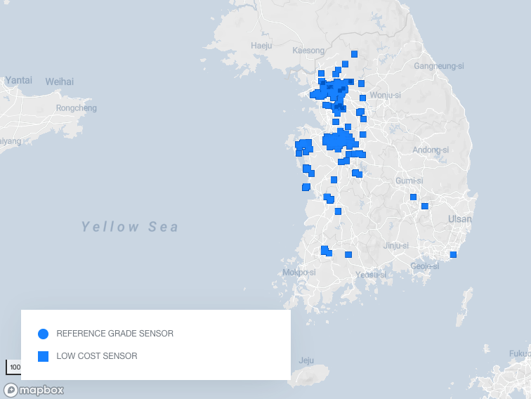
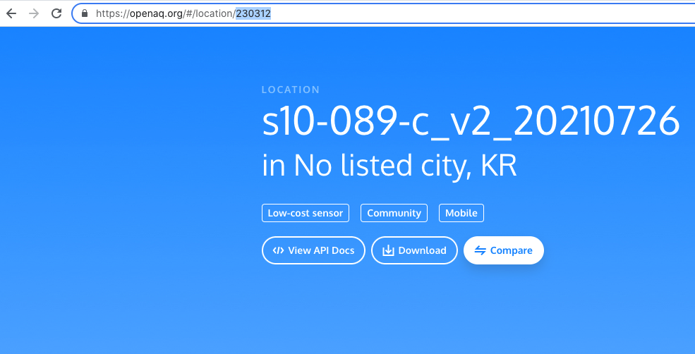

## OpenAQ API에 액세스

API는 **응용 프로그래밍 인터페이스**를 나타냅니다. 이것은 두 응용 프로그램이 서로 소통할 수 있게 해주는 소프트웨어입니다. Facebook과 같은 앱을 사용하거나 인스턴트 메시지를 보내거나 휴대전화로 날씨를 확인할 때마다 API를 사용하고 있는 것입니다.

휴대폰에서 앱을 사용할 때마다 앱이 인터넷에 연결되어 내가 알고 싶은 정보를 서버로 전송합니다. 그런 다음 서버는 원하는 데이터를 찾아 검색하고 해석한 다음 휴대전화로 다시 보냅니다. 그런 다음 앱은 반환된 데이터를 가져와서 읽을 수 있는 방식으로 원하는 정보를 제공합니다. 이것이 API 입니다. 인터넷을 통해 다른 기계를 제어하는 방법 — 이 모든 것이 **API**를 통해 발생합니다.

한 가지 주목할 부분은 온라인 정보 데이터베이스를 조사하고 원하는 데이터를 전화 대신 LEGO® 대시보드에 반환하는 자체 앱을 우리가 작성할 수 있다는 것입니다. Raspberry Pi를 브레인으로 사용하여 해당 데이터를 얻은 다음 표시할 수 있습니다. 손으로 만든 맞춤형 LEGO 표시기에 표시하는 것이죠!

그렇게 하려면 몇 가지 사항들을 우선 결정해야 합니다. 대기 질에 대해 알 수 있는 위치를 선택해야 합니다. 전 세계 어디에서나 선택할 수 있습니다! — 그리고 나타내고자 하는 대기 질 지표를 결정해야 합니다.

### OpenAQ — 오픈 소스 대기질 데이터베이스

예제 대시보드에서는 [**OpenAQ**](https://openaq.org/#/){:target="_blank"}에 API를 사용할 것입니다. OpenAQ를 사용하면 전 세계 수천 개의 측정 스테이션에서 수집한 전 세계의 다양한 대기 오염 데이터를 볼 수 있습니다.

이미 API를 사용하는 마법사라면 대시보드에 표시하고 싶은 모든 데이터를 사용할 수 있습니다. 우리를 따라 다니며 첫 번째 시도로 OpenAQ를 사용하려면 조사하려는 측정 스테이션과 볼 수 있는 측정 스테이션을 찾아야 합니다.

--- task ---

[여기를 눌러](https://openaq.org/#/map){:target="_blank"} OpenAQ map으로 **탐색**하세요! 점으로 덮인 세계 지도를 보여주는 웹페이지가 나타나야 합니다.

--- /task ---

--- task ---

**전 세계에서 대기 질에 대한 데이터를 수집하고 싶은 곳을** 결정하십시오. 이것은 당신이 살고 있는 곳 근처, 당신이 관심 있는 곳, 또는 흥미로운 데이터가 있다고 생각되는 곳일 수 있습니다.

--- /task ---

라즈베리파이 본사가 영국 케임브리지에 있으므로 여기에서는 영국 케임브리지를 예로 사용하겠습니다.

대기 질 모니터링 스테이션에서 수행하는 다양한 측정이 있습니다. OpenAQ 데이터베이스에는 다음 유형의 대기 오염에 대한 정보가 있습니다.

 + PM2.5 및 PM10(미세먼지): 공기 중에 떠다니는 미세한 입자(연기, 스모그)
 + NO2(이산화질소): 오존 생성, 어린이 천식 유발
 + CO(일산화탄소): 인체에 치명적, 화석연료 연소 부작용
 + SO2(이산화황): 악취, 호흡 문제를 일으킬 수 있음, 산성비 생성, 산업적 처리의 부작용
 + O3(오존): NO2가 햇빛에 반응하여 생성, 스모그 유발, 식물에 유해
 + BC(블랙카본): 많은 곳(미국, 폴란드)에서 측정되지 않음, 비효율적인 연료 연소로 인해 발생, 지구 온난화에 추가, 인간에게 위험

--- task ---

**어떤 종류의 대기 오염을 측정하는 데 가장 관심이 있는지** 결정하십시오. 화면 왼쪽에 있는 색상 눈금 근처의 풀다운 메뉴에서 다른 옵션을 선택할 수 있습니다. 

** 참고: ** 원형 표시는 더 다양한 오염 물질을 측정하는 더 광범위한 대기 질 측정 스테이션을 나타냅니다.

--- /task ---

--- task ---

**** 확대하고 측정하려는 장소에서 가장 가까운 점을 찾습니다. 가장 가까운 점을 클릭하면 위치 정보를 볼 수 있습니다. 표시되는 팝업에서 **View Location**버튼을 클릭합니다.  

--- /task ---

--- task ---

새 웹사이트가 선택된 위치에서 측정의 세부사항을 로드하고 표시하는 동안 새 페이지의 URL에 숫자를 ** 적어 두십시오**. 이것은 선택한 공기질 측정소의 OpenAQ 식별 번호입니다. (이 예에서는 ID 번호가 **2480** Sandy Roadside 측정 스테이션입니다.) 

--- /task ---

--- task ---

위치 페이지에서 해당 위치에서 측정된 다양한 유형의 오염 물질을 볼 수 있습니다. 데이터 패널에 표시할 목록에서 두 개를 ** 선택 **하십시오.  Sandy 근처에 있는 이 측정 스테이션은 NO2, PM10 및 PM2.5를 표시할 수 있습니다. 따라서 이 예에서는 NO2 및 PM2.5를 사용합니다.

--- /task ---