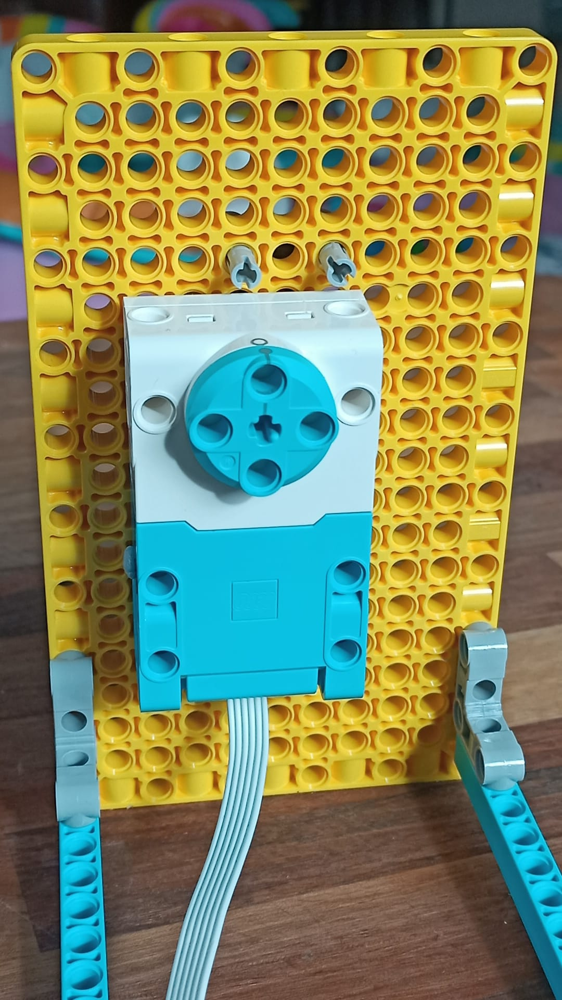

## 制作一个乐高（LEGO®）滑动指示器

现在可以开始制作乐高（LEGO®）滑动指示器了！ 如果您不想包含滑动指示器，可以跳到下一步：创建旋转乐高（LEGO）表盘。

这是垂直滑动指示器的样子：

如果您愿意，也可以将滑动指示器逆时针旋 90 度，从而做到水平滑动。

--- task ---

按照以下步骤创建垂直滑动指示器：

要构建此模型，请按照我们下述的构建指南进行操作，也可在此[下载](resources/lego-data-dash-slider.pdf)。
<embed src="resources/lego-data-dash-slider.pdf" width="600" height="500" alt="pdf" pluginspage="https://www.adobe.com/products/acrobat/readstep2.html">
  
 
  
  

    --- /task ---
  

  
  

    --- task ---
  

  
  

    取一个黄色板，利用 90 度螺柱支架连接上两个蓝色横梁。
  

  
  

    --- /task ---
  

  
  

    --- task ---
  

  
  

    接上两个灰色直支架，中间分隔一列。 
  

  
  

    --- /task ---
  

  
  

    --- task ---
  

  
  

    将两个带垫片的，灰色双倍长度螺柱连接到支架上方。 
  

  
  

    --- /task ---
  

  
  

    --- task ---
  

  
  

    将两个直支架用两个黄色（三孔）梁水平连接起来。 
  

  
  

    --- /task ---
  

  
  

    --- task ---
  

  
  

    取一个黑色的小齿轮和一个短轴，将它们连接在一起。 
  

  
  

    --- /task ---
  

  
  

    --- task ---
  

  
  

    如图所示，将短轴穿过右支架上方的Build Plate： 
  

  
  

    --- /task ---
  

  
  

    --- task ---
  

  
  

    取一个齿条、一个红色轴和一个指示箭头。 将红色轴插入齿条的一端，连接指示箭头，并指向牙齿侧方向： 
  

  
  

    --- /task ---
  

  
  

    --- task ---
  

  
  

    将齿条滑入支架结构，直到触及顶部。
  

  
  

    您须要向前拉齿轮，以便于齿条通过，然后将齿轮推回并与齿扣接合。 当齿轮和轴可以自由转动时，带了指示箭头的齿条可以轻易地上下滑动。 连接马达后就可以保持齿条的稳定。 
  

  
  

    --- /task ---
  

  
  

    --- task ---
  

  
  

    取一个马达，在平滑面的顶部上方添加两个螺柱。 
  

  
  

    --- /task ---
  

  
  

    --- task ---
  

  
  

    在将马达连接到滑动指示器的背面之前，通过将马达边缘的两个棒棒糖符号对齐，确保它已“归零”：
  

  
  

    
  

  
  

    --- /task ---
  

  
  

    --- task ---
  

  
  

    调整你的齿条高度，使齿轮位于它的一半左右。将齿条固定后，然后使用两个螺柱将马达安装在指示器的背面。 确保短轴准确地插入马达 <strong x-id="1">平滑面</strong>的孔中。 这样可以使齿轮保持稳定在齿条的中部。 
  

  
  

    --- /task ---
  

<h3 spaces-before="0">
  测试滑动指示器
</h3>

  要对滑动指示器进行编程，您可以重复使用在 <a href="https://projects.raspberrypi.org/en/projects/lego-plotter">LEGO® Data plotter</a> 项目中编写的一些代码，因为它们使用相同的机制。

  --- task ---

  将滑动指示器的马达连接到 Build HAT 上的端口 A。

  --- /task ---

  --- task ---

  您将使用 BuildHAT Python 库，因此请确保已安装它：

  --- collapse ---

<h2 spaces-before="0">
  title：安装 BuildHAT Python 库
</h2>

  按下<kbd>Ctrl</kbd>+<kbd>Alt</kbd>+<kbd>T</kbd>，在 Raspberry Pi 上打开一个终端窗口。

  在提示符后键入： <code>sudo pip3 install buildhat</code>

  按 <kbd>回车</kbd> 并等待“installation completed”消息。

  --- /collapse ---

  --- /task ---

<h3 spaces-before="0">
  为您的滑动指示器创建比例尺
</h3>

  现在您知道滑动指示器可以运作了，您需要为它创建一个刻度，从而知道它的含义。

  --- task ---

  拿一张大约和你的齿条一样长的卡片。 将它贴在指针下方的滑动指示器旁边。 准备好记号笔或铅笔。

  --- /task ---

  --- task ---

  从Raspberry Pi 上的<strong x-id="1">Programming </strong>菜单中启动 <strong x-id="1">Thonny</strong>。

  在（底部的）<strong x-id="1">Shell</strong> 窗口中，在三个箭头后面键入： <code>from buildhat import Motor</code> 并按 <kbd>回车</kbd>。 您应该会看到一个同样带有三个箭头的新行。

  --- /task ---

  --- task ---

  现在输入： <code>motor = = Motor('A')</code> 并按 <kbd>回车</kbd>。 --- /task ---

  现在您已经配置好马达，请将马达运转到最大和最小读数以查看指示箭头可以移动到多远 - 在卡片上标记相应位置。

  --- task ---

  键入： <code>motor.run_to_position(-180, 100)</code> 并按 <kbd>回车</kbd>。 在卡片上标记箭头指示的位置。 这是您的最小读数。

  --- /task ---

  --- task ---

  键入： <code>motor.run_to_position(180, 100)</code> 并按 <kbd>回车</kbd>。 在卡片上标记箭头指示的位置。 这是您的最大读数。

  --- /task ---

  您现在知道您的最小和最大读数在哪里。 一旦你将滑块指示器关联到一些数据，你就将能够创建一个准确的尺度。

<h3 spaces-before="0">
  编程您的滑动指示器以显示实时数据
</h3>

  --- task ---

  新建文件并输入以下代码：

  --- code ---

  language: python filename: slider_test.py line_numbers: true line_number_start: 1

<h2 spaces-before="0">
  line_highlights:
</h2>

  from buildhat import Motor from time import sleep from random import randint

  motor_slider = Motor('A')

  motor_slider.run_to_position(0,100)

  while True: current_angle = motor_slider.get_aposition() new_angle = randint(-175, 175) print(sensor_data) if new_angle > current_angle: motor_slider.run_to_position(new_angle, 100, direction="clockwise") print('Turning CW') elif new_angle < current_angle: motor_slider.run_to_position(new_angle, 100, direction="anticlockwise") print('Turning ACW') sleep(0.1)

  --- /code ---

  将您的工作保存为 <code>slider_test.py</code> 并单击 <strong x-id="1">Run</strong>。 您应该可以看到滑块上下移动（或前后移动！）

  --- /task ---

  --- save ---

