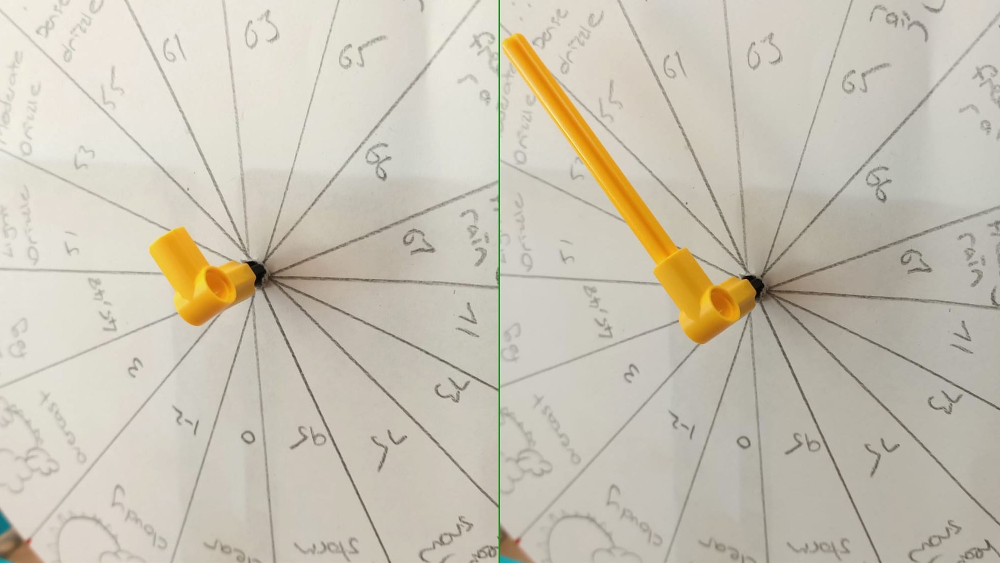

## 制作一个乐高（LEGO®）仪表盘

另一种快速显示数据的方法是使用 **刻度盘**，也称为 **仪表**。 你以前肯定见过他们；它们通常是圆形或半圆形的，有两个主要的可见部分：

+ 表盘，上面有刻度
+ 指针，沿刻度移动以显示读数

仪表或刻度盘是您可以使用乐高（LEGO®）创建的最简单的显示数据的模型，因为它仅需要创建表盘和指针。 因为指针或刻度盘直接连接到您的马达，因此搭建非常简单：

--- task ---

在将马达连接到仪表的背面之前，通过将马达边缘的两个棒棒糖符号对齐，确保它已“归零”：

--- /task ---

### 创建一个比例尺

要完成仪表的构建，您需要使用纸张、卡片或其他美术用品创建一个比例尺。 机制和编码完全相同，但现在您要考虑一下期望的仪表的外观。

 --- task ---

 **选择** 您将制作什么样的表盘。

 您可以使用乐高（LEGO®）创建两种简单的类型：

+ 一个通过旋转指针来指示表盘上某个点的仪表：

+ 一个具有固定在顶部的指针，但是可以旋转整个表盘以显示一个数值的仪表：

--- /task ---

--- task ---

在一张空白纸上，按照您希望的仪表大小画一个完整的圆圈。 标记好中心点，然后用剪刀裁剪出整个圆圈。

--- /task ---

--- task ---

通过圆心将圆圈等分成几个部分（每个读数一个），或着在圆圈的边缘绘制刻度。

--- /task ---

--- task ---

在每个段内画一个图标或写下该部分所指示的内容。

--- /task ---

完成仪表盘后，您需要将其安装到仪表板上。

--- collapse ---
---
title：如果您创建的是指针仪表
---

要完成你的指针仪表：

--- task ---

将表盘穿过轮轴，使用蓝胶（Blu Tack）或胶带将其粘在后面的仪表板上，这样可以防止表盘在轮轴转动时滑动。 

--- /task ---

--- task ---

在轮轴的末端添加一个 90 度弯头，然后用其连接另一个轮轴。 请确保它足够长，可以达到您的标尺并明确显示读数。

如果您在安装轮轴时能保持指针笔直向上（并且马达“归零”），这对后面的工作会有帮助，因为这样可以更轻松地计算读数所需的旋转量。

--- /task ---

--- /collapse ---

--- collapse ---
---
title：如果您创建的是盘面旋转仪表
---

要完成一个旋转仪表：

--- task ---

在表盘后面安装一个齿轮作为垫片，以防止表盘卡在仪表板上。 用蓝胶（Blu Tack）将表盘粘在设备上。 如果您刚才创建的比例尺是递增式的，就将比例尺的中间放置在仪表板的高处（与“归零”了棒棒糖标记对齐），同时比例尺的最大最小值将位于仪表板的底部。

--- /task ---

--- /collapse ---

### 测试您的仪表

--- task ---

将您仪表的马达连接到Build HAT的端口A。

--- /task ---

--- task ---

您将使用 BuildHAT Python 库，因此请确保已安装它：

--- collapse ---
---
title：安装 BuildHAT Python 库
---

按下<kbd>Ctrl</kbd>+<kbd>Alt</kbd>+<kbd>T</kbd>，在 Raspberry Pi 上打开一个终端窗口。

在提示符后键入： `pip3 install buildhat`。您可能需要使用sudo执行这个命令。

按 <kbd>回车</kbd> 并等待“installation completed”消息。

--- /collapse ---

--- /task ---

--- task ---

从Raspberry Pi 上的**Programming **菜单中启动 **Thonny**。

新建文件并输入以下代码：

--- code ---
---
language: python filename: gauge_test.py line_numbers: true line_number_start: 1
line_highlights:
---
from buildhat import Motor from time import sleep from random import randint

motor_gauge = Motor('A')

motor_gauge.run_to_position(0,100)

while True: angle = randint(-180, 180) motor_gauge.run_to_position(angle, 100) sleep(0.3)

--- /code ---

将您的工作保存为 `gauge_test.py` 并单击 **Run**。 您将看到您的仪表盘开始移动了！

--- /task ---
