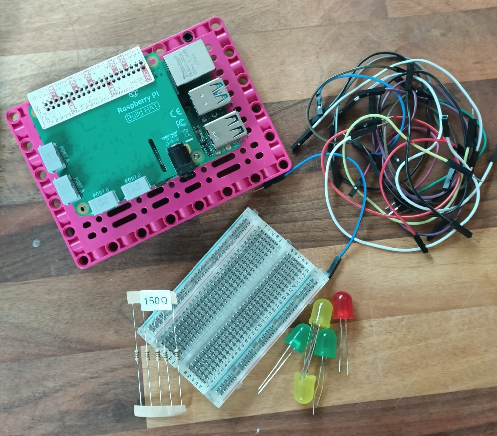
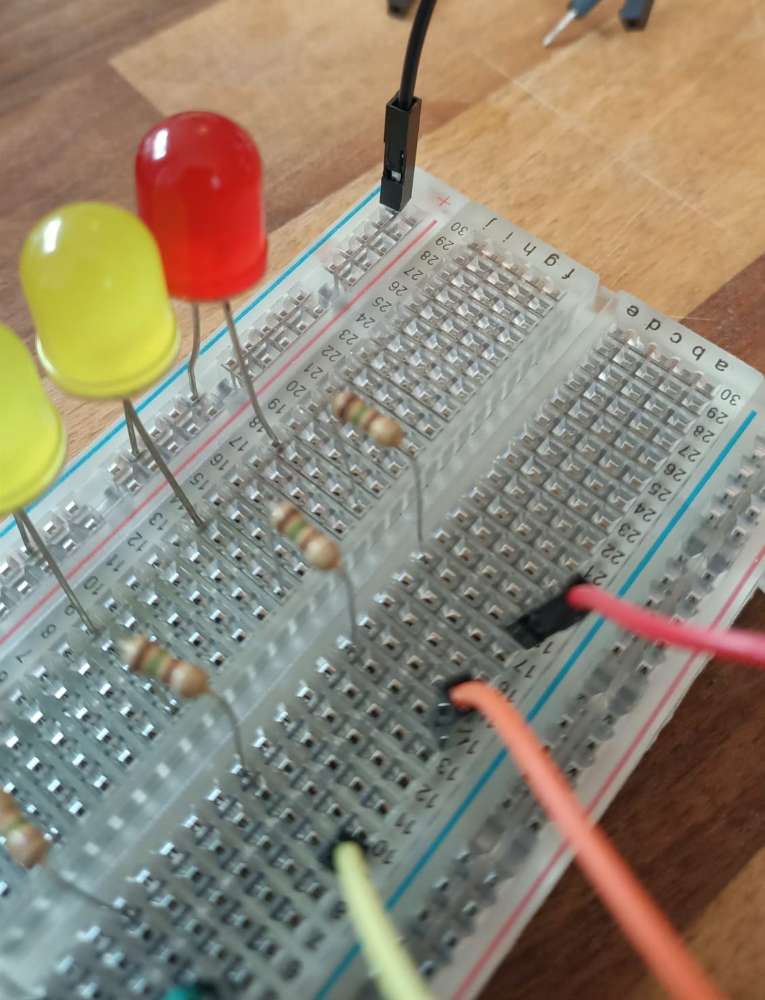
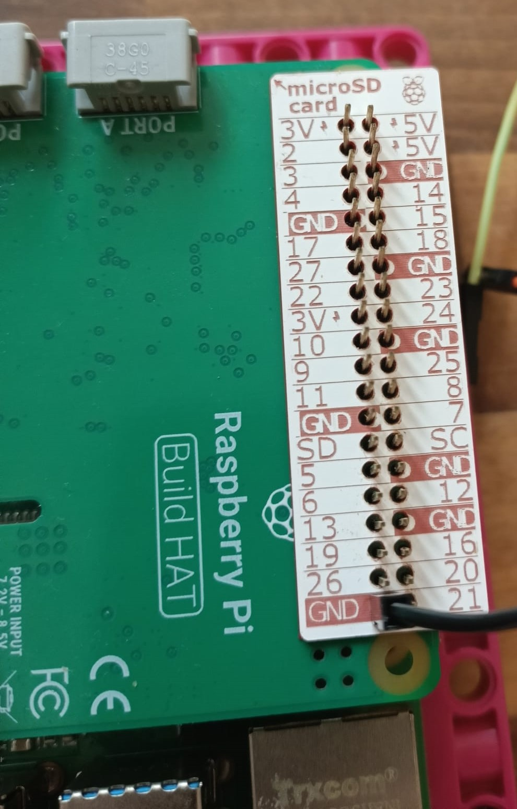
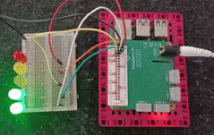

## 制作一个 LED 比例尺

另一种非常酷的数据显示方式是使用一连串的LED。这些 LED 会随着读数的变化而变化——读数越高，点亮的LED越多；就像计算机上显示音乐音量的图形均衡器。

要制作 LED 显示屏，您需要一些LED灯泡——灯泡越多，您的刻度就越精确。 但是有一个上限：您只能拥有与可用的GPIO 引脚一样多的LED。 在这个例子中，我们使用了五个 LED，但如果您愿意，您 **可以** 连接十多个。

**注意：** 由于 Build HAT 的设计，您 **无法访问 GPIO 14 或 15（引脚 8 和 10）**。

--- task ---

连接LED、电阻、公母跨接电缆和面包板。 

--- /task ---

--- task ---

仔细观察您的 LED — 您会注意到一条腿比另一条腿长。 

--- /task ---

--- task ---

将 LED 的 **短腿** 接入面包板的**公共接地轨**（最边缘蓝线旁边的那条），将长腿插入最近的编号行： 

--- /task ---

您需要在电路中添加一个电阻，以防止 LED 过载、烧坏或爆裂。 现在这是一个操作的好机会。

--- task ---

取一个电阻并将一端插入您序列中的第一个LED所在行 **** 将电阻的另一端插入面包板**脊柱对面**的同一行，如下所示：

对序列中的所有 LED 重复上述操作：

--- /task ---

--- task ---

将公母跨接电缆的公端与电阻器插入同一行，以便将它们连接到 Raspberry Pi 上的引脚： 

--- /task ---

--- task ---

将另一根公母跨接电缆公端接入公共地轨的末端： 

--- /task ---

您完成的 LED比例尺应如下所示：

下一步是将其连接到 Raspberry Pi 上的 GPIO 引脚。

--- task ---

将连接到公共接地轨的公母跨接电缆的母端连接到引脚 39。 这是 Raspberry Pi 上的几个接地引脚之一，它将为 **所有** LED 灯泡提供接地。 

--- /task ---

--- task ---

将剩余的跨接电缆连接到各个GPIO 引脚，记下每个LED对应的引脚。

在本示例中，我们使用了引脚 16、19、20、21 和 26（将它们全部放在同一端以保持整洁）： 

--- /task ---

现在您的 LED 阵列已连接到您的 Raspberry Pi，您需要为其通电并对其进行编程。

--- task ---

将 7.5V 电源连接到 Build HAT 上的桶形插孔。 您应该会看到 Raspberry Pi 启动并加载 Raspberry Pi OS 桌面。

--- /task ---

--- task ---

从**Programming**菜单中启动 **Thonny**。

脚本的第一行将导入 gpiozero 和 randint 库并将 LED 设置为可控。 您将需要更改括号中的值以匹配您的 LED 连接到的引脚编号。 **注意：** 这些数字的顺序很重要！ 引脚编号应该依照“条形图”的位置由低到高递增。

在空白窗口中输入以下代码：

--- code ---
---
language: python 
filename: led_bargraph.py 
line_numbers: true 
line_number_start: 1
line_highlights:
---
from gpiozero import LEDBarGraph 
from random import randint

graph = LEDBarGraph(16, 19, 20, 21, 26) #这儿数字的顺序应该和您链接的引脚号匹配

--- /code ---

--- /task ---

您现在已经可以编写LED的程序了，代码的下一部分应该获取你想要测量的数据，然后根据结果来决定需要点亮多少LED。 您应该使用随机数据来测试。

目的是让 LED 在读数增大时逐渐打开，在读数变小时逐渐关闭。 与其他指标一样，您需要将数据映射到您的比例尺。

--- task ---

将以下代码添加到脚本的末尾：

--- code ---
---
language: python 
filename: led_sequence.py 
line_numbers: true 
line_number_start: 9
line_highlights:
---
while True: 
    data_reading = randint(0, 100) 
    graph.value = 1/data_reading #这将生成一个小于1的数用于显示 
    sleep(0.5)
--- /code ---

--- /task ---

--- task ---

将您的工作保存为 `led_sequence.py` 并单击 **Run**。 您应该会看到您的条形图开始渐渐亮起！

--- /task ---

--- save ---
