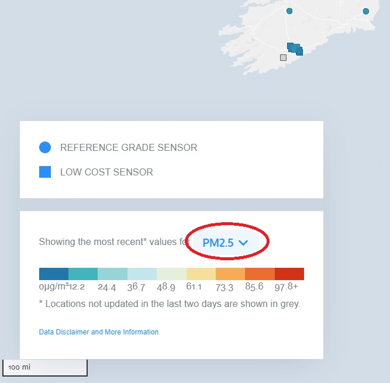
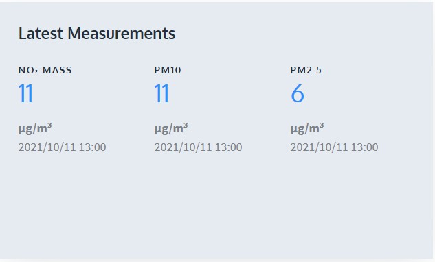

## 访问 OpenAQ API

API 代表 **应用程序编程接口**;这是一个允许两个应用程序相互交谈的软件。 每次您使用 Facebook 等应用程序、发送即时消息或在手机上查看天气时，您都在使用 API。

每当您在手机上使用应用程序时，该应用程序都会连接到互联网并将有关您想知道的内容的数据发送到服务器。 然后服务器会查找并检索您想要的数据，对其进行解释，然后将其发送回您的手机。 然后，该应用程序获取已返回的数据，并以可读的方式向您呈现您想要的信息。 这就是 API：一种通过互联网控制其他机器的方法——所有这些都通过 **API**。

最酷的部分是，您可以编写自己的应用程序来调查在线信息数据库并将所需数据返回到您的 LEGO® 仪表板而不是手机 — 您将使用 Raspberry Pi 作为大脑来获取这些数据，然后显示它在您手工制作的定制乐高指示器上！

为此，您需要决定几件事：您需要选择可以了解空气质量的地点——您可以选择世界上任何地方！ — 您需要决定要代表哪些空气质量标志。

### OpenAQ — 开源空气质量数据库

在您的示例仪表板中，您将使用 [**OpenAQ**](https://openaq.org/#/){:target="_blank"} 的 API，这是一个开源的全球空气质量数据项目。 OpenAQ 允许您查看由全球数千个测量站收集的来自全球各地的大量不同空气污染数据。

如果您已经是 API 向导，则可以使用您喜欢在仪表板上表示的任何数据。 如果您想跟随我们并首次尝试使用 OpenAQ，您需要找出您想要调查的测量站以及您能够查看的测量结果。

--- task ---

**[单击此处](https://openaq.org/#/map){:target="_blank"} 导航** 到 OpenAQ 地图。 应该会出现一个显示由点覆盖的世界地图的网页。

--- /task --- 

--- task ---

**决定** 您希望从世界上的哪个地方收集有关空气质量的数据。 这可能是您居住地附近的区域、您感兴趣的地方或您认为可能有有趣数据的地方。

--- /task --- 

由于我们的总部位于英国剑桥，因此我们将以此为示例。

空气质量监测站进行了许多不同的测量。 OpenAQ 数据库包含有关以下类型空气污染的信息：

 + PM2.5和PM10（颗粒物）：漂浮在空气中的微小颗粒（烟、雾）
 + NO2（二氧化氮）：导致臭氧产生，导致儿童哮喘
 + CO（一氧化碳）：对人类致命，燃烧化石燃料的副作用
 + SO2（二氧化硫）：气味难闻，会导致呼吸问题，产生酸雨，工业处理的副作用
 + O3（臭氧）：当 NO2 与阳光发生反应时产生，产生烟雾，对植物有害
 + BC（黑碳）：在很多地方（美国和波兰）没有测量，由于燃料燃烧效率低下，加剧了全球变暖，对人类有害

--- task ---

**决定** 您最想测量哪种空气污染。 您可以从屏幕左侧靠近彩色刻度的下拉菜单中选择不同的选项。 

**注意：** 圆形标记代表重要的空气质量站，它们可能会测量更多种类的污染物。

--- /task ---

--- task ---

在地图上**放大** 您选择的区域，找到离您想要测量的位置最近的点。 单击最近的那个点，查看位置详细信息。 在出现的弹出窗口中，单击 **View Location**按钮。  

--- /task ---

--- task ---

当显示在该位置进行的测量的详细信息的网页加载时， **记下**该页面 URL 中的数字。 这是您选择的空气质量站的 OpenAQ 识别号。 （在本例中，它是 Sandy Roadside 测量站，ID 号为 **2480**。） 

--- /task ---

--- task ---

在位置信息的页面上，您将看到在该位置测量的不同类型的污染物。 从列表上**选择** 2个您期望显示在您的数据仪表板的数据。  桑迪附近的这个测量站可以显示 NO2、PM10 和 PM2.5——因此我们将在示例中使用 NO2 和 PM2.5。

--- /task ---