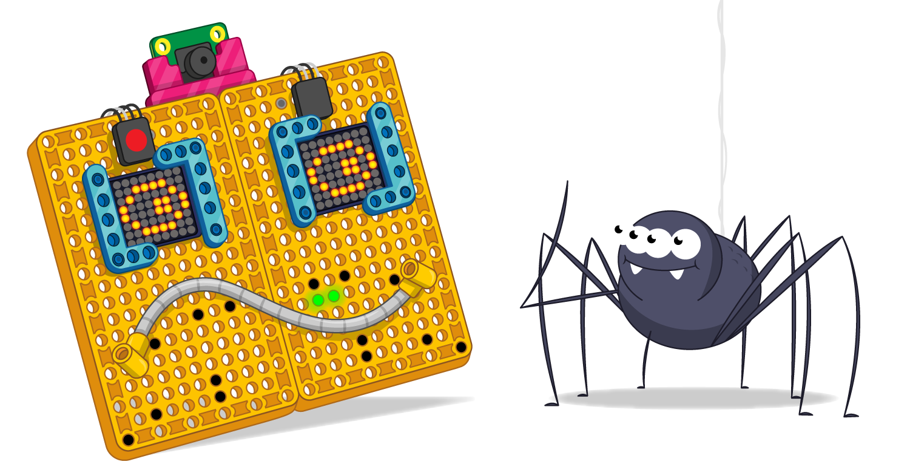

## 接下来还有什么项目？

您可以很容易地在仪表板上添加第三个马达，或创建一个新的 LED 条形图来显示来自 OpenAQ 的其他数据。现在您知道如何使用乐高（LEGO®）指示器来显示数据，您可以使用新的数据仪表板来显示几乎所有内容！

一些可能您可以用于在仪表板上显示的数据来源：

+ 如果您制作 YouTube 视频，则可以使用 [YouTube Developer API](https://developers.google.com/youtube/v3)
+ Fortnite 玩家可以访问他们的 [玩家数据](https://fortnitetracker.com/site-api)
+ 因为NASA，您可以显示[火星上的天气](https://mars.nasa.gov/insight/weather/)！
+ 显示[COVID 瘟疫](https://github.com/M-Media-Group/Covid-19-API)相关的数据
+ 或者，通过[Fitbit API](https://dev.fitbit.com/build/reference/web-api/) 将您的 Fitbit 连接到您的仪表板并跟踪您的锻炼！

如果您依照 [乐高（LEGO）Build HAT 简介](https://projects.raspberrypi.org/zh-CN/pathways/lego-intro)路径学习，您可以继续学习 [乐高（LEGO）机器人脸](https://projects.raspberrypi.org/zh-CN/projects/lego-data-dash) 项目。 在这个项目中，您将用乐高（LEGO®）和一些 LED 阵列制作一张人脸，然后将其连接到机器学习模型来识别物体，并让它用滑稽的动作对物体做出反应！

如果您已经完成了所有乐高（LEGO®）Spark 项目并希望在探索 Python 时获得更多乐趣，那么您可以尝试 [这些项目](https://projects.raspberrypi.org/zh-CN/projects?software%5B%5D=python)。

***
该项目由以下志愿者翻译：

Lestin Liu

正因为志愿者们的辛勤工作，我们才能为世界各地的人们提供用母语来学习的机会。您也可以通过志愿翻译工作来帮助我们吸引更多的人 - 更多信息，请访问[rpf.io/translate](https://rpf.io/translate)。
